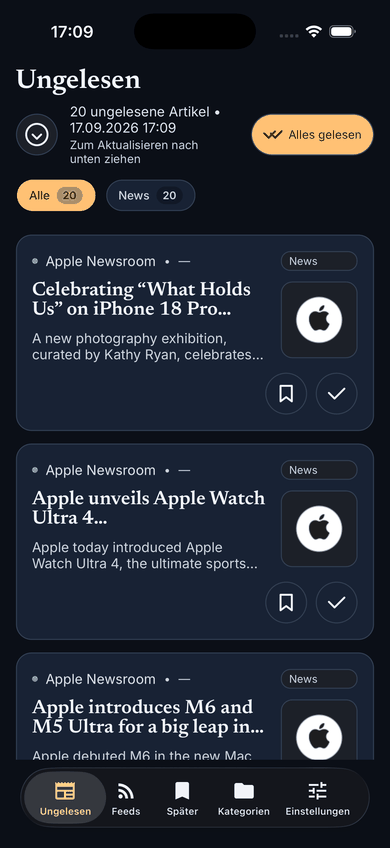

<!-- Licensed under the PolyForm Noncommercial License 1.0.0 - see the LICENSE file in the project root for details. -->

# Reporter

[](https://dotnet.microsoft.com)
[](https://github.com/martin-stromberg/Reporter/actions/workflows/staging-ci.yml)
[](https://github.com/martin-stromberg/Reporter/actions/workflows/release.yml)
[](https://github.com/martin-stromberg/Reporter/releases)
[](LICENSE)

Lokaler RSS-/Feed-Reader als .NET MAUI-App für iOS (derzeit nur iPhone). Der Windows-Build dient als Umgebung für Entwicklung und automatisierte Tests.



Die Demo wurde im iOS-Simulator aufgenommen und zeigt den ersten Start mit dem automatisch angelegten Demo-Feed sowie das Suchen und Abonnieren eines Feeds. Einzelne Screenshots liegen in [docs/help/anwendung/screenshots/readme-demo-ios/](docs/help/anwendung/screenshots/readme-demo-ios/).

## Features

- Shell-Navigation mit den Tabs **Ungelesen**, **Feeds**, **Später**, **Kategorien** und **Einstellungen**
- RSS-/Atom-Feed-Abruf (RSS 2.0, Atom 1.0 und Atom 0.3) mit Feed-Health-Status und Sync-Protokoll
- Feeds per Suche (feedsearch.dev plus Autodiscovery) oder direkter URL-Eingabe hinzufügen; Verwaltung per Kontextmenü auf der **Feeds**-Seite
- Artikeldetailansicht mit WebView-Volltext, automatischem Gelesen-Markieren, „Für später bewahren", Teilen und Öffnen im Browser — externe Links im Artikeltext werden an den System-Browser übergeben
- Kategoriefilter, Keyword-Blacklist beim Feed-Abruf und konfigurierbare Sortierung der ungelesenen Artikel
- Automatische Hintergrund-Aktualisierung (In-App-Timer; unter iOS zusätzlich OS-Hintergrundabruf) und lokale iOS-Benachrichtigungen mit Ruhezeiten
- Vollständig offline lesbar dank lokaler SQLite-Datenhaltung; unter iOS sind die Nutzerdaten (Abonnements, Einstellungen, Lesestatus) im iCloud-Backup enthalten, während die re-downloadbaren Artikelinhalte in einer separaten, ausgeschlossenen Datei liegen und nach einer Wiederherstellung automatisch nachgeladen werden
- Light/Dark-Theme, lokalisierte UI (Deutsch/Englisch), durchgängige Barrierefreiheit und ein Design-System mit eigenem App-Icon
- Beim ersten Start legt die App einmalig die Kategorie „News" mit einem Demo-Feed an

## Projektstruktur

| Projekt | Verantwortlichkeit |
| --- | --- |
| `Reporter` | .NET MAUI-App für iOS, UI, Navigation — der Windows-Build dient als Test-Host |
| `Reporter.Core` | Domänenmodelle, Schnittstellen, ViewModels, mehrsprachige RESX-Ressourcen und Anwendungs-Services |
| `Reporter.Data` | Datenbankzugriff und Repositories |
| `Reporter.Tests` | Unit- und Integrationstests |
| `Reporter.E2ETests` | FlaUI-UIA3-End-to-End-Smoke-Tests der Windows-App |

## Voraussetzungen

- .NET 10 SDK (inkl. .NET-MAUI-Workload)
- iOS (Zielplattform): Xcode auf macOS
- Windows (Entwicklung und Tests): Windows 10 Build 19041 oder höher

## Installation / Setup

```bash
dotnet build Reporter.sln
```

Primäres Ziel-Framework ist `net10.0-ios` — unter macOS das einzige; unter Windows baut zusätzlich `net10.0-windows10.0.19041.0` als Entwicklungs- und Testziel. Die Target Frameworks lassen sich über die MSBuild-Schalter `IncludeIosTarget` (Default `true`) und `IncludeAndroidTarget` (Default `false`) steuern.

## Starten

```bash
# iOS (auf macOS)
dotnet run --project src/Reporter/Reporter.csproj -f net10.0-ios

# Windows (Entwicklung und Tests)
dotnet run --project src/Reporter/Reporter.csproj -f net10.0-windows10.0.19041.0
```

Geräte-Deployment, Simulator, Signing und App-Store-Upload übernimmt `scripts/iOS-Deployment.ps1` — Details siehe [iOS-Deployment](docs/help/ios-deployment/index.md).

## Tests

```bash
dotnet test Reporter.sln --filter "Category!=E2E"   # Unit-/Integrationstests
npm test                                          # node:test-Suite der Release-Skripte
.\scripts\Run-E2ETests.ps1                        # E2E-Smoke-Tests (nur Windows, interaktive Desktop-Session)
```

Die E2E-Suite hinterlässt keine verwaisten App-Prozesse: Die gestartete `Reporter.exe` ist per Windows-Job-Objekt an den Test-Host gebunden und endet auch bei dessen hartem Abbruch; das Skript beendet im `finally` zusätzlich verbliebene Prozesse aus dem Build-Output — eine parallel installierte App bleibt unberührt. Details und Fehlerbehebung siehe [Tests](docs/help/tests/index.md).

## CI/CD

GitHub-Actions-Pipeline nach dem Branch-Modell `staging` → `main`: PR-Gates (`static checks`, `build & test`), RC-Pre-Releases auf `staging`, automatischer Promotion-PR und stabile Releases mit Plattform-Artefakten auf `main` — Details siehe [Release-Management](docs/help/release-management/index.md).

## Changelog

Siehe [changes.log](changes.log).

## Lizenz

Dieses Projekt steht unter der **PolyForm Noncommercial License 1.0.0** — den vollständigen Lizenztext siehe [LICENSE](LICENSE).

- **Private und nicht-kommerzielle Nutzung ist erlaubt:** persönliche Nutzung, Hobby-Projekte, Forschung und Lehre sowie die Nutzung durch gemeinnützige Organisationen, Bildungseinrichtungen und staatliche Stellen.
- **Kommerzielle Nutzung ist untersagt:** Jede Nutzung mit kommerziellem Zweck erfordert eine separate, individuell vereinbarte kommerzielle Lizenz — Anfragen an Martin Stromberg (<mstromberg84+reporter@gmail.com>), Details siehe [COMMERCIAL-LICENSE.md](COMMERCIAL-LICENSE.md).
- **Beiträge (Contributions)** werden unter derselben Lizenz angenommen — Details siehe [CONTRIBUTING.md](CONTRIBUTING.md).
- **Sicherheitslücken** bitte vertraulich melden — Details siehe [SECURITY.md](SECURITY.md).

## Weitere Informationen

**Anwendung und Konfiguration**

- [Anwendung im Überblick](docs/help/anwendung/index.md) — Bedienung, Feed-Suche und -Verwaltung, Synchronisation, Offline-Verhalten, Sprache, Barrierefreiheit, Architektur und Datenmodell
- [Einstellungen](docs/help/einstellungen/index.md) — Aufbewahrungsdauer, Keyword-Filter, Hintergrund-Aktualisierung, Ungelesen-Sortierung, Benachrichtigungen & Ruhezeiten, Erscheinungsbild, Sprache sowie Diagnose & Support
- [Benachrichtigungen](docs/help/benachrichtigungen/index.md) — lokale iOS-Benachrichtigungen und der OS-Hintergrundabruf im Detail

**Betrieb und Entwicklung**

- [iOS-Deployment](docs/help/ios-deployment/index.md) — lokaler Buildlauf, Signing, Gerät/Simulator, TestFlight und App Store
- [Datenschutzerklärung](docs/privacy-policy.md) — öffentlich referenzierbare Privacy-Policy (deutsch/englisch) für App Store Connect
- [App-Store-Review](docs/app-store-review.md) — Review-Notizen zur Einreichung: App-Privacy-Antworten, ATS-Begründung, Altersfreigabe, iPad-Entscheidung
- [Release-Management](docs/help/release-management/index.md) — Release-Pipeline, Workflow-Dateien und Asset-Reparatur
- [Tests](docs/help/tests/index.md) — Testinfrastruktur, E2E-Suite und `REPORTER_*`-Umgebungsvariablen
- [Entwicklung](docs/help/entwicklung/index.md) — Git-Hooks und lokale statische Prüfungen
- [Contributing](CONTRIBUTING.md) — Richtlinien für Beiträge
- [Release Notes](docs/RELEASE_NOTES.md) — Versionshinweise der Releases
