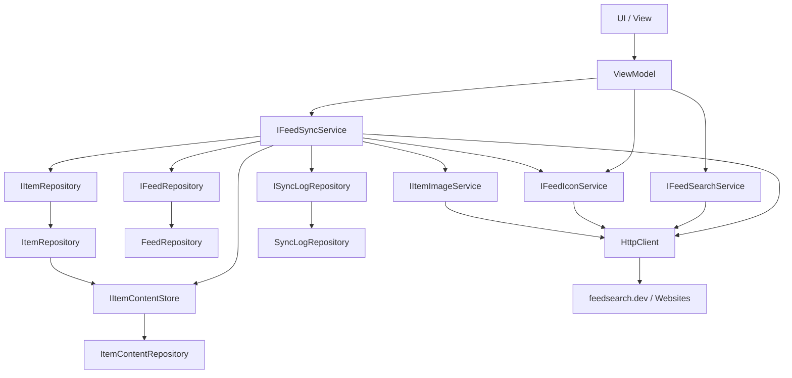

<!-- Licensed under the PolyForm Noncommercial License 1.0.0 - see the LICENSE file in the project root for details. -->

← [Zurück zur Übersicht](index.md)

# Anwendung — Architektur

## Beteiligte Komponenten

| Komponente | Projekt | Rolle |
|------------|---------|-------|
| `Reporter` | `src/Reporter` | .NET MAUI-App mit UI und Navigation — Zielplattform iOS; der Windows-Build dient als Test-Host für die E2E-Suite |
| `Reporter.Core` | `src/Reporter.Core` | Domänenmodelle, Schnittstellen, ViewModels, mehrsprachige RESX-Ressourcen und Anwendungs-Services |
| `Reporter.Data` | `src/Reporter.Data` | Datenbankzugriff und Repositories |
| `Reporter.Tests` | `src/Reporter.Tests` | Unit- und Integrationstests |
| `Reporter.E2ETests` | `src/Reporter.E2ETests` | FlaUI-UIA3-End-to-End-Smoke-Tests der Windows-App (nur Windows, interaktive Desktop-Session); Details siehe [Tests](../tests/index.md) |

## Abhängigkeiten

- `Reporter` referenziert `Reporter.Core` und `Reporter.Data`.
- `Reporter.Data` referenziert `Reporter.Core`.
- `Reporter.Tests` referenziert `Reporter.Core` und `Reporter.Data`.
- `Microsoft.Extensions.DependencyInjection` wird für alle Services und ViewModels verwendet.
- `CommunityToolkit.Mvvm` bildet die Basis für die ViewModels.
- Externe Abhängigkeit der Feed-Suche: die öffentliche Verzeichnis-API `feedsearch.dev` (JSON-GET ohne Authentifizierung) plus Abruf der jeweils eingegebenen Website für die clientseitige Feed-Autodiscovery — beides synchron über den DI-`HttpClient`; Details siehe [Feed-Suche — Technischer Ablauf](feed-suche-technisch.md).

## Datenfluss

## Wichtige Klassen

- `MauiProgram.CreateMauiApp()` — Konfiguriert DI, Fonts und MAUI; wendet nach `builder.Build()` über `ApplyPersistedLanguage` die gespeicherte Sprachwahl an (`AppCulture.Apply`), bevor `CreateWindow` die `AppShell` erzeugt. Wertet die Prozess-Overrides `REPORTER_DB_PATH` (DB-Dateipfad), `REPORTER_FEEDSEARCH_ENDPOINT` (Directory-Endpunkt, via `ResolveFeedSearchEndpoint`) und `REPORTER_DISABLE_DEMO_SEED` (Demo-Seed-Unterdrückung, via `ResolveDemoSeedSuppressed`) aus und erfasst vor `builder.Build()` per `!File.Exists(databasePath)`, ob die Datenbank frisch angelegt wird — das Ergebnis wird als `FirstRunState`-Singleton registriert (die Auswertung muss vor dem `Migrate()` in `ApplyPersistedLanguage` liegen, das die DB-Datei erzeugt); der effektive `databasePath` wird zusätzlich als `DatabasePath`-Singleton registriert (für die iCloud-Backup-Behandlung, siehe `IBackupExclusionService` weiter unten). Die App nutzt zwei SQLite-Datenbanken: Neben `reporter.db` (Nutzerdaten) liegt `reporter-content.db` (re-downloadbare Artikelinhalte, eigener `ContentDbContext` mit eigener Migrationshistorie) im selben Verzeichnis — der Pfad wird aus `Path.GetFullPath(databasePath)` abgeleitet, sodass ein `REPORTER_DB_PATH`-Override beide Dateien verlagert. Vor `ApplyPersistedLanguage` läuft der try/catch-isolierte Schritt `MigrateContentStoreAndLegacyData` (Content-Schema-Migration + Kopie der Bestands-`items.content_html` in den Content-Speicher über `IContentMigrationService`), damit die `reporter.db`-Migration die Legacy-Spalte erst nach der Kopie entfernt.
- `HttpClient` — DI-Singleton (`MauiProgram`, 30 s Timeout), gemeinsam genutzt von `FeedSyncService`, `FeedSearchService`, `FeedIconService` und `ItemImageService`. Auf iOS/MacCatalyst läuft er über `NSUrlSessionHandler`, dessen App-Transport-Security-Policy statisch in der `Info.plist` steht: `NSAppTransportSecurity` → `NSAllowsArbitraryLoads = true` in `Platforms/iOS/Info.plist` und `Platforms/MacCatalyst/Info.plist` erlaubt Klartext-HTTP — damit funktionieren vom Anwender eingegebene `http`-Feed-URLs auf allen Plattformen (eine `NSExceptionDomains`-Whitelist könnte beliebige Domains nicht abdecken). Die Freigabe ist Build-Ebene, nicht zur Laufzeit umschaltbar; bei App-Store-Reviews ist `NSAllowsArbitraryLoads` begründungspflichtig — die konsolidierte Review-Begründung steht in [`docs/app-store-review.md`](../../app-store-review.md).
- `Colors.xaml` / `Styles.xaml` — Enthalten das Design-System (Farb- und Typografie-Tokens, Light/Dark-Styles). Beide haben ein `x:Class`-Code-Behind und werden in `App.xaml.cs` der `MergedDictionaries` hinzugefügt. Farbtokens u. a. `SurfaceCard`/`BorderSubtle` (Karten + Hairline), `SurfaceCardTranslucent` (schwebende Leiste), `Status*Tint`/`Status*Text` (Status-Badges), `ChipCountCapsule` (Chip-Zähler), `BookmarkGold`; Typo-Styles u. a. `LabelMdStyle`/`LabelSmStyle`/`LabelMetaStyle`, alle benannten Typo-Styles setzen `FontAutoScalingEnabled="True"` explizit.
- Alle `.csproj` erzwingen XML-Dokumentation (`GenerateDocumentationFile` + `CS1591` als Fehler).
- `AppShell` — Definiert die Shell-Navigation mit den Tabs **Ungelesen**, **Feeds**, **Später**, **Kategorien** und **Einstellungen**; pro Tab wird ein `Icon` aus den `MauiImage`-Assets `tab_*.svg` (`Resources/Images/`) gesetzt, die Einfärbung übernehmen die impliziten Shell-Styles (`TabBarForegroundColor`/`TabBarUnselectedColor`).
- `Newsreader` (Editorial-Headlines) und `Inter` (UI-Texte) — Eingebundene Schriftarten.
- `AppResources` — Typisierter Zugriff auf RESX-Lokalisierung (EN/DE).
- `BaseViewModel` — Basisklasse für die ViewModels mit Netzwerkbezug, erbt von `ObservableObject`; Connectivity-Bausteine siehe Abschnitt zu `INetworkStatusService` weiter unten. Kapselt außerdem den gemeinsamen Einmal-Sync `RunFeedSyncAsync(Func<Task<SyncResult>>)` — privater `_isSyncInProgress`-Reentrancy-Guard (die gebundene `IsSyncing` wird vom `RefreshView.IsRefreshing`-TwoWay-Binding vorgezogen und taugt nicht als Sperre), Offline-Early-Return mit `SetIsSyncing(false)`, `SyncStatusError`-Meldung über den `ReportSyncError`-Hook — sowie `LoadCategoriesWithNoneAsync` (Kategorien mit führendem `Guid.Empty`/`CategoryNone`-Pseudo-Eintrag); genutzt von `FeedsViewModel.SyncAsync` und `FeedDetailViewModel.RefreshAsync`. `SettingsViewModel` und `CategoriesViewModel` erben direkt von `ObservableObject`.
- `UnreadPage` / `UnreadViewModel` — Ansicht und ViewModel für ungelesene Artikel: paged Liste (`PageSize`, `LoadMoreCommand`, `RemainingItemsThreshold`) und eine horizontal scrollbare Chip-`CollectionView` (`ItemsSource="{Binding Categories}"` über `CategoryFilterItem` mit `IsSelected`/`Count`/`AccessibilityDescription`; Tap → `SelectCategoryCommand`, Aktiv-/Inaktiv-Tokens per `DataTrigger` auf `IsSelected`). Hält eine `ISettingsRepository`-Abhängigkeit: `LoadPageAsync` wertet `Settings.UnreadSortOrder` aus und reicht sie als `ascending`-Parameter an `IItemRepository.GetUnreadByDateAsync`.
- `FeedsPage` / `FeedsViewModel` — Ansicht und ViewModel für Feeds: reine Listenansicht mit Pull-to-Refresh (`RefreshAllCommand` über `BaseViewModel.RunFeedSyncAsync`); `OnFeedTapped` navigiert per `Shell.Current.GoToAsync($"feeddetail?feedId={feed.Id}")` auf die `FeedDetailPage` — das frühere Aktionsblatt ist dorthin umgezogen. Das Hinzufügen-Formular liegt als Bottom-Sheet-Overlay (`ShowAddForm`, nur noch Add-Modus) auf der Seite. Der `HealthStatus` jeder `FeedListItem`-Karte wird als Micro-Pill-Badge gerendert (`DataTrigger` auf `OK`/`Warning`/`Error` → `Status*Tint`-Hintergrund, `Status*`-Dot, `Status*Text`-Textfarbe); links davon zeigt eine Bild-Spalte `FaviconUrl` (nur online) bzw. den `FeedInitial`-Kreis. Die Feed-Karten tragen den `SemanticProperties.Hint` `AccessibilityOpenFeedDetails` („Tippen, um die Feed-Details zu öffnen").
- `FeedDetailPage` / `FeedDetailViewModel` — Detailansicht eines einzelnen Feeds (Shell-Route `feeddetail?feedId=…`, `IQueryAttributable`, beide transient): Kopfbereich mit Favicon/`FeedInitial`-Kreis, Titel, Meta-Zeile (Kategorie, `LastCheckedAt`, `UnreadCount`) und `HealthStatus`-Badge; `SearchBar` filtert den Artikeltitel mit 300-ms-Debounce; `CollectionView` mit `ArticleCardView` lädt alle Items des Feeds seitenweise nach (`PageSize = 20`, `RemainingItemsThresholdReachedCommand` → `LoadMoreCommand`, `SemaphoreSlim`-Sperre, `HasMore = items.Count == PageSize` — Muster `LaterViewModel`) über den neuen `IItemRepository.GetByFeedAsync(Guid, int, int, string?)`-Overload (`Title.Contains`-Filter, `PublishedAt`-desc + `Id`-Tiebreak, `SelectListItemRows`-Hydration); `RefreshView` führt den Einzel-Sync aus. Der Button **Aktionen** (`IsEnabled` via `HasFeed`) öffnet das `DisplayActionSheetAsync` mit den aus der `FeedsPage` übernommenen Aktionen — `GetFeedErrorMessage` zeigt bei `FeedHealth.Error` den lokalisierten `FeedErrorKind*`-Text plus `LastErrorMessage`; ein eigenes Edit-Bottom-Sheet (`ShowEditForm`) deckt URL und Benachrichtigungs-Schalter ab (`FeedUrlValidator.IsValidFeedUrl` + Dublettenprüfung via `GetByUrlAsync`). Details siehe [Feeddetailansicht — Technischer Ablauf](feeddetailansicht-technisch.md).
- `LaterPage` / `LaterViewModel` — Ansicht und ViewModel für später gemerkte Artikel mit demselben Paging-Muster wie `UnreadViewModel`: `SavedItems` als `ObservableCollection<ItemListItem>`, `PageSize = 20`, `LoadMoreCommand` (`SemaphoreSlim`-Lock, `HasMore`/`IsLoading`), `ErrorMessage`/`HasError` (`ErrorLoadFailed`); `ToggleSavedAsync`/`MarkReadAsync` aktualisieren die Liste in-place (`Remove`/`ItemListItem.CopyWith`) statt neu zu laden.
- `IFeedSyncService` / `FeedSyncService` — Service zum Abruf, Parsen und Speichern von Feed-Inhalten; ruft nach jedem Sync mit neuen Artikeln fehlerisoliert `INotificationService.NotifyNewItemsAsync` auf. Parst RSS 2.0, Atom 1.0 und Atom 0.3 über `SyndicationFeed.Load`: Dokumente mit dem Atom-0.3-Namespace `http://purl.org/atom/ns#` werden nach einem `MoveToContent`-Peek in `Atom03NormalizingXmlReader` gewrappt, der Namespace und Elementnamen (`tagline`→`subtitle`, `issued`→`published`, `modified`→`updated`, `copyright`→`rights`) sowie `type`-Attributwerte der Text-/Content-Konstrukte on-the-fly auf Atom 1.0 normalisiert. Ersetzt beim ersten Sync einen Platzhalter-`Feed.Title` (leer, `== Url`, `== Host` oder `==` Dateiname der Feed-URL via `FeedTitleFallback.IsFileNamePlaceholderTitle`) durch `SyndicationFeed.Title`. Feeds ohne `FaviconUrl` rüstet er beim erfolgreichen Sync nach (Site-Link `alternate` des Feed-Dokuments → `IFeedIconService`, fehlerisoliert, persistiert über `UpdateFeedHealthAsync`). `RunSyncAsync` dedupliziert neue Items in-memory über ein `HashSet<string>` auf `GuidOrHash` (aus den zuvor geladenen `existingItems`; deckt auch Dubletten innerhalb eines Feed-Dokuments ab), filtert neue Items gegen die konfigurierte Keyword-Liste (`IKeywordFilter` — Treffer werden verworfen und in der `SyncLog.Message` als `, N filtered` ausgewiesen) und persistiert die verbleibenden `Item`s einmalig via `IItemRepository.AddRangeAsync` — ein `DbContext`, ein `SaveChangesAsync` statt N+1-Einzelinserts. Bekannte Items ohne gespeicherten Inhalt (`ContentHtml is null`, z. B. nach einem Restore ohne Content-Datenbank) sammelt `CollectNewItems` als `contentBackfill`-Einträge und `RunSyncAsync` schreibt sie per `IItemContentStore.SetRangeAsync` nach — ohne erneutes Keyword-Matching und ohne Überschreiben vorhandener Inhalte. Zusätzlich löst `CollectNewItems` je neuem Item und je Bestandsitem ohne gespeichertes Bild (Menge via `IItemContentStore.GetImageIdsAsync`) die Bild-URL über `IItemImageService.ResolveImageUrl` auf; `RunSyncAsync` lädt die Kandidaten anschließend sequentiell per `TryDownloadImageAsync` herunter, weist neuen Items das `ItemImage` per `Item.Image`-`set`-Accessor zu und mergt Backfill-Treffer pro `ItemId` in `contentBackfill` (bestehender Eintrag → `ItemContentEntry(id, content, image)`, sonst `ItemContentEntry(id, null, image)`), sodass Inhalt und Bild in einem gemeinsamen Upsert landen — Download-Fehlschläge liefern `null`, lassen Artikel und Sync unberührt (Remote-`ImageUrl` bleibt Fallback) und werden am Ende als aggregierte `IDebugLogService`-Warnung (`DebugLogCategory.Sync`) notiert. Schlägt der Abruf fehl, klassifiziert `FeedSyncErrorKind.Classify(ex, feed.Url)` die Exception (`HttpRequestException` mit `StatusCode` → `HttpStatus` — Vorrang vor der Scheme-Prüfung —, ohne `StatusCode` bei `http`-Feed-URL → `InsecureHttpBlocked`, sonst → `Network`; `XmlException` → `Parse`; Rest → `Unknown`); `UpdateFeedHealthAsync` schreibt Kategorie und Rohmeldung (`"Synchronization failed: {ex.Message}"`) über das `FeedHealthUpdate`-Record in `Feed.LastErrorKind`/`LastErrorMessage` und setzt beide beim nächsten erfolgreichen Sync auf `null` zurück. `OperationCanceledException` wird bewusst nicht als Sync-Fehler erfasst.
- `IFeedIconService` / `FeedIconService` (`Reporter.Core`) — Favicon-Discovery hinter einem Vertrag: `FindFaviconUrlAsync(siteUrl)` wertet `<link rel="icon|shortcut icon|apple-touch-icon">` im `<head>` der Website per Regex aus und verifiziert jeden Kandidaten inkl. des `{Origin}/favicon.ico`-Fallbacks per Request; `TryFindFaviconUrlAsync(feedUrl, siteUrl)` löst vorher die Site-URL auf (`FeedSiteResolver` — `siteUrl`, sonst Authority der Feed-URL) und ist strikt fehlerisoliert (`null` statt Exception). Wird bei der Feed-Anlage (`FeedsViewModel.TryPersistNewFeedAsync`, nur online) und beim Sync-Backfill (`FeedSyncService`) genutzt; Singleton in `MauiProgram`. Die interne Hilfsklasse `FeedAvatar` liefert den Initialbuchstaben für den Fallback-Kreis (`ItemListItem.FeedInitial`, `FeedListItem.FeedInitial`).
- `IItemImageService` / `ItemImageService` (`Reporter.Core`) — Artikelbild-Auflösung und -Download hinter einem Vertrag, Muster `IFeedIconService`: `ResolveImageUrl(feedItem, contentHtml, itemLink, feedUrl)` ermittelt den Bildkandidaten in fester Priorität (Enclosure/`link rel="enclosure"` mit `image/*`-MIME → MediaRSS `media:thumbnail`/`media:content` → `itunes:image` → erstes `` des Inhalts) und löst relative URLs gegen den Artikel-Link, dann die Feed-URL auf; `TryDownloadImageAsync(url, ct)` lädt den Kandidaten über den gemeinsamen `HttpClient` herunter — `image/*`-MIME-Pflicht, internes 5-MB-Limit (`MaxImageBytes`, `Content-Length`-Vorabprüfung plus Streaming-Cap), Download-/Format-/Netzwerkfehler liefern strikt `null` (nur `OperationCanceledException` propagiert). Die statische Hilfsmethode `ExtractFirstImageUrl` teilt die ``-Extraktion mit `ItemRepository.ExtractImageUrl`, damit Download-Kandidat und Remote-Fallback stets dasselbe Bild meinen. Singleton in `MauiProgram`; das Transport-Value-Object ist `ItemImage` (`Data`, `ContentType`, `Url`).
- `IFeedSearchService` / `FeedSearchService` (`Reporter.Core`) — Feed-Suche hinter einem Gateway-Vertrag: Verzeichnisabfrage gegen `feedsearch.dev` (`skip_crawl=true`) plus clientseitige Autodiscovery (`<link rel="alternate">`-Parsing, Standardpfade) in einem gemeinsamen 2-s-Zeitbudget; Treffermodell `FeedSearchResult` mit `FeedSearchMatchKind`, Fehler nur als `FeedSearchUnavailableException` bei Ausfall beider Quellen. Der UI-Teil (Eingabe-Klassifikation, `SearchResults`/`ShowSearchResults`, `SearchCommand`/`DirectAddCommand`/`SubscribeResultCommand`/`CloseSearchResultsCommand`, `ConfirmDirectAddAsync`-Callback, Anlage über `TryPersistNewFeedAsync` mit `FeedTitleFallback`-Platzhalter-Titel) liegt in `FeedsViewModel.Search.cs`; Details siehe [Feed-Suche — Technischer Ablauf](feed-suche-technisch.md).
- `INotificationService` / `NotificationService` (`Reporter.Core`) — Entscheidungslogik für lokale Benachrichtigungen (Feed-/globaler Schalter, Ruhezeit via `TimeProvider`, Keyword-Filter, Einzel- vs. Sammel-Modus); Details siehe [Benachrichtigungen](../benachrichtigungen/index.md).
- `ILocalNotificationService` / `LocalNotificationService` (`src/Reporter/Services/`) — Plattformabstraktion für lokale Benachrichtigungen; iOS-Ausprägung über `UserNotifications` (`#if IOS`), No-Op auf anderen Targets. Tap-Handling und Vordergrund-Unterdrückung (`UNNotificationPresentationOptions.None` — Mitteilungen erscheinen nur aus dem OS-Hintergrundabruf) über `NotificationDelegate`/`AppDelegate` unter `Platforms/iOS`.
- `IBackgroundRefreshService` / `BackgroundRefreshService` (`src/Reporter/Services/`) — Gateway für den OS-seitigen Hintergrundabruf: `IsSupported` (nur iOS `true`), `ApplySettingsAsync` plant den iOS-`BGAppRefreshTask` via `BGTaskScheduler` (`Submit`/`Cancel`, `EarliestBeginDate` aus `SettingsValues.ClampRefreshIntervalMinutes`); No-Op auf anderen Targets.
- `IScheduledSyncRunner` / `ScheduledSyncRunner` (`Reporter.Core`) — Führt den Sync eines ausgelösten Hintergrund-Tasks fehlerisoliert aus (`IFeedSyncService.SyncAllAsync`, `RunAsync` → `Task<bool>` für `SetTaskCompleted`) und plant den Folgeabruf aus den persistierten Settings neu — auch im Fehlerfall; wird vom iOS-`AppDelegate.HandleRefreshTaskAsync` lazy über `IPlatformApplication.Current.Services` aufgelöst.
- `IRetentionCleanupService` / `RetentionCleanupService` — Service für das automatische Aufräumen gelesener Artikel nach `Settings.RetentionDays` inkl. Keyword-Löschregel und einem Waisen-Sweep im Content-Speicher (`IItemContentStore`); wird in `App.OnStart` aufgerufen, ungelesene und gemerkte Artikel bleiben erhalten. Details siehe [Aufbewahrung und automatisches Aufräumen](aufbewahrung.md).
- `IDemoContentService` / `DemoContentService` (`Reporter.Core`) — Einmaliger Demo-Seed beim ersten Start: `App.OnStart` ruft `EnsureSeededAsync` in einem eigenen fehlerisolierten `try/catch`-Block auf — nach `MigrateAsync`, `IDebugLogService.BeginSessionAsync` und der Exception-Handler-Registrierung, vor dem Retention-Cleanup und dem Start-Abruf (`IAutoRefreshService.StartAsync`, der den geseedeten Feed direkt synchronisiert). Der Service seedet nur bei `FirstRunState.ShouldSeedDemoContent` (`IsFirstRun && !DemoSeedSuppressed`) und legt dann über `ICategoryRepository`/`IFeedRepository` die Kategorie `DemoCategoryName` („News") und den Feed `DemoFeedUrl` mit Titel `DemoFeedTitle` („Apple Newsroom", `NotificationsEnabled = false`, damit der erste Sync weder einen Berechtigungs-Prompt noch eine Benachrichtigungsflut auslöst) an; eine vorhandene Kategorie wird per `OrdinalIgnoreCase` wiederverwendet, ein bereits vorhandener Demo-Feed (`GetByUrlAsync`) macht den Aufruf zum No-op. Ein erfolgreicher Seed schreibt einen `Lifecycle`/`Info`-Eintrag ins Session-Log. Seed-Werte siehe [Datenmodell](datenmodell.md).
- `FirstRunState` (`Reporter.Core.Models`) — POCO, das die in `MauiProgram` erkannte First-Run-Information in die DI transportiert: `IsFirstRun` (die DB-Datei existierte vor dem Start nicht — damit seedet die App nach einer DB-Löschung korrekt erneut), `DemoSeedSuppressed` (`REPORTER_DISABLE_DEMO_SEED`, E2E-/CI-Läufe), berechnet `ShouldSeedDemoContent`.
- `DatabasePath` / `ContentDatabasePath` (`Reporter.Core.Models`) — POCOs, die den effektiven Dateipfad der Nutzerdatenbank (inkl. `REPORTER_DB_PATH`-Override) bzw. der abgeleiteten Content-Datenbank als Singletons in die DI transportieren; `App.OnStart` nutzt beide für die iCloud-Backup-Behandlung.
- `IBackupExclusionService` / `BackupExclusionService` (`src/Reporter/Services/`) — Gateway für den iCloud-Backup-Ausschluss: `ExcludeFromBackup(filePath)`/`IncludeInBackup(filePath)` setzen bzw. entfernen unter iOS per `#if IOS` das `NSUrl.IsExcludedFromBackupKey`-Resource-Flag (`File.Exists`-Guard), auf anderen Targets No-op. `App.OnStart` wendet ihn fehlerisoliert nach `MigrateAsync` über die `BackupExclusionPlan`-Pfadmengen an: `IncludeInBackup` für `reporter.db` samt `-wal`-/`-shm`-Sidecars (entfernt bei Bestandsinstallationen das von älteren App-Versionen gesetzte Ausschluss-Flag) und `ExcludeFromBackup` für `reporter-content.db` samt Sidecars — iOS Data Storage Guidelines: Nur die nicht reproduzierbaren Nutzerdaten gehören ins Backup, die re-downloadbaren Inhalte bleiben ausgeschlossen.
- `BackupExclusionPlan` (`Reporter.Core.Services`, statisch) — Liefert die Pfadmengen für die Backup-Behandlung: `ExcludedPaths(ContentDatabasePath)` = `reporter-content.db` + `-wal`/`-shm`, `IncludedPaths(DatabasePath)` = `reporter.db` + `-wal`/`-shm`.
- `IItemContentStore` / `ItemContentRepository` (`Reporter.Data`) — Gateway des Content-Speichers über `IDbContextFactory<ContentDbContext>` (`reporter-content.db`, Tabelle `item_contents` mit `item_id` als Primärschlüssel, `content_html` und den Bild-Spalten `image_data`/`image_content_type`/`image_url`; keine FK zur Nutzerdatenbank): `GetAsync`/`GetRangeAsync` (Content-Batch-Lookup für Listen), `GetImageAsync` (Einzelbild inkl. BLOB), `GetImageIdsAsync` (Mengen-Lookup ohne BLOB-Last — für die Listen-Projektionen und die Bild-Backfill-Kandidaten des Syncs), `SetAsync`/`SetRangeAsync` (feldweise Upsert-Semantik — ein `ItemImage` schreibt nur die Bild-Spalten, `null` lässt sie unberührt; `null`/leerer Inhalt entfernt den gespeicherten Inhalt nur ohne mitgegebenes Bild; die Zeile entfällt erst, wenn sie weder Inhalt noch Bild trägt; Transport-Record `ItemContentEntry(ItemId, ContentHtml, Image?)`), `DeleteAsync`/`DeleteRangeAsync`, `GetItemIdsAsync` (für den Waisen-Sweep des Retention-Cleanups — deckt auch bild-only-Zeilen ab).
- `IContentMigrationService` / `ItemContentMigrationService` (`Reporter.Data`) — Einmalige Bestandsüberführung `items.content_html` → `item_contents` beim Update: idempotent über `PRAGMA table_info('items')` (Spalte vorhanden?), seitenweises Kopieren (500er-Blöcke) über `IItemContentStore.SetRangeAsync`; stellt vorab das Content-Schema per `MigrateAsync` sicher. Läuft in `MauiProgram.MigrateContentStoreAndLegacyData` vor der `reporter.db`-Migration und wird in `App.OnStart` (`MigrateContentAsync`, eigener fehlerisolierter Start-Schritt) idempotent wiederholt — fängt ab, dass der erste Lauf scheiterte, bevor die EF-Migration `DropItemContentHtml` die Legacy-Spalte entfernt.
- `IKeywordMatcher` / `KeywordMatcher` — Zentrales Keyword-Matching (`OrdinalIgnoreCase`-Teilwort auf Titel und HTML-Inhalt).
- `IKeywordFilter` / `KeywordFilter` — Kapselt `IKeywordRepository` + `IKeywordMatcher`: `GetKeywordTextsAsync` lädt die Keyword-Texte einmal pro Lauf, `MatchesAny` prüft Titel und HTML-Inhalt. Wiederverwendung durch den Ingest-Filter in `FeedSyncService`, den Cleanup und das Benachrichtigungs-Paket (Tiefenverteidigung).
- `IAutoRefreshService` / `AutoRefreshService` — `PeriodicTimer`-basierter Hintergrund-Sync (`IFeedSyncService.SyncAllAsync`) mit `TimeProvider` und Overlap-Guard; startet in `App.OnStart`, wird bei Einstellungsänderungen neu konfiguriert. Überspringt Ticks ohne Netzwerk (`INetworkStatusService.IsOnline`), damit offline keine `SyncLog`-Fehler entstehen. `StartAsync` löst zusätzlich bei `Settings.RefreshOnStartupEnabled && IsOnline` einen einmaligen, fehlerisolierten Start-Abruf aus (`RunStartupSyncAsync`, fire-and-forget — blockiert den App-Start nicht). `ApplySettingsAsync` leitet die Settings außerdem fehlerisoliert an `IBackgroundRefreshService` weiter (nur bei `IsSupported`) und koppelt so den iOS-`BGAppRefreshTask` an `AutoRefreshEnabled`/`RefreshIntervalMinutes` — auch bei deaktiviertem Schalter, damit der OS-Task abgemeldet wird.
- `IAppThemeService` / `AppThemeService` (`src/Reporter/Services/`) — Setzt `Application.UserAppTheme` anhand `Settings.Theme`; Interface in `Reporter.Core`, Implementierung im MAUI-Projekt, da Core keine MAUI-Referenz hat.
- `INetworkStatusService` / `NetworkStatusService` (`src/Reporter/Services/`) — Plattformabstraktion des Netzwerkzustands nach dem Gateway-Muster (`IsOnline` + `ConnectivityChanged`-Event über `Connectivity.Current`); das Event wird per `MainThread.BeginInvokeOnMainThread` auf den UI-Thread dispatcht. Singleton in `MauiProgram`, frühes Resolve in `App.OnStart`. Alle Sync-Einstiegspunkte (`UnreadViewModel.RefreshAsync`, `FeedsViewModel.RefreshAsync`/`RefreshAllAsync`, `FeedSyncService.SyncAllAsync`/`SyncFeedAsync`, `AutoRefreshService`) prüfen `IsOnline` und brechen offline ohne `SyncLog`-/`HealthStatus`-Schreibzugriff ab.
- `BaseViewModel` — Bietet zusätzlich die Connectivity-Bausteine `InitConnectivity`/`TrackConnectivity`/`UntrackConnectivity`/`RefreshConnectivityStatus` sowie die überschreibbare `OnConnectivityChanged(bool)`: `UnreadViewModel`, `FeedsViewModel` und `LaterViewModel` (Singletons) abonnieren dauerhaft; `ArticleDetailViewModel` (transient) bindet das Abonnement sichtbarkeitsgebunden über `AttachConnectivity()`/`DetachConnectivity()` (`ArticleDetailPage.OnAppearing`/`OnDisappearing`, Letztere inkl. `CancelAutoMarkRead`).
- `ArticleHtmlSanitizer` (`Reporter.Core.Services`, statisch) — Regex-basierte Sanitize-Pipeline für das Artikel-HTML (Skript-/Event-Handler-Entfernung); mit `forOffline: true` werden `<a>`-Tags durch ihren Text ersetzt und ``-Elemente entfernt. Der optionale Parameter `localImage` (`ItemImage?`) bildet die Ausnahme: Bei `forOffline` und vorhandenem lokalem Bild wird das erste ``-Tag durch `` ersetzt — ohne `` im Inhalt (inkl. leerem/`null`-Inhalt, bild-only-Artikel) wird ein Header-`` vorangestellt — während alle übrigen ``-Tags weiterhin entfernt werden. Wird von `ArticleDetailViewModel.RebuildHtml` mit `forOffline: !IsOnline` und `localImage: Item?.Image` aufgerufen; in `Reporter.Tests` unit-testbar (`ArticleHtmlSanitizerTests`).
- `WebViewNavigationGuard` (`Reporter.Core.Services`, statisch) — `IsExternalUrl` klassifiziert `Navigating`-URLs; nur http/https gilt als extern. `DecideAction(url, isOnline)` bildet daraus die Navigationsentscheidung (`WebViewNavigationAction`): `Proceed` für lokale/sonstige URLs, `CancelAndOpenExternally` für externe URLs online, `CancelAndShowOfflineHint` offline. `ArticleDetailPage.OnWebViewNavigating` setzt das Ergebnis um: externe Navigation wird grundsätzlich mit `e.Cancel = true` abgebrochen — online öffnet `ArticleDetailViewModel.OpenLinkInBrowserAsync` die URL über `Browser.OpenAsync` im System-Browser, offline erscheint der bestehende lokalisierte Alert. Die Entscheidung ist unit-testbar (`WebViewNavigationGuardTests`).
- `ArticleCardView` — Wiederverwendbare Artikelkarte; das `BindableProperty IsOnline` (Default `true`) blendet den 80×80-Thumbnail-`Border` offline nur noch aus, wenn kein lokales Bild existiert (`MultiTrigger` `IsOnline == False` **und** `HasLocalImage == False`); gebunden auf `UnreadPage` und `LaterPage` über `Source={x:Reference PageRoot}`. Der Thumbnail ist eine Kaskade per `MultiTrigger`: lokales Bild (`LocalImageLoader` via `LocalImageLoaderToImageSourceConverter` → `StreamImageSource`, `AutomationId="ArticleCardThumbnail"`, `IsVisible` an `HasLocalImage`) → `ImageUrl` (Remote-Artikelbild) → `FeedFaviconUrl` → Kreis-`Border` mit `FeedInitial`-`Label` — alle Remote-Stufen tragen zusätzlich die Bedingung `HasLocalImage == False`, damit sie bei vorhandenem lokalem Bild gar nicht erst laden. Zeigt `ReadingTimeText` in der Meta-Zeile (ausgeblendet bei leerem Text via `StringNotEmptyToBoolConverter` — `ReadingTimeEstimator` liefert für ≤ 1 Minute `string.Empty`), einen 6-pt-`Secondary`-Ungelesen-Dot per `DataTrigger` auf `IsRead=False` und füllt das Lesezeichen mit `BookmarkGold`; Karten-`Stroke` ist `BorderSubtle`, Aktions-`Border` und Tap-Overlay tragen `SemanticProperties.Description`/`-Hint`.
- `ArticleDetailPage` / `ArticleDetailViewModel` — Detailansicht mit `Grid RowDefinitions="Auto,Auto,Auto,*,Auto,Auto"`; die Aktionsleiste in Row 5 ist eine schwebende Pill (`SurfaceCardTranslucent`, `BorderSubtle`, `Shadow`), deren sechs Aktionen als echte transparente `Button`-Controls über den Icon-Glyphen liegen — dadurch erscheinen sie mit ihren `SemanticProperties.Description`s im UI-Automation-/Screenreader-Baum. Source-Footer und Aktionsleiste werden vor dem `WebView` deklariert (WebView2 kann die UIA-Enumeration späterer Geschwister abschneiden).
- `ReadingTimeEstimator` (`Reporter.Core.Services`, statisch) — `EstimateText(contentHtml)` liefert die lokalisierte Lesezeit (`ArticleReadingTimeFormat`, 200 Wörter/Minute, mindestens 1) aus der HTML-Wortzählung — oder `string.Empty`, wenn die geschätzte Lesezeit ≤ 1 Minute beträgt (Unterdrückung an der Quelle; gilt identisch in Liste und Detailansicht); geteilt zwischen den `ItemRepository`-Projektionen (`ItemListItem.ReadingTimeText`) und `ArticleDetailViewModel`.
- `ItemListItem` — Projektionsmodell für Listenkarten; `CopyWith(isRead, isSavedForLater)` erzeugt Zustandskopien für die in-place-Updates in `UnreadViewModel`/`LaterViewModel` (führt `FeedFaviconUrl` und `LocalImageLoader` mit); `FeedInitial` liefert den Fallback-Buchstaben via `FeedAvatar.Initial(FeedTitle)`. `LocalImageLoader` (`Func<CancellationToken, Task<Stream>>?`) lädt das lokal gespeicherte Artikelbild lazy — `ItemRepository` setzt den Delegat nur, wenn `GetImageIdsAsync` ein Bild meldet, und der BLOB wird erst beim Rendern der Karte per `GetImageAsync` geholt; `HasLocalImage` (`LocalImageLoader is not null`) ist das Bindungsziel der Kaskaden-`MultiTrigger`.
- `FeedListItem` — Projektionsmodell für Feed-Karten; trägt `FaviconUrl` sowie `LastErrorKind`/`LastErrorMessage` (aus `FeedRepository.GetAllWithDetailsAsync`, für die Fehlerdetails-Anzeige) und `FeedInitial` via `FeedAvatar.Initial(Title)`.
- `CategoryFilterItem` — Filter-Chip-Modell (`Name`, `Count`, `IsSelected`); `AccessibilityDescription` liefert die lokalisierte Screenreader-Beschreibung inkl. Singular/Plural (`AccessibilityCategoryFilter`/`AccessibilityCategoryFilterSingular`, `AccessibilitySelected`/`AccessibilityNotSelected`) und invalidiert sich über `NotifyPropertyChangedFor` bei `Count`-/`IsSelected`-Änderungen.
- `FeedSearchResult` — In-Memory-Treffer der Feed-Suche; `DisplayTitle` = `Title ?? FeedUrl` für Karten-Überschrift und `SemanticProperties.Description`.
- `AppResources` — Typisierter Zugriff auf RESX-Lokalisierung: neutrale `AppResources.resx` = Englisch = Fallback für alle Nicht-DE-Systemsprachen, `AppResources.de.resx` = Deutsch; Auswahl über `CultureInfo.CurrentUICulture`. Die statische Klasse `AppCulture` (`Reporter.Core.Localization`) setzt beim App-Start `CurrentUICulture`/`CurrentCulture` sowie `DefaultThreadCurrentUICulture`/`DefaultThreadCurrentCulture` aus der persistierten Sprachwahl (`Settings.Language`: `"system"`/`"de"`/`"en"`); bei `"system"` bleibt die Gerätesprache wirksam. Persistierte `SyncLog`-Meldungen bleiben bewusst englisch.
- `SettingsPage` / `SettingsViewModel` — Ausgebaute Einstellungsseite mit Sofort-Persistierung und Keyword-Verwaltung; Details siehe [Einstellungen](../einstellungen/index.md).
- `Item` — Domänenmodell für einen Artikel (`Id`, `Title`, `IsRead`, `ContentHtml`, `Image`); `ContentHtml` und `Image` bleiben Teil des Modells, werden aber aus dem Content-Speicher (`IItemContentStore`) befüllt statt aus der `items`-Tabelle. `Image` (`ItemImage?`) ist bewusst die einzige `set`-Eigenschaft des ansonsten `init`-only-Modells — `FeedSyncService` weist das heruntergeladene Bild den bereits konstruierten Entities erst nach der Download-Schleife zu.
- `IItemRepository` / `ItemRepository` — Schnittstelle und Implementierung für den Artikel-Zugriff; gepagte Queries `GetUnreadByDateAsync(page, pageSize, categoryId, ascending)` (Richtungsparameter: aufsteigend `OrderBy(PublishedAt).ThenByDescending(Id)`, absteigend unverändert) und `GetSavedForLaterAsync(page, pageSize)` (`Skip`/`Take` + `ThenBy(Id)`-Stabilisierung), Batch-Insert `AddRangeAsync`; beide `ItemListItem`-Projektionen laufen über die gemeinsamen Helfer `SelectListItemRows`/`MapToListItem`, projizieren `FeedFaviconUrl` aus `i.Feed.FaviconUrl` und füllen `ReadingTimeText` via `ReadingTimeEstimator`. Arbeitet zweistufig auf beiden Speichern: Metadaten in `reporter.db`, `ContentHtml` und `Image` im `IItemContentStore` — Lesepfade hydratisieren den Content per `GetRangeAsync`-Batch (auch für `ImageUrl`/`Summary`/`ReadingTimeText` der Listenzeilen); `GetByIdAsync` lädt zusätzlich `GetImageAsync` nach `Item.Image`, und die Listen-Projektionen prüfen per `GetImageIdsAsync`, welche Zeilen ein Bild tragen, und setzen dann den lazy `LocalImageLoader` (`LoadImageStreamAsync` → `GetImageAsync` erst beim Rendern) statt den BLOB pauschal zu laden. Schreib-/Löschpfade (`AddAsync`/`AddRangeAsync`/`UpdateAsync`/`DeleteAsync`/`DeleteExpiredAsync`/`DeleteRangeAsync`) spiegeln die Änderungen in den Content-Speicher — `AddAsync`/`AddRangeAsync` schreiben auch bild-only-Items (`ContentHtml == null`, `Image != null`) in den Store, `UpdateAsync` lässt ein gespeichertes Bild unberührt; `GetAllIdsAsync` liefert alle `items.id` für den Waisen-Sweep des Retention-Cleanups.
- `ISyncLogRepository` / `SyncLogRepository` — Schnittstelle und Implementierung für Synchronisations-Logs; `GetLatestAsync(maxEntries)` liefert die jüngsten Einträge begrenzt in der Abfrage (für den Debugbericht).
- `IDebugLogService` / `DebugLogService` + `IDebugLogRepository` / `DebugLogRepository` — Session-Debug-Log in `debug_log_entries`: `App.OnStart` ruft nach der Migration `BeginSessionAsync` (Reset bis auf `Error`-Einträge + `Settings.DebugCollectionEnabled` laden); `App` (unbehandelte Exceptions, `OnSleep`/`OnResume`), `FeedSyncService` und `AutoRefreshService` schreiben Ereignisse; der Schalter in den Einstellungen schaltet zur Laufzeit via `SetEnabled`. Details siehe [Einstellungen](../einstellungen/index.md).
- `IDebugReportService` / `DebugReportService` + `IEmailService` / `EmailService` + `IDeviceInfoProvider` / `DeviceInfoProvider` — Debugbericht: sammelt App-/Geräteinfo (`AppDeviceInfo`-Snapshot), Online-Status, Settings, Feed-Health, Sync- und Session-Log und übergibt einen Plain-Text-Entwurf an `Email.Default.ComposeAsync` (kein SMTP-Versand, Anwender sendet selbst; Empfänger = MSBuild-Property `DebugReportRecipient`, Default `debug@example.com` in `Directory.Build.props`). Details siehe [Einstellungen](../einstellungen/index.md).
