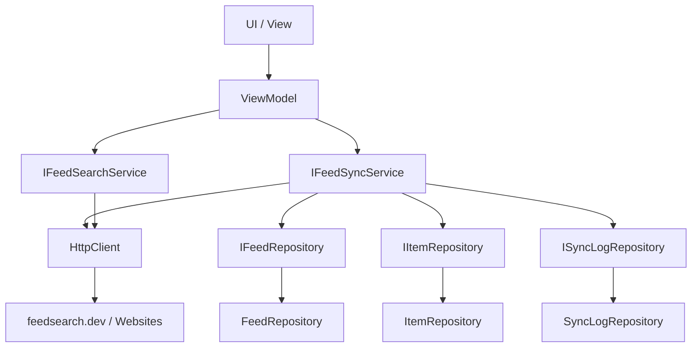

<!-- Licensed under the PolyForm Noncommercial License 1.0.0 - see the LICENSE file in the project root for details. -->

← [Zurück zur Übersicht](index.md)

# Anwendung — Architektur

## Beteiligte Komponenten

| Komponente | Projekt | Rolle |
|------------|---------|-------|
| `Reporter` | `src/Reporter` | .NET MAUI-App mit UI und Navigation |
| `Reporter.Core` | `src/Reporter.Core` | Domänenmodelle, Schnittstellen, ViewModels, mehrsprachige RESX-Ressourcen und Anwendungs-Services |
| `Reporter.Data` | `src/Reporter.Data` | Datenbankzugriff und Repositories |
| `Reporter.Tests` | `src/Reporter.Tests` | Unit- und Integrationstests |

## Abhängigkeiten

- `Reporter` referenziert `Reporter.Core` und `Reporter.Data`.
- `Reporter.Data` referenziert `Reporter.Core`.
- `Reporter.Tests` referenziert `Reporter.Core` und `Reporter.Data`.
- `Microsoft.Extensions.DependencyInjection` wird für alle Services und ViewModels verwendet.
- `CommunityToolkit.Mvvm` bildet die Basis für die ViewModels.
- Externe Abhängigkeit der Feed-Suche: die öffentliche Verzeichnis-API `feedsearch.dev` (JSON-GET ohne Authentifizierung) plus Abruf der jeweils eingegebenen Website für die clientseitige Feed-Autodiscovery — beides synchron über den DI-`HttpClient`; Details siehe [Feed-Suche — Technischer Ablauf](feed-suche-technisch.md).

## Datenfluss

## Wichtige Klassen

- `MauiProgram.CreateMauiApp()` — Konfiguriert DI, Fonts und MAUI; wendet nach `builder.Build()` über `ApplyPersistedLanguage` die gespeicherte Sprachwahl an (`AppCulture.Apply`), bevor `CreateWindow` die `AppShell` erzeugt.
- `Colors.xaml` / `Styles.xaml` — Enthalten das Design-System (Farb- und Typografie-Tokens, Light/Dark-Styles). Beide haben ein `x:Class`-Code-Behind und werden in `App.xaml.cs` der `MergedDictionaries` hinzugefügt. Farbtokens u. a. `SurfaceCard`/`BorderSubtle` (Karten + Hairline), `SurfaceCardTranslucent` (schwebende Leiste), `Status*Tint`/`Status*Text` (Status-Badges), `ChipCountCapsule` (Chip-Zähler), `BookmarkGold`; Typo-Styles u. a. `LabelMdStyle`/`LabelSmStyle`/`LabelMetaStyle`, alle benannten Typo-Styles setzen `FontAutoScalingEnabled="True"` explizit.
- Alle `.csproj` erzwingen XML-Dokumentation (`GenerateDocumentationFile` + `CS1591` als Fehler).
- `AppShell` — Definiert die Shell-Navigation mit den Tabs **Ungelesen**, **Feeds**, **Später**, **Kategorien** und **Einstellungen**; pro Tab wird ein `Icon` aus den `MauiImage`-Assets `tab_*.svg` (`Resources/Images/`) gesetzt, die Einfärbung übernehmen die impliziten Shell-Styles (`TabBarForegroundColor`/`TabBarUnselectedColor`).
- `Newsreader` (Editorial-Headlines) und `Inter` (UI-Texte) — Eingebundene Schriftarten.
- `AppResources` — Typisierter Zugriff auf RESX-Lokalisierung (EN/DE).
- `BaseViewModel` — Basisklasse für die ViewModels mit Netzwerkbezug, erbt von `ObservableObject`; Connectivity-Bausteine siehe Abschnitt zu `INetworkStatusService` weiter unten. `SettingsViewModel` und `CategoriesViewModel` erben direkt von `ObservableObject`.
- `UnreadPage` / `UnreadViewModel` — Ansicht und ViewModel für ungelesene Artikel: paged Liste (`PageSize`, `LoadMoreCommand`, `RemainingItemsThreshold`) und eine horizontal scrollbare Chip-`CollectionView` (`ItemsSource="{Binding Categories}"` über `CategoryFilterItem` mit `IsSelected`/`Count`/`AccessibilityDescription`; Tap → `SelectCategoryCommand`, Aktiv-/Inaktiv-Tokens per `DataTrigger` auf `IsSelected`).
- `FeedsPage` / `FeedsViewModel` — Ansicht und ViewModel für Feeds: reine Listenansicht mit Pull-to-Refresh (`RefreshAllCommand`) und Feed-Kontextmenü (`OnFeedTapped`-ActionSheet mit Aktualisieren/Umbenennen/Kategorie ändern/Bearbeiten/Löschen); das Hinzufügen-/Bearbeiten-Formular liegt als Bottom-Sheet-Overlay (`ShowAddForm`/`IsEditMode`) auf der Seite. Der `HealthStatus` jeder `FeedListItem`-Karte wird als Micro-Pill-Badge gerendert (`DataTrigger` auf `OK`/`Warning`/`Error` → `Status*Tint`-Hintergrund, `Status*`-Dot, `Status*Text`-Textfarbe).
- `LaterPage` / `LaterViewModel` — Ansicht und ViewModel für später gemerkte Artikel mit demselben Paging-Muster wie `UnreadViewModel`: `SavedItems` als `ObservableCollection<ItemListItem>`, `PageSize = 20`, `LoadMoreCommand` (`SemaphoreSlim`-Lock, `HasMore`/`IsLoading`), `ErrorMessage`/`HasError` (`ErrorLoadFailed`); `ToggleSavedAsync`/`MarkReadAsync` aktualisieren die Liste in-place (`Remove`/`ItemListItem.CopyWith`) statt neu zu laden.
- `IFeedSyncService` / `FeedSyncService` — Service zum Abruf, Parsen und Speichern von Feed-Inhalten; ruft nach jedem Sync mit neuen Artikeln fehlerisoliert `INotificationService.NotifyNewItemsAsync` auf. Ersetzt beim ersten Sync einen Platzhalter-`Feed.Title` (leer, `== Url`, `== Host` oder `==` Dateiname der Feed-URL via `FeedTitleFallback.IsFileNamePlaceholderTitle`) durch `SyndicationFeed.Title`. `RunSyncAsync` dedupliziert neue Items in-memory über ein `HashSet<string>` auf `GuidOrHash` (aus den zuvor geladenen `existingItems`; deckt auch Dubletten innerhalb eines Feed-Dokuments ab) und persistiert alle neuen `Item`s einmalig via `IItemRepository.AddRangeAsync` — ein `DbContext`, ein `SaveChangesAsync` statt N+1-Einzelinserts.
- `IFeedSearchService` / `FeedSearchService` (`Reporter.Core`) — Feed-Suche hinter einem Gateway-Vertrag: Verzeichnisabfrage gegen `feedsearch.dev` (`skip_crawl=true`) plus clientseitige Autodiscovery (`<link rel="alternate">`-Parsing, Standardpfade) in einem gemeinsamen 2-s-Zeitbudget; Treffermodell `FeedSearchResult` mit `FeedSearchMatchKind`, Fehler nur als `FeedSearchUnavailableException` bei Ausfall beider Quellen. Der UI-Teil (Eingabe-Klassifikation, `SearchResults`/`ShowSearchResults`, `SearchCommand`/`DirectAddCommand`/`SubscribeResultCommand`/`CloseSearchResultsCommand`, `ConfirmDirectAddAsync`-Callback, Anlage über `TryPersistNewFeedAsync` mit `FeedTitleFallback`-Platzhalter-Titel) liegt in `FeedsViewModel.Search.cs`; Details siehe [Feed-Suche — Technischer Ablauf](feed-suche-technisch.md).
- `INotificationService` / `NotificationService` (`Reporter.Core`) — Entscheidungslogik für lokale Benachrichtigungen (Feed-/globaler Schalter, Ruhezeit via `TimeProvider`, Keyword-Filter, Einzel- vs. Sammel-Modus); Details siehe [Benachrichtigungen](../benachrichtigungen/index.md).
- `ILocalNotificationService` / `LocalNotificationService` (`src/Reporter/Services/`) — Plattformabstraktion für lokale Benachrichtigungen; iOS-Ausprägung über `UserNotifications` (`#if IOS`), No-Op auf anderen Targets. Tap-Handling und Vordergrund-Darstellung über `NotificationDelegate`/`AppDelegate` unter `Platforms/iOS`.
- `IRetentionCleanupService` / `RetentionCleanupService` — Service für das automatische Aufräumen gelesener Artikel nach `Settings.RetentionDays` inkl. Keyword-Löschregel; wird in `App.OnStart` aufgerufen, ungelesene und gemerkte Artikel bleiben erhalten. Details siehe [Aufbewahrung und automatisches Aufräumen](aufbewahrung.md).
- `IKeywordMatcher` / `KeywordMatcher` — Zentrales Keyword-Matching (`OrdinalIgnoreCase`-Teilwort auf Titel und HTML-Inhalt) für den Cleanup und später das Benachrichtigungs-Paket.
- `IAutoRefreshService` / `AutoRefreshService` — `PeriodicTimer`-basierter Hintergrund-Sync (`IFeedSyncService.SyncAllAsync`) mit `TimeProvider` und Overlap-Guard; startet in `App.OnStart`, wird bei Einstellungsänderungen neu konfiguriert. Überspringt Ticks ohne Netzwerk (`INetworkStatusService.IsOnline`), damit offline keine `SyncLog`-Fehler entstehen.
- `IAppThemeService` / `AppThemeService` (`src/Reporter/Services/`) — Setzt `Application.UserAppTheme` anhand `Settings.Theme`; Interface in `Reporter.Core`, Implementierung im MAUI-Projekt, da Core keine MAUI-Referenz hat.
- `INetworkStatusService` / `NetworkStatusService` (`src/Reporter/Services/`) — Plattformabstraktion des Netzwerkzustands nach dem Gateway-Muster (`IsOnline` + `ConnectivityChanged`-Event über `Connectivity.Current`); das Event wird per `MainThread.BeginInvokeOnMainThread` auf den UI-Thread dispatcht. Singleton in `MauiProgram`, frühes Resolve in `App.OnStart`. Alle Sync-Einstiegspunkte (`UnreadViewModel.RefreshAsync`, `FeedsViewModel.RefreshAsync`/`RefreshAllAsync`, `FeedSyncService.SyncAllAsync`/`SyncFeedAsync`, `AutoRefreshService`) prüfen `IsOnline` und brechen offline ohne `SyncLog`-/`HealthStatus`-Schreibzugriff ab.
- `BaseViewModel` — Bietet zusätzlich die Connectivity-Bausteine `InitConnectivity`/`TrackConnectivity`/`UntrackConnectivity`/`RefreshConnectivityStatus` sowie die überschreibbare `OnConnectivityChanged(bool)`: `UnreadViewModel`, `FeedsViewModel` und `LaterViewModel` (Singletons) abonnieren dauerhaft; `ArticleDetailViewModel` (transient) bindet das Abonnement sichtbarkeitsgebunden über `AttachConnectivity()`/`DetachConnectivity()` (`ArticleDetailPage.OnAppearing`/`OnDisappearing`, Letztere inkl. `CancelAutoMarkRead`).
- `ArticleHtmlSanitizer` (`Reporter.Core.Services`, statisch) — Regex-basierte Sanitize-Pipeline für das Artikel-HTML (Skript-/Event-Handler-Entfernung); mit `forOffline: true` werden `<a>`-Tags durch ihren Text ersetzt und ``-Elemente entfernt. Wird von `ArticleDetailViewModel.RebuildHtml` mit `forOffline: !IsOnline` aufgerufen; in `Reporter.Tests` unit-testbar (`ArticleHtmlSanitizerTests`).
- `WebViewNavigationGuard` (`Reporter.Core.Services`, statisch) — `IsExternalUrl` klassifiziert `Navigating`-URLs; nur http/https gilt als extern. `ArticleDetailPage.OnWebViewNavigating` bricht externe Navigation offline mit `e.Cancel = true` ab und zeigt einen lokalisierten Alert.
- `ArticleCardView` — Wiederverwendbare Artikelkarte; das `BindableProperty IsOnline` (Default `true`) blendet den 80×80-Thumbnail-`Border` offline per `DataTrigger` aus; gebunden auf `UnreadPage` und `LaterPage` über `Source={x:Reference PageRoot}`. Zeigt `ReadingTimeText` in der Meta-Zeile (ausgeblendet bei leerem Text via `StringNotEmptyToBoolConverter`), einen 6-pt-`Secondary`-Ungelesen-Dot per `DataTrigger` auf `IsRead=False` und füllt das Lesezeichen mit `BookmarkGold`; Karten-`Stroke` ist `BorderSubtle`, Aktions-`Border` und Tap-Overlay tragen `SemanticProperties.Description`/`-Hint`.
- `ArticleDetailPage` / `ArticleDetailViewModel` — Detailansicht mit `Grid RowDefinitions="Auto,Auto,Auto,*,Auto,Auto"`; die Aktionsleiste in Row 5 ist eine schwebende Pill (`SurfaceCardTranslucent`, `BorderSubtle`, `Shadow`), deren sechs Aktionen als echte transparente `Button`-Controls über den Icon-Glyphen liegen — dadurch erscheinen sie mit ihren `SemanticProperties.Description`s im UI-Automation-/Screenreader-Baum. Source-Footer und Aktionsleiste werden vor dem `WebView` deklariert (WebView2 kann die UIA-Enumeration späterer Geschwister abschneiden).
- `ReadingTimeEstimator` (`Reporter.Core.Services`, statisch) — `EstimateText(contentHtml)` liefert die lokalisierte Lesezeit (`ArticleReadingTimeFormat`, 200 Wörter/Minute, mindestens 1) aus der HTML-Wortzählung; geteilt zwischen den `ItemRepository`-Projektionen (`ItemListItem.ReadingTimeText`) und `ArticleDetailViewModel`.
- `ItemListItem` — Projektionsmodell für Listenkarten; `CopyWith(isRead, isSavedForLater)` erzeugt Zustandskopien für die in-place-Updates in `UnreadViewModel`/`LaterViewModel`.
- `CategoryFilterItem` — Filter-Chip-Modell (`Name`, `Count`, `IsSelected`); `AccessibilityDescription` liefert die lokalisierte Screenreader-Beschreibung inkl. Singular/Plural (`AccessibilityCategoryFilter`/`AccessibilityCategoryFilterSingular`, `AccessibilitySelected`/`AccessibilityNotSelected`) und invalidiert sich über `NotifyPropertyChangedFor` bei `Count`-/`IsSelected`-Änderungen.
- `FeedSearchResult` — In-Memory-Treffer der Feed-Suche; `DisplayTitle` = `Title ?? FeedUrl` für Karten-Überschrift und `SemanticProperties.Description`.
- `AppResources` — Typisierter Zugriff auf RESX-Lokalisierung: neutrale `AppResources.resx` = Englisch = Fallback für alle Nicht-DE-Systemsprachen, `AppResources.de.resx` = Deutsch; Auswahl über `CultureInfo.CurrentUICulture`. Die statische Klasse `AppCulture` (`Reporter.Core.Localization`) setzt beim App-Start `CurrentUICulture`/`CurrentCulture` sowie `DefaultThreadCurrentUICulture`/`DefaultThreadCurrentCulture` aus der persistierten Sprachwahl (`Settings.Language`: `"system"`/`"de"`/`"en"`); bei `"system"` bleibt die Gerätesprache wirksam. Persistierte `SyncLog`-Meldungen bleiben bewusst englisch.
- `SettingsPage` / `SettingsViewModel` — Ausgebaute Einstellungsseite mit Sofort-Persistierung und Keyword-Verwaltung; Details siehe [Einstellungen](../einstellungen/index.md).
- `Item` — Domänenmodell für einen Artikel (`Id`, `Title`, `IsRead`, `ContentHtml`).
- `IItemRepository` / `ItemRepository` — Schnittstelle und Implementierung für den Artikel-Zugriff; gepagte Queries `GetUnreadByDateAsync(page, pageSize)` und `GetSavedForLaterAsync(page, pageSize)` (`Skip`/`Take` + `ThenBy(Id)`-Stabilisierung), Batch-Insert `AddRangeAsync`; beide `ItemListItem`-Projektionen laufen über die gemeinsamen Helfer `SelectListItemRows`/`MapToListItem` und füllen `ReadingTimeText` via `ReadingTimeEstimator`.
- `ISyncLogRepository` / `SyncLogRepository` — Schnittstelle und Implementierung für Synchronisations-Logs.
