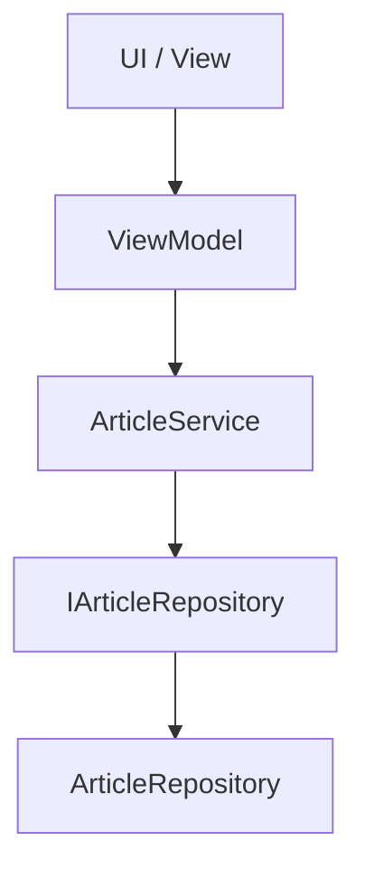

← [Zurück zur Übersicht](index.md)

# Anwendung — Architektur

## Beteiligte Komponenten

| Komponente | Projekt | Rolle |
|------------|---------|-------|
| `Reporter` | `src/Reporter` | .NET MAUI-App mit UI, Navigation und ViewModels |
| `Reporter.Core` | `src/Reporter.Core` | Domänenmodelle, Schnittstellen und Anwendungs-Services |
| `Reporter.Data` | `src/Reporter.Data` | Datenbankzugriff und Repositories |
| `Reporter.Tests` | `src/Reporter.Tests` | Unit- und Integrationstests |

## Abhängigkeiten

- `Reporter` referenziert `Reporter.Core` und `Reporter.Data`.
- `Reporter.Data` referenziert `Reporter.Core`.
- `Reporter.Tests` referenziert `Reporter.Core` und `Reporter.Data`.
- `Microsoft.Extensions.DependencyInjection` wird für alle Services und ViewModels verwendet.
- `CommunityToolkit.Mvvm` bildet die Basis für die ViewModels.

## Datenfluss

## Wichtige Klassen

- `MauiProgram.CreateMauiApp()` — Konfiguriert DI, Fonts und MAUI.
- `Colors.xaml` / `Styles.xaml` — Enthalten das Design-System (Farb- und Typografie-Tokens, Light/Dark-Styles).
- `AppShell` — Definiert die Shell-Navigation mit den Tabs **Ungelesen**, **Feeds**, **Später** und **Einstellungen**.
- `Newsreader` (Editorial-Headlines) und `Inter` (UI-Texte) — Eingebundene Schriftarten.
- `BaseViewModel` — Basisklasse für alle ViewModels, erbt von `ObservableObject`.
- `UnreadPage` / `UnreadViewModel` — Ansicht und ViewModel für ungelesene Artikel.
- `FeedsPage` / `FeedsViewModel` — Ansicht und ViewModel für Feeds.
- `LaterPage` / `LaterViewModel` — Ansicht und ViewModel für später gemerkte Artikel.
- `SettingsPage` / `SettingsViewModel` — Ansicht und ViewModel für Einstellungen.
- `Article` — Domänenmodell für einen Artikel (`Id`, `Title`, `IsRead`).
- `IArticleRepository` / `ArticleRepository` — Schnittstelle und Implementierung für den Artikel-Zugriff.
- `IArticleService` / `ArticleService` — Anwendungs-Service für Artikel-Operationen.
