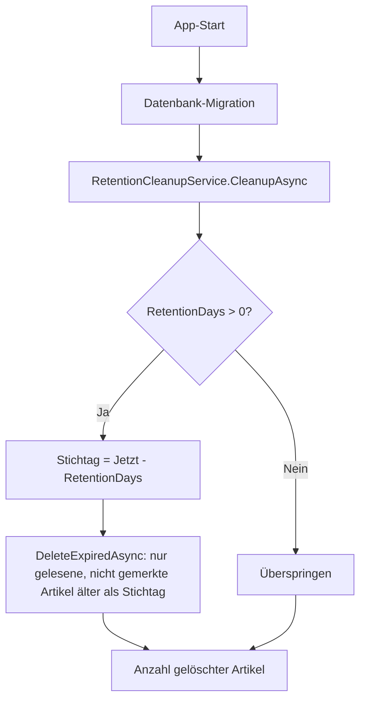

← [Zurück zur Übersicht](index.md)

# Anwendung — Aufbewahrung und automatisches Aufräumen

Beim App-Start entfernt Reporter gelesene Artikel, deren Aufbewahrungsfrist abgelaufen ist. Für später gemerkte Artikel sind von dieser automatischen Löschung strukturell ausgenommen.

## Technischer Ablauf

### 1. App-Start

`App.OnStart` führt in einem eigenen DI-Scope zunächst `Database.MigrateAsync()` aus und ruft danach `IRetentionCleanupService.CleanupAsync()` auf. Der Aufruf ist fehlerisoliert: Ein Fehler beim Aufräumen wird per `Debug.WriteLine` protokolliert und blockiert den App-Start nicht.

Beteiligte Komponenten:
- `App.OnStart` — Aufrufpunkt, Fehlerisolierung
- `IRetentionCleanupService` / `RetentionCleanupService` — Orchestrierung (`Reporter.Core`)
- `ISettingsRepository` / `SettingsRepository` — Lesen der Singleton-Einstellungen
- `IItemRepository` / `ItemRepository` — Ausführung der Löschung

### 2. Frist prüfen und Stichtag berechnen

`RetentionCleanupService.CleanupAsync` lädt die Einstellungen über `ISettingsRepository.GetAsync()`:

- `Settings.RetentionDays <= 0` → der Cleanup wird übersprungen, Rückgabe `0` (Schutzregel: Ohne diesen Abbruch läge der Stichtag in der Zukunft und alle gelesenen Artikel würden gelöscht).
- Sonst: `cutoff = DateTime.UtcNow.AddDays(-settings.RetentionDays)`.

### 3. Abgelaufene Artikel löschen

`IItemRepository.DeleteExpiredAsync(cutoff)` führt in `ItemRepository` ein `ExecuteDeleteAsync` mit der Bedingung `IsRead && !IsSavedForLater && (ReadAt ?? PublishedAt) < cutoff` aus und liefert die Anzahl gelöschter Artikel zurück.

## Business Rules

### Lösch-Invariante „Für später bewahren"

**Beschreibung:** Für später gemerkte Artikel werden nie automatisch gelöscht.

**Bedingungen:**
- `IsSavedForLater == true` → Artikel ist per `ExecuteDeleteAsync`-Filter von der Löschung ausgeschlossen.
- Die Bedingung ist fester Teil von `DeleteExpiredAsync`, der einzigen automatischen Löschmethode — sie kann nicht versehentlich umgangen werden.

**Umsetzung:** `ItemRepository.DeleteExpiredAsync`

### Welche Artikel gelöscht werden

| Bedingung | Verhalten |
|-----------|-----------|
| `IsRead == false` | Bleibt erhalten — die Frist gilt nur für gelesene Artikel. |
| `IsSavedForLater == true` | Bleibt erhalten — Lösch-Invariante. |
| `(ReadAt ?? PublishedAt) >= cutoff` | Bleibt erhalten — innerhalb der Frist. |
| `ReadAt` und `PublishedAt` beide `null` | Bleibt erhalten — der NULL-Vergleich trifft nicht. |
| `ReadAt` gesetzt | Maßgeblich ist der Lesezeitpunkt (`ReadAt`), nicht das Veröffentlichungsdatum. |

### Ausnahmen von der Invariante

- `IItemRepository.DeleteAsync(Guid)` löscht einen einzelnen Artikel ohne `IsSavedForLater`-Prüfung; die Methode ist für explizite Einzellöschungen vorgesehen und hat aktuell keinen produktiven Aufrufer.
- Das explizite, rückfragebestätigte Löschen eines Feeds entfernt dessen Artikel per `DeleteBehavior.Cascade` — inklusive gemerkter Artikel. Das gilt als bestätigte Nutzeraktion, nicht als automatische Löschung.

## Konfiguration

| Parameter | Typ | Standardwert | Beschreibung |
|-----------|-----|--------------|--------------|
| `Settings.RetentionDays` | `int` | `30` | Aufbewahrungsdauer in Tagen; Singleton-Datensatz, wird beim ersten Zugriff angelegt. `<= 0` deaktiviert das Aufräumen. |

Die Frist ist derzeit nicht über die Einstellungen-Seite der App konfigurierbar; die `IsSavedForLater`-Ausnahme ist nicht abschaltbar.
