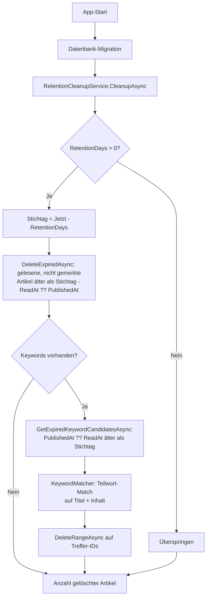

← [Zurück zur Übersicht](index.md)

# Anwendung — Aufbewahrung und automatisches Aufräumen

Beim App-Start entfernt Reporter gelesene Artikel, deren Aufbewahrungsfrist abgelaufen ist — zusätzlich gelesene Artikel, die ein konfiguriertes Filter-Schlagwort enthalten und deren Veröffentlichungsdatum die Frist überschreitet. Ungelesene und für später gemerkte Artikel sind von dieser automatischen Löschung strukturell ausgenommen.

## Technischer Ablauf

### 1. App-Start

`App.OnStart` führt in einem eigenen DI-Scope zunächst `Database.MigrateAsync()` aus und ruft danach `IRetentionCleanupService.CleanupAsync()` auf. Der Aufruf ist fehlerisoliert: Ein Fehler beim Aufräumen wird per `Debug.WriteLine` protokolliert und blockiert den App-Start nicht.

Beteiligte Komponenten:
- `App.OnStart` — Aufrufpunkt, Fehlerisolierung
- `IRetentionCleanupService` / `RetentionCleanupService` — Orchestrierung (`Reporter.Core`)
- `ISettingsRepository` / `SettingsRepository` — Lesen der Singleton-Einstellungen
- `IItemRepository` / `ItemRepository` — Ausführung der Löschung

### 2. Frist prüfen und Stichtag berechnen

`RetentionCleanupService.CleanupAsync` lädt die Einstellungen über `ISettingsRepository.GetAsync()`:

- `Settings.RetentionDays <= 0` → der Cleanup wird übersprungen, Rückgabe `0` (Schutzregel: Ohne diesen Abbruch läge der Stichtag in der Zukunft und alle gelesenen Artikel würden gelöscht; gilt für beide Löschregeln).
- Sonst: `cutoff = DateTime.UtcNow.AddDays(-settings.RetentionDays)`.

### 3. Abgelaufene Artikel löschen

`IItemRepository.DeleteExpiredAsync(cutoff)` führt in `ItemRepository` ein `ExecuteDeleteAsync` mit der Bedingung `IsRead && !IsSavedForLater && (ReadAt ?? PublishedAt) < cutoff` aus und liefert die Anzahl gelöschter Artikel zurück. Fristbasis ist der Lesezeitpunkt (`ReadAt`, Fallback `PublishedAt`).

### 4. Keyword-gefilterte Artikel löschen

Anschließend läuft die Keyword-Löschregel:

1. `IKeywordRepository.GetAllAsync` liefert die Filterliste; bei leerer Liste endet der Cleanup mit der bisherigen Löschzahl.
2. `IItemRepository.GetExpiredKeywordCandidatesAsync(cutoff)` lädt Kandidaten: `IsRead && !IsSavedForLater && (PublishedAt ?? ReadAt) < cutoff` — Fristbasis ist hier das Veröffentlichungsdatum (`PublishedAt`, Fallback `ReadAt`).
3. `IKeywordMatcher.MatchesAny(item.Title, item.ContentHtml, keywordTexts)` filtert Treffer im Speicher: Teilwort-Vergleich per `Contains` mit `StringComparison.OrdinalIgnoreCase` auf Titel und HTML-Inhalt; `Link` wird nicht gematcht.
4. `IItemRepository.DeleteRangeAsync(matchedIds)` löscht die Treffer per `ExecuteDeleteAsync` auf IDs; der Gesamtrückgabewert ist die Summe beider Löschungen.

## Business Rules

### Lösch-Invariante „Für später bewahren"

**Beschreibung:** Für später gemerkte Artikel werden nie automatisch gelöscht.

**Bedingungen:**
- `IsSavedForLater == true` → Artikel ist per `ExecuteDeleteAsync`-Filter von der Löschung ausgeschlossen.
- Die Bedingung ist fester Teil beider automatischen Löschpfade — `DeleteExpiredAsync` und `GetExpiredKeywordCandidatesAsync`/`DeleteRangeAsync` — sie kann nicht versehentlich umgangen werden.

**Umsetzung:** `ItemRepository.DeleteExpiredAsync`, `ItemRepository.GetExpiredKeywordCandidatesAsync`

### Welche Artikel gelöscht werden

| Bedingung | Verhalten |
|-----------|-----------|
| `IsRead == false` | Bleibt erhalten — beide Regeln gelten nur für gelesene Artikel. |
| `IsSavedForLater == true` | Bleibt erhalten — Lösch-Invariante, gilt auch für die Keyword-Regel. |
| `(ReadAt ?? PublishedAt) >= cutoff` | Bleibt bei der allgemeinen Regel erhalten — innerhalb der Frist. |
| `ReadAt` und `PublishedAt` beide `null` | Bleibt erhalten — der NULL-Vergleich trifft nicht. |
| `ReadAt` gesetzt | Allgemeine Regel: Maßgeblich ist der Lesezeitpunkt (`ReadAt`), nicht das Veröffentlichungsdatum. |
| Keyword-Match und `(PublishedAt ?? ReadAt) < cutoff` | Keyword-Regel: Wird gelöscht — hier zählt das Veröffentlichungsdatum, damit die Regel nicht zur leeren Teilmenge der allgemeinen Regel wird. |

### Keyword-Matching

- Match-Felder: `Item.Title` und `Item.ContentHtml`; `Item.Link` wird bewusst nicht gematcht (opake URLs, Zufallstreffer).
- Semantik: Teilwort + `OrdinalIgnoreCase` — fest verdrahtet, nicht konfigurierbar (in der UI als nicht-interaktives Badge „Immer aktiv" neben „Teilwort & Case-Insensitive" dargestellt).
- Zeitpunkt: Matching zur Cleanup-Zeit gegen die gespeicherten Inhalte — kein Filter-Flag am `Item`, Keyword-Änderungen wirken beim nächsten App-Start sofort.

### Ausnahmen von der Invariante

- `IItemRepository.DeleteAsync(Guid)` löscht einen einzelnen Artikel ohne `IsSavedForLater`-Prüfung; die Methode ist für explizite Einzellöschungen vorgesehen und hat aktuell keinen produktiven Aufrufer.
- Das explizite, rückfragebestätigte Löschen eines Feeds entfernt dessen Artikel per `DeleteBehavior.Cascade` — inklusive gemerkter Artikel. Das gilt als bestätigte Nutzeraktion, nicht als automatische Löschung.

## Konfiguration

| Parameter | Typ | Standardwert | Beschreibung |
|-----------|-----|--------------|--------------|
| `Settings.RetentionDays` | `int` | `30` | Aufbewahrungsdauer in Tagen; Singleton-Datensatz, wird beim ersten Zugriff angelegt. `<= 0` deaktiviert das Aufräumen. |
| `keywords`-Tabelle | Datensätze | leer | Schlagwortliste der Blacklist; `keyword_text` max. 500 Zeichen, Unique-Index. |

Die Frist ist über den Schieberegler **Gelesene Artikel aufbewahren** (1–365 Tage) auf der Seite **Einstellungen** konfigurierbar; dort werden auch die Filter-Schlagworte als Chips verwaltet — Details siehe [Einstellungen](../einstellungen/index.md). Die `IsSavedForLater`-Ausnahme ist nicht abschaltbar.
