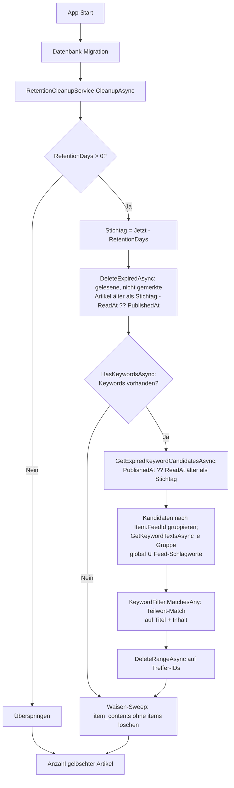

<!-- Licensed under the PolyForm Noncommercial License 1.0.0 - see the LICENSE file in the project root for details. -->

← [Zurück zur Übersicht](index.md)

# Anwendung — Aufbewahrung und automatisches Aufräumen

Beim App-Start entfernt Reporter gelesene Artikel, deren Aufbewahrungsfrist abgelaufen ist — zusätzlich bereits gespeicherte gelesene Artikel, die ein konfiguriertes Filter-Schlagwort enthalten (global oder feed-spezifisch) und deren Veröffentlichungsdatum die Frist überschreitet. Neu abgerufene Artikel mit Schlagwort-Treffer werden dagegen bereits beim Feed-Abruf verworfen und gar nicht erst gespeichert — sie erscheinen in keiner Liste; die Anzahl verworfener Treffer steht im Sync-Verlauf (`, N filtered` in der `SyncLog.Message`). Ungelesene und für später gemerkte Artikel sind von dieser automatischen Löschung strukturell ausgenommen.

## Technischer Ablauf

### 1. App-Start

`App.OnStart` führt in einem eigenen DI-Scope zunächst fehlerisoliert die Content-Migration aus (`MigrateContentAsync` → `IContentMigrationService.MigrateLegacyContentAsync` — bewusst vor der Haupt-Migration, weil diese die Legacy-Spalte `items.content_html` entfernt) und danach `Database.MigrateAsync()`; anschließend ruft es `IRetentionCleanupService.CleanupAsync()` auf. Der Aufruf ist fehlerisoliert: Ein Fehler beim Aufräumen wird per `Debug.WriteLine` protokolliert und blockiert den App-Start nicht.

Beteiligte Komponenten:
- `App.OnStart` — Aufrufpunkt, Fehlerisolierung
- `IRetentionCleanupService` / `RetentionCleanupService` — Orchestrierung (`Reporter.Core`)
- `ISettingsRepository` / `SettingsRepository` — Lesen der Singleton-Einstellungen
- `IItemRepository` / `ItemRepository` — Ausführung der Löschung
- `IItemContentStore` / `ItemContentRepository` — Content-Speicher (`reporter-content.db`) für den Waisen-Sweep

### 2. Frist prüfen und Stichtag berechnen

`RetentionCleanupService.CleanupAsync` lädt die Einstellungen über `ISettingsRepository.GetAsync()`:

- `Settings.RetentionDays <= 0` → der Cleanup wird übersprungen, Rückgabe `0` (Schutzregel: Ohne diesen Abbruch läge der Stichtag in der Zukunft und alle gelesenen Artikel würden gelöscht; gilt für beide Löschregeln).
- Sonst: `cutoff = DateTime.UtcNow.AddDays(-settings.RetentionDays)`.

### 3. Abgelaufene Artikel löschen

`IItemRepository.DeleteExpiredAsync(cutoff)` führt in `ItemRepository` ein `ExecuteDeleteAsync` mit der Bedingung `IsRead && !IsSavedForLater && (ReadAt ?? PublishedAt) < cutoff` aus und liefert die Anzahl gelöschter Artikel zurück. Fristbasis ist der Lesezeitpunkt (`ReadAt`, Fallback `PublishedAt`).

### 4. Keyword-gefilterte Artikel löschen

Neu abgerufene Artikel mit Keyword-Treffer erreichen diesen Pfad nicht: `FeedSyncService.RunSyncAsync` matcht jedes neue `SyndicationItem` beim Abruf gegen die für den Feed wirksame Keyword-Liste (`IKeywordFilter.GetKeywordTextsAsync(feed.Id)` = Union aus globalen und Feed-Schlagworten; `IKeywordFilter.MatchesAny` auf Titel und Inhalt) und verwirft Treffer, bevor sie gespeichert werden; die Anzahl wird als `, N filtered` in der `SyncLog.Message` ausgewiesen. Die folgende Löschregel bereinigt daher nur noch Treffer, die vor Anlage des Schlagworts gespeichert wurden.

Anschließend läuft die Keyword-Löschregel:

1. `IKeywordFilter.HasKeywordsAsync` prüft, ob überhaupt ein Schlagwort existiert (global oder feed-spezifisch); bei `false` endet der Cleanup mit der bisherigen Löschzahl — die Kandidatenabfrage wird dann komplett übersprungen.
2. `IItemRepository.GetExpiredKeywordCandidatesAsync(cutoff)` lädt Kandidaten: `IsRead && !IsSavedForLater && (PublishedAt ?? ReadAt) < cutoff` — Fristbasis ist hier das Veröffentlichungsdatum (`PublishedAt`, Fallback `ReadAt`).
3. Die Kandidaten werden nach `Item.FeedId` gruppiert; pro Gruppe liefert `IKeywordFilter.GetKeywordTextsAsync(feedId)` die wirksame Liste (Union aus globalen und Feed-Schlagworten). Gruppen ohne wirksame Schlagworte werden übersprungen.
4. `IKeywordFilter.MatchesAny(item.Title, item.ContentHtml, keywordTexts)` filtert Treffer im Speicher pro Feed-Gruppe: Teilwort-Vergleich per `Contains` mit `StringComparison.OrdinalIgnoreCase` auf Titel und HTML-Inhalt; `Link` wird nicht gematcht.
5. `IItemRepository.DeleteRangeAsync(matchedIds)` löscht die gesammelten Treffer-IDs aller Gruppen per `ExecuteDeleteAsync`; der Gesamtrückgabewert ist die Summe beider Löschungen.

Die Kandidaten kommen hydratisiert aus dem `ItemRepository` — `item.ContentHtml` stammt dabei aus dem Content-Speicher (`reporter-content.db`, Tabelle `item_contents`), nicht aus der `items`-Tabelle.

### 5. Content-Waisen aufräumen

Artikelinhalt und lokal gespeichertes Artikelbild liegen getrennt von den Nutzerdaten in der Content-Datenbank `reporter-content.db` (siehe [Datenmodell](datenmodell.md)) — eine `item_contents`-Zeile kann Inhalt, Bild oder beides tragen. Damit dort keine verwaisten Zeilen liegen bleiben, führt `RetentionCleanupService` am Ende von `CleanupAsync` zusätzlich einen Sweep durch (er läuft nur bei aktiver Aufbewahrungsfrist — bei `RetentionDays <= 0` endet `CleanupAsync` bereits vorher):

1. `IItemContentStore.GetItemIdsAsync()` liest alle im Content-Speicher vorhandenen `item_id`-Werte.
2. `IItemRepository.GetAllIdsAsync()` liefert die noch existierenden Artikel-IDs der Hauptdatenbank.
3. `IItemContentStore.DeleteRangeAsync` löscht alle Content-IDs ohne zugehörigen Artikel.

Der Sweep ist Sicherheitsnetz: Die expliziten Löschpfade räumen `item_contents` bereits unmittelbar mit — `DeleteAsync`, `DeleteExpiredAsync` und `DeleteRangeAsync` im `ItemRepository` sowie `FeedRepository.DeleteAsync`, das nach der Haupt-Datenbankkaskade die Inhalte und Bilder aller Artikel des Feeds entfernt. Da die Bilddaten in denselben Zeilen liegen, gehen sie bei jeder Löschung automatisch mit verloren. Der Sweep entfernt Restbestände, die trotzdem zurückgeblieben sind (etwa aus einem früheren Zwischenstand). Der Rückgabewert von `CleanupAsync` zählt weiterhin nur gelöschte Artikel — Waisen-Zeilen fließen nicht in die Zahl ein.

## Business Rules

### Lösch-Invariante „Für später bewahren"

**Beschreibung:** Für später gemerkte Artikel werden nie automatisch gelöscht.

**Bedingungen:**
- `IsSavedForLater == true` → Artikel ist per `ExecuteDeleteAsync`-Filter von der Löschung ausgeschlossen.
- Die Bedingung ist fester Teil beider automatischen Löschpfade — `DeleteExpiredAsync` und `GetExpiredKeywordCandidatesAsync`/`DeleteRangeAsync` — sie kann nicht versehentlich umgangen werden.

**Umsetzung:** `ItemRepository.DeleteExpiredAsync`, `ItemRepository.GetExpiredKeywordCandidatesAsync`

### Welche Artikel gelöscht werden

| Bedingung | Verhalten |
|-----------|-----------|
| `IsRead == false` | Bleibt erhalten — beide Regeln gelten nur für gelesene Artikel. |
| `IsSavedForLater == true` | Bleibt erhalten — Lösch-Invariante, gilt auch für die Keyword-Regel. |
| `(ReadAt ?? PublishedAt) >= cutoff` | Bleibt bei der allgemeinen Regel erhalten — innerhalb der Frist. |
| `ReadAt` und `PublishedAt` beide `null` | Bleibt erhalten — der NULL-Vergleich trifft nicht. |
| `ReadAt` gesetzt | Allgemeine Regel: Maßgeblich ist der Lesezeitpunkt (`ReadAt`), nicht das Veröffentlichungsdatum. |
| Keyword-Match und `(PublishedAt ?? ReadAt) < cutoff` | Keyword-Regel: Wird gelöscht — hier zählt das Veröffentlichungsdatum, damit die Regel nicht zur leeren Teilmenge der allgemeinen Regel wird. |

### Keyword-Matching

- Match-Felder: `Item.Title` und `Item.ContentHtml`; `Item.Link` wird bewusst nicht gematcht (opake URLs, Zufallstreffer).
- Semantik: Teilwort + `OrdinalIgnoreCase` — fest verdrahtet, nicht konfigurierbar (in der UI als nicht-interaktives Badge „Immer aktiv" neben „Teilwort, Groß-/Kleinschreibung egal" dargestellt).
- Schlagwort-Bereich: Die wirksame Liste eines Artikels ist die Union aus den globalen Schlagworten (`keywords.feed_id IS NULL`, gepflegt in den Einstellungen) und den Schlagworten seines Feeds (`keywords.feed_id = items.feed_id`, gepflegt im Formular **Feed bearbeiten** der Feeddetailansicht); ein Schlagwort eines anderen Feeds wirkt nie.
- Zeitpunkt: zweifach — beim Feed-Abruf in `FeedSyncService` gegen die abgerufenen Inhalte (Treffer werden gar nicht erst gespeichert) und zur Cleanup-Zeit gegen die gespeicherten Inhalte. Es gibt kein Filter-Flag am `Item`; Keyword-Änderungen wirken beim nächsten Abruf bzw. App-Start sofort.

### Ausnahmen von der Invariante

- `IItemRepository.DeleteAsync(Guid)` löscht einen einzelnen Artikel ohne `IsSavedForLater`-Prüfung; die Methode ist für explizite Einzellöschungen vorgesehen und hat aktuell keinen produktiven Aufrufer.
- Das explizite, rückfragebestätigte Löschen eines Feeds entfernt dessen Artikel per `DeleteBehavior.Cascade` — inklusive gemerkter Artikel; `FeedRepository.DeleteAsync` löscht die zugehörigen `item_contents`-Zeilen im Content-Speicher anschließend explizit mit. Das gilt als bestätigte Nutzeraktion, nicht als automatische Löschung.

## Konfiguration

| Parameter | Typ | Standardwert | Beschreibung |
|-----------|-----|--------------|--------------|
| `Settings.RetentionDays` | `int` | `30` | Aufbewahrungsdauer in Tagen; Singleton-Datensatz, wird beim ersten Zugriff angelegt. `<= 0` deaktiviert das Aufräumen. |
| `keywords`-Tabelle | Datensätze | leer | Schlagwortliste des Keyword-Filters; `keyword_text` max. 500 Zeichen, `feed_id` nullable (`null` = global, sonst Feed-Zuordnung per FK auf `feeds.id` mit `ON DELETE CASCADE`); Eindeutigkeit pro Bereich über Unique-Index `(feed_id, keyword_text)` plus gefiltertem Unique-Index `keyword_text WHERE feed_id IS NULL`. |

Die Frist ist über den Schieberegler **Gelesene Artikel aufbewahren** (1–365 Tage) auf der Seite **Einstellungen** konfigurierbar; dort werden auch die globalen Filter-Schlagworte als Chips verwaltet — feed-spezifische Schlagworte pflegst du im Formular **Feed bearbeiten** der Feeddetailansicht (Details siehe [Einstellungen](../einstellungen/index.md) und [Feeddetailansicht](feeddetailansicht.md)). Die `IsSavedForLater`-Ausnahme ist nicht abschaltbar.
