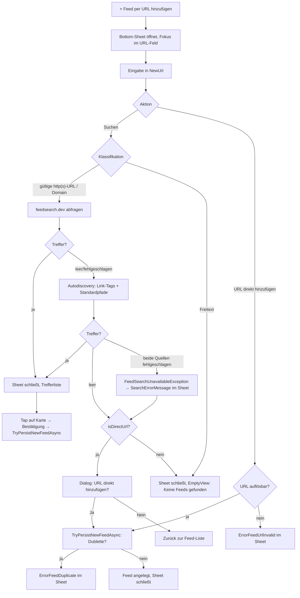

<!-- Licensed under the PolyForm Noncommercial License 1.0.0 - see the LICENSE file in the project root for details. -->

← [Zurück zur Übersicht](index.md)

# Feed-Suche — Technischer Ablauf

## Übersicht

Die `FeedsPage` ist eine reine Listenansicht: Die Feed-Liste füllt den Seitenbereich (`Grid`-Row `*`), darüber sitzt nur der Primär-Button `ActionAddFeed`. Das Hinzufügen-Formular ist ein In-Page-Bottom-Sheet-`Grid`-Overlay (halbtransparenter `BoxView`-Backdrop mit `TapGestureRecognizer` + unten angedockte `Border`-Karte, Sichtbarkeit per `DataTrigger` auf `ShowAddForm`). Das Sheet kennt zwei Modi: **Add-Modus** (`Entry NewUrl` + „Suchen" + „URL direkt hinzufügen") und **Edit-Modus** (`IsEditMode` — URL-`Entry`, `Switch FeedNotificationsEnabled` + iOS-Hinweis, „Speichern"; Such-/Direkt-Add-Buttons und Offline-Hinweis sind per `DataTrigger`/`CanExecute` ausgeblendet bzw. deaktiviert). Die Suche läuft über `IFeedSearchService` und umfasst zwei Quellen in einem gemeinsamen Zeitbudget: die öffentliche Verzeichnis-API **feedsearch.dev** und eine clientseitige Autodiscovery auf der eingegebenen Website. Treffer werden als `FeedSearchResult`-Liste an das `FeedsViewModel` zurückgegeben; die Trefferansicht ersetzt weiterhin die Feed-Liste auf Seitenebene, das Sheet schließt sich automatisch (`ShowAddForm = false`), sobald `ShowSearchResults = true` wird.

Neue Feeds werden mit festen Defaults persistiert (`CategoryId = null`, `NotificationsEnabled = true`, `HealthStatus = FeedHealth.Ok`) und erhalten ohne bekannten Titel einen Platzhalter aus `FeedTitleFallback` (letztes nicht-leeres, URL-dekodiertes Pfadsegment → `Host` → URL), den `FeedSyncService` beim ersten Sync durch `SyndicationFeed.Title` ersetzt. Das Feed-Kontextmenü (`OnFeedTapped` → `DisplayActionSheetAsync`) bietet zusätzlich „Umbenennen" (`DisplayPromptAsync` → `RenameFeedAsync`) und „Kategorie ändern" (`DisplayActionSheetAsync` → `ChangeFeedCategoryAsync`).

## Beteiligte Komponenten

| Komponente | Typ | Rolle |
|------------|-----|-------|
| `IFeedSearchService` (`src/Reporter.Core/Interfaces`) | Interface | Vertrag: `SearchAsync(string query, CancellationToken)` → geordnete `IReadOnlyList<FeedSearchResult>`; wirft `FeedSearchUnavailableException`, wenn beide Quellen scheitern. |
| `FeedSearchService` (`src/Reporter.Core/Services`) | Service | Implementierung: Verzeichnisabfrage + Autodiscovery, Mapping, Dedupe, Sortierung. Konstruktor-Dep `HttpClient` (DI-Singleton, 30 s Timeout). Singleton in `MauiProgram`. |
| `FeedSearchResult` (`src/Reporter.Core/Models`) | Datenmodell | In-Memory-Treffer: `Title`, `Description`, `SiteName`, `SiteUrl`, `FeedUrl` (required), `Score`, `MatchKind`. Wird nie persistiert. |
| `FeedSearchMatchKind` (`src/Reporter.Core/Models`) | Enum | Trefferart in Sortierreihenfolge: `ExactUrl`, `Directory`, `Discovered`. |
| `FeedSearchUnavailableException` (`src/Reporter.Core/Services`) | Exception | Einheitlicher Fehler: Verzeichnis **und** Autodiscovery fehlgeschlagen. |
| `FeedTitleFallback` (`src/Reporter.Core/Services`) | Statische Hilfsklasse | `GetFallbackTitle(url)` — letztes nicht-leeres, URL-dekodiertes Pfadsegment → `Host` → URL; `IsFileNamePlaceholderTitle(title, url)` — `OrdinalIgnoreCase`-Vergleich Titel vs. Dateiname für die Sync-Platzhalter-Erkennung. |
| `FeedsViewModel` (`FeedsViewModel.cs` + `FeedsViewModel.Search.cs`) | ViewModel | Sheet-Zustand (`ShowAddForm`, `IsEditMode`, `OpenAddFormCommand`, `CloseAddFormCommand` → `ResetForm`), Eingabe-Klassifikation, Suchzustand (`SearchResults`, `ShowSearchResults`, `IsSearching`, `SearchErrorMessage`/`HasSearchError`), Commands `SearchCommand`, `DirectAddCommand`, `SubscribeResultCommand`, `CloseSearchResultsCommand`, Callback `ConfirmDirectAddAsync`, öffentliche Methoden `RenameFeedAsync`, `ChangeFeedCategoryAsync`, gemeinsame Helfer `TryPersistNewFeedAsync`, `FinishAddFlowAsync`, `ToFeed`. |
| `FeedsPage` (`src/Reporter/Views`) | Page/Code-Behind | XAML für Sheet-Overlay, Treffer-`CollectionView`, Attribution, Offline-/Fehlerhinweise (auf Seitenebene **und** identisch gebunden im Sheet-Hinweisblock); `OnFeedTapped` (ActionSheet: `ButtonRefresh`, `ButtonRename`, `ButtonChangeCategory`, `ButtonEdit`, `ButtonDelete`), `OnSearchResultTapped`, `ConfirmDirectAddAsync`, `DisplayPromptAsync` für Umbenennen, `DisplayActionSheetAsync` für Kategorie, `OnBackButtonPressed`-Override (schließt offenes Sheet), `PropertyChanged`-Handler für `NewUrlEntry.Focus()` beim Öffnen. |
| `FeedSyncService` (`src/Reporter.Core/Services`) | Service | Ersetzt beim ersten Sync einen Platzhalter-Titel durch `SyndicationFeed.Title` (Erkennung: leer, `== Url`, `IsHostPlaceholderTitle`, `FeedTitleFallback.IsFileNamePlaceholderTitle`). |
| `FakeFeedSearchService` (`src/Reporter.Tests`) | Test-Double | `IFeedSearchService`-Fake: `NextResults`, `NextException`, `LastQuery`, `CallCount`. |

## Externe Schnittstelle

`FeedSearchService` ruft `GET https://feedsearch.dev/api/v1/search?url={query}&info=true&favicon=false&opml=false&skip_crawl=true` auf (Endpunkt als Konstante `DirectoryEndpoint`). `skip_crawl=true` verhindert, dass das Verzeichnis unbekannte Domains live crawlt (> 2 s) — diese Fälle deckt die eigene Autodiscovery ab. Die API liefert ein JSON-Array; genutzt werden `url` (→ `FeedUrl`), `title`, `description`, `site_name`, `site_url`, `score`; Einträge ohne `url` oder mit `bozo == 1`/`true` werden verworfen. Nutzungsbedingung: sichtbare Attribution in der UI (`FeedSearchAttribution`).

## Ablauf

### 1. Sheet öffnen und schließen

- `OpenAddFormCommand` → `OpenAddForm`: ruft zuerst `ResetForm` (verwirft verworfene Edit-Zustände — Invariante „Add-Modus ⇒ kein `SelectedFeed`"), dann `ShowAddForm = true` und leert `ErrorMessage`/`SearchErrorMessage`.
- `CloseAddFormCommand` → `ResetForm`: `SelectedFeed = null`, `NewUrl`/`NewTitle` leeren (der `NewUrl`-Setter räumt zusätzlich den Suchzustand ab), `FeedNotificationsEnabled = true`, `ErrorMessage`/`SearchErrorMessage` leeren, `ShowAddForm = false`, `IsEditMode = false`.
- Backdrop-Tap (`TapGestureRecognizer` → `CloseAddFormCommand`), „Abbrechen"-Button im Sheet und `OnBackButtonPressed` (gibt bei offenem Sheet `true` zurück, Seite bleibt) schließen auf demselben Weg.
- Fokus: `FeedsPage` abonniert `viewModel.PropertyChanged` in `OnAppearing` (Abmeldung in `OnDisappearing` — Singleton-VM × Transient-Page); bei `ShowAddForm`-Wechsel auf `true` wird `NewUrlEntry.Focus()` via `Dispatcher.Dispatch` aufgerufen — deckt den „+"-Pfad und den `EditAsync`-Pfad ab.

### 2. Eingabe klassifizieren (`FeedsViewModel.SearchAsync`)

- Leere Eingabe, `!IsOnline` oder `IsEditMode` → Abbruch ohne Fehler (Edit-Guard verhindert, dass eine Suche — auch per `Entry.ReturnCommand`/Enter — eine laufende Bearbeitung lautlos verwirft).
- `TryResolveSearchUrl`: `IsValidFeedUrl` (absolute http/https-URL) → direkt an den Service, `isDirectUrl = true`. Sonst `TryNormalizeDomainUrl` (kein `://`, kein Whitespace, `https://`-Host mit Punkt) → `https://{eingabe}` an den Service. Sonst (Freitext) → `SearchResults` leeren, `ShowSearchResults = true` **und `ShowAddForm = false`** (EmptyView), kein Service-Aufruf.

### 3. Suche ausführen (`FeedSearchService.SearchAsync`)

1. Gelinkte `CancellationTokenSource` mit `CancelAfter(2 s)` (Konstante `SearchTimeout`) — gemeinsames Budget für alle folgenden Requests.
2. `SearchDirectoryAsync`: Verzeichnis-GET, JSON parsen, Mapping auf `FeedSearchResult` (`MatchKind = ExactUrl`, wenn `FeedUrl` der Query entspricht, sonst `Directory`).
3. Nur bei leerem Ergebnis: `DiscoverFeedsAsync`:
   - `GET {query}` mit `Accept: text/html`.
   - Antwort mit Feed-Content-Type (`application/rss+xml`, `application/atom+xml`, `application/feed+json`, `application/xml`, `text/xml`) → die eingegebene URL ist selbst ein Feed → ein `ExactUrl`-Treffer.
   - HTML-Antwort → `ExtractFeedLinks` parst `<link>`-Tags im `<head>` per Regex (`rel="alternate"` + Feed-Medientyp; relative `href`s werden gegen die Basis-URI aufgelöst) → `Discovered`-Treffer.
   - Keine Link-Tags → `ProbeStandardPathsAsync` prüft `/feed`, `/rss`, `/rss.xml`, `/atom.xml`, `/feed.xml`, `/index.xml` relativ zum Origin auf Feed-Content-Type → `Discovered`-Treffer.
4. Merge und Dedupe nach `FeedUrl` (`OrdinalIgnoreCase`); Sortierung: `MatchKind` aufsteigend, `Score` absteigend, `FeedUrl` ordinal.
5. Scheitern **beide** Quellen → `FeedSearchUnavailableException`. Fehler einer einzelnen Quelle (HTTP-Status, Timeout, Parse-/Netzwerkfehler) gelten nur als Quellausfall; vom Aufrufer angeforderte Abbrüche propagieren.

Zurück im ViewModel: `IsStaleInput(input)` verwirft Ergebnis wie Fehler, wenn `NewUrl` zwischenzeitlich geändert wurde. Trefferpfad: `SearchResults` befüllen, `ShowSearchResults = true`, `ShowAddForm = false`; `offerDirectAdd = results.Count == 0 && isDirectUrl`. Fehlerpfad (`HandleSearchFailure`): `SearchErrorMessage` = `FeedSearchUnavailable` bei `isDirectUrl`, sonst `FeedSearchUnavailableRetry`; `ShowSearchResults = false`, `ShowAddForm` bleibt `true` — der Fehler ist im Sheet-Hinweisblock sichtbar.

### 4. Treffer abonnieren (`SubscribeResultAsync`)

1. Tap auf Trefferkarte → `OnSearchResultTapped` (`TapGestureRecognizer`, `CommandParameter="{Binding .}"`).
2. `DisplayAlertAsync` (`ConfirmSubscribeFeedTitle`/`ConfirmSubscribeFeedMessage` mit Treffer-Titel bzw. `FeedUrl`, `ButtonYes`/`ButtonNo`).
3. `SubscribeResultAsync`: `Title = result.Title` (getrimmt) oder bei leerem Treffer-Titel `FeedTitleFallback.GetFallbackTitle(result.FeedUrl)`; Persistenz über `TryPersistNewFeedAsync` (Dublettenprüfung `GetByUrlAsync` → `ErrorFeedDuplicate`, Defaults `CategoryId = null`, `NotificationsEnabled = true`, `HealthStatus = FeedHealth.Ok`); bei Erfolg `FinishAddFlowAsync` (`SearchResults` leeren, `ShowSearchResults = false`, `ResetForm`, `LoadAsync`).

### 5. URL direkt hinzufügen

Zwei Einstiegspfade teilen sich `TryPersistNewFeedAsync` + `FinishAddFlowAsync`:

- **`DirectAddAsync`** (Button `ButtonDirectAdd` → `DirectAddCommand`, `CanExecute = !IsSearching && !IsEditMode`): `IsEditMode`-Guard; leere/unauflösbare Eingabe (`TryResolveSearchUrl` — inkl. Domain-Normalisierung `https://…`) → `ErrorMessage = ErrorFeedUrlInvalid`, Sheet bleibt offen; sonst persistiert die URL sofort mit `FeedTitleFallback.GetFallbackTitle(url)` — kein Dialog, auch offline möglich.
- **`OfferDirectAddAsync`** (aus `SearchAsync` bei 0 Treffern oder `FeedSearchUnavailableException` mit `isDirectUrl`): `ConfirmDirectAddAsync`-Callback → `DisplayAlertAsync` (`FeedSearchNoResultsTitle`/`FeedSearchNoResultsAddUrl` mit `{0}` = eingegebene Adresse). Dialog-Exception wird geloggt und geschluckt. Bei Ablehnung nur Suchzustand leeren; bei Bestätigung direkte Persistenz — scheitert sie (Dublette), wird `ShowSearchResults = false` und `ShowAddForm = true` gesetzt, sodass `ErrorFeedDuplicate` als einzige Meldung im Sheet-Hinweisblock steht (`TryPersistNewFeedAsync` leert im Dubletten-Fall `SearchErrorMessage`).

### 6. Feed umbenennen (`RenameFeedAsync`)

1. `OnFeedTapped` → `ButtonRename` → `DisplayPromptAsync` (`PromptRenameFeedTitle`, `PromptRenameFeedMessage`, `initialValue = feed.Title`, `ButtonOk`/`ButtonCancel`); `null` (Abbruch) → kein Aufruf.
2. `RenameFeedAsync(feed, newTitle)`: `feed is null` → Abbruch; `IsNullOrWhiteSpace(newTitle)` → `ErrorMessage = ErrorFeedTitleEmpty` (Seitenebene — Sheet ist geschlossen); sonst `UpdateAsync(ToFeed(feed, title: newTitle.Trim(), categoryId: feed.CategoryId))` — `ToFeed` rekonstruiert den `Feed` aus dem `FeedListItem`, sodass alle übrigen Felder unverändert bleiben — danach `ErrorMessage` leeren + `LoadAsync`.
3. Ein manuell vergebener Titel ist kein Platzhalter und wird beim Sync nicht überschrieben.

### 7. Kategorie ändern (`ChangeFeedCategoryAsync`)

1. `OnFeedTapped` → `ButtonChangeCategory` → `ChangeCategoryAsync` im Code-Behind: `DisplayActionSheetAsync` (Titel `LabelFeedCategory`, Abbrechen `ButtonCancel`) über `viewModel.Categories` — inkl. `CategoryNone`-Pseudo-Eintrag (`Id = Guid.Empty`, Klartext „Keine Kategorie"/„No category", von `LoadAsync` an Position 0 eingefügt).
2. Namensauflösung im Code-Behind: Kategorien, die exakt wie der Abbrechen-Button heißen, werden aus den Optionen gefiltert (Abbruch und Auswahl wären sonst nicht unterscheidbar); `FeedsViewModel.MakeUniqueOptionLabels` erzeugt kollisionsfreie Labels (Zählsuffix `„News (2)"`, erhöht bis eindeutig — deckt auch Literal-Kollisionen wie eine Kategorie namens `„News (2)"` ab); die Auswahl wird positionsbasiert (`options.IndexOf(selectedName)` → `categories[index]`) zurück auf die `Category` gemappt — Abbrechen/unbekannter Eintrag → kein Aufruf.
3. `ChangeFeedCategoryAsync(feed, category)`: Null-Guards; `category.Id == Guid.Empty` → `CategoryId = null`; `UpdateAsync(ToFeed(feed, feed.Title, categoryId))` + `LoadAsync`.

### 8. Feed bearbeiten (Edit-Modus)

1. `OnFeedTapped` → `ButtonEdit` → `EditAsync` lädt `SelectedFeed`, `NewUrl`, `NewTitle`, `FeedNotificationsEnabled`, leert `ErrorMessage` und setzt `IsEditMode = true`, `ShowAddForm = true`.
2. Sheet im Edit-Modus: Titel `FeedEditSheetTitle` (per `DataTrigger` auf `IsEditMode`), sichtbar sind `Entry NewUrl`, `Switch FeedNotificationsEnabled` (`IsEnabled = NotificationsSupported`, sonst Opazität 0,4 + `NotificationsIosOnlyHint`-`Border`) und „Speichern". Ausgeblendet/deaktiviert: `ButtonSearch` + `ButtonDirectAdd` (`DataTrigger` `IsEditMode`), `SearchCommand`/`DirectAddCommand` (`CanExecute` enthält `!IsEditMode`), Sheet-`FeedSearchOfflineHint` (`DataTrigger` `IsEditMode` → `IsVisible = false`).
3. `SaveAsync` ist rein edit-bound: `SelectedFeed is null` → Abbruch (kein Add-Pfad mehr — Hinzufügen läuft ausschließlich über Suche/Abonnieren/Direkt-Add). Validierung `IsValidFeedUrl` → `ErrorFeedUrlInvalid`; `NewTitle` leer → `ErrorFeedTitleEmpty` (durch `EditAsync`-Vorbelegung aus der UI praktisch unerreichbar); Dublettenprüfung `GetByUrlAsync` mit `SelectedFeed`-Ausnahme → `ErrorFeedDuplicate`. Bei Fehlschlag bleibt `ShowAddForm = true` (Fehler im Sheet-Hinweisblock), bei Erfolg `UpdateAsync(ToFeed(SelectedFeed, url: NewUrl, title: NewTitle, categoryId: SelectedFeed.CategoryId, notificationsEnabled: FeedNotificationsEnabled))` + `ResetForm` + `LoadAsync`. `SelectedFeed.CategoryId` wird unverändert zurückgeschrieben — die Kategorie ist im Edit-Modus bewusst nicht editierbar (→ „Kategorie ändern").

### 9. Titel-Auflösung beim ersten Sync (`FeedSyncService.RunSyncAsync`)

- `resolvedTitle` wird nur an `UpdateFeedHealthAsync` übergeben, wenn der gespeicherte Titel ein Platzhalter ist — `IsNullOrWhiteSpace(feed.Title)`, `Title == feed.Url` (`OrdinalIgnoreCase`), `IsHostPlaceholderTitle(feed)` (Titel `== Host`) **oder `FeedTitleFallback.IsFileNamePlaceholderTitle(feed.Title, feed.Url)`** (Titel `==` letztes nicht-leeres, URL-dekodiertes Pfadsegment) — **und** `syndicationFeed.Title?.Text` nicht leer ist. Sonst `null`, der Titel bleibt unverändert. Nutzer- und trefferseitig gesetzte Titel werden nie überschrieben.

## Diagramm

## Fehlerbehandlung

- **`FeedSearchUnavailableException`** (oder unerwartete Exception, geloggt via `Debug.WriteLine`): `HandleSearchFailure` setzt `SearchErrorMessage` = `FeedSearchUnavailable` bei `isDirectUrl`, sonst `FeedSearchUnavailableRetry`; `ShowAddForm` bleibt `true`, der Fehler erscheint im Sheet-Hinweisblock; bei gültiger URL zusätzlich der `ConfirmDirectAddAsync`-Dialog.
- **Dubletten** in allen drei Anlage-Pfaden (`SubscribeResultAsync`, `OfferDirectAddAsync`, `DirectAddAsync`): `TryPersistNewFeedAsync` setzt `ErrorMessage = ErrorFeedDuplicate`, leert `SearchErrorMessage` und persistiert nichts. Beim bestätigten Dialog-Pfad öffnet das Sheet anschließend über der Feed-Liste (`ShowSearchResults = false`, `ShowAddForm = true`).
- **Ungültige URL** (`DirectAddAsync`, `SaveAsync`): `ErrorFeedUrlInvalid`, Sheet bleibt offen.
- **Leerer Titel** beim Umbenennen: `ErrorFeedTitleEmpty` auf Seitenebene.
- **Während der Suche geänderte Eingabe**: `IsStaleInput` verwirft Ergebnisse und Fehlermeldungen der verlassenen Query.
- **`NewUrl`-Setter** leert `SearchResults`, setzt `ShowSearchResults = false` und leert `SearchErrorMessage`.
- **Dialog-Exception** in `OfferDirectAddAsync` wird geloggt und geschluckt — kein zweiter Dialog, keine Persistenz.

## Offline-Verhalten

- `SearchCommand.CanExecute` = `IsOnline && !IsSearching && !IsEditMode`; `DirectAddCommand.CanExecute` = `!IsSearching && !IsEditMode` — der Direkt-Add bleibt bewusst **offline aktiv** (kein `IsOnline` im CanExecute, kein Netzwerkzugriff im Pfad).
- `OnConnectivityChanged` leert `SyncErrorMessage`/`SearchErrorMessage` und ruft `SearchCommand.NotifyCanExecuteChanged()`.
- `FeedsPage.xaml`: Offline-Label `FeedSearchOfflineHint` per `DataTrigger` (`IsOnline == false`) auf Seitenebene und im Sheet; im Sheet zusätzlich per `DataTrigger` auf `IsEditMode` ausgeblendet (der Hinweis verspricht Aktionen, die es dort nicht gibt).

## Regeln im Überblick

- **Eingabe-Klassifikation:** Nur absolute http(s)-URLs und domain-artige Eingaben erreichen den Such-Service; den Dialog „URL direkt hinzufügen?" gibt es nur bei gültiger URL — der `ButtonDirectAdd` normalisiert Domain-Eingaben zu `https://…`.
- **Fehlerkontrakt:** `FeedSearchUnavailableException` nur bei Ausfall **beider** Quellen; eine leere Trefferliste ist kein Fehler.
- **Sortierung:** `ExactUrl` → `Directory` → `Discovered`, dann `Score` absteigend, dann `FeedUrl` ordinal.
- **Anlage-Defaults:** Neue Feeds erhalten fest `CategoryId = null`, `NotificationsEnabled = true`, `HealthStatus = FeedHealth.Ok` — Kategorie und Benachrichtigungen sind nachträglich über „Kategorie ändern" bzw. „Bearbeiten" erreichbar.
- **Platzhalter-Titel:** `Title` leer, `== Url`, `== Host` oder `==` Dateiname der Feed-URL gilt als Platzhalter und wird beim ersten Sync durch `SyndicationFeed.Title` ersetzt; manuell vergebene Titel nie.
- **Kategorie/Beschreibung:** `CategoryId` ist bei Neuanlage fest `null` (kein Picker im Add-Sheet); `Description` wird nur angezeigt, nie persistiert — `Feed` bleibt unverändert, keine Migration nötig.
- **Fehler-/Hinweis-Labels** existieren an zwei Stellen (Seitenebene + Sheet-Hinweisblock) mit identischen Bindings — nie gleichzeitig sichtbar, da der Backdrop die Seitenebene bei offenem Sheet verdeckt; XAML-Änderungen an diesen Labels sind an beiden Stellen mitzuziehen.

## Ressourcenschlüssel

Neu mit dem Sheet-Umbau (`AppResources.resx` EN + `AppResources.de.resx` DE, Designer regeneriert): `ActionAddFeed`, `FeedAddSheetTitle`, `FeedEditSheetTitle`, `ButtonDirectAdd`, `ButtonRename`, `ButtonChangeCategory`, `PromptRenameFeedTitle`, `PromptRenameFeedMessage`; `CategoryNone` enthält jetzt Klartext („Keine Kategorie"/„No category" statt „—"). Entfernt: `PlaceholderFeedTitle` (tot); `PlaceholderFeedUrl` wurde bereits in Lauf 1 durch `PlaceholderFeedSearch` ersetzt. Weiterverwendet: `ButtonSearch`, `ButtonSave`, `ButtonCancel`, `ButtonOk`, `ButtonYes`/`ButtonNo`, `ButtonEdit`, `ButtonDelete`, `ButtonRefresh`, `ButtonCloseSearchResults`, `ActionSheetTitleFeed`, `LabelFeedCategory`, `ErrorFeedTitleEmpty`, `ErrorFeedDuplicate`, `ErrorFeedUrlInvalid`, `FeedNotificationsLabel`/`FeedNotificationsHint`, `NotificationsIosOnlyHint`, `PlaceholderFeedSearch`, `FeedSearchOfflineHint`, `FeedSearchUnavailable`, `FeedSearchUnavailableRetry`, `FeedSearchNoResults*`, `FeedSearchAttribution`, `ConfirmSubscribeFeed*`, `ConfirmDeleteFeed*`, `OfflineHint`.

## Tests

- `FeedTitleFallbackTests` (`src/Reporter.Tests`): `GetFallbackTitle` (letztes Pfadsegment, URL-Dekodierung, Host-Fallback bei pfadloser URL, unparsebare URL → Original-String, Trailing Slash) und `IsFileNamePlaceholderTitle` (Match/Mismatch, Case-insensitiv).
- `FeedsViewModelTests`: `OpenAddFormCommand`/`CloseAddFormCommand` (inkl. `OpenAddFormCommand_AfterEdit_ClearsStaleEditState`, `CloseAddFormCommand_WhenSheetShowsErrors_ClearsErrorChannels`), `EditAsync` öffnet Sheet im Edit-Modus, `SaveCommand_EditMode_PreservesCategoryId`, `RenameFeedAsync` (Erfolg/leer → `ErrorFeedTitleEmpty`/null-Guard), `ChangeFeedCategoryAsync` (Setzen/`Guid.Empty` → `null`/null-Argumente), `MakeUniqueOptionLabels_*` (Dubletten-Suffix, Literal-Kollision in beiden Reihenfolgen), Suche schließt Sheet bei Treffern, Sheet bleibt bei `FeedSearchUnavailableException` und `SaveAsync`-Validierungsfehlern offen, `SearchCommand_InEditMode_DoesNotDiscardEdit`, `DirectAddCommand`-Fälle (offline persistiert mit Defaults, Domain-Normalisierung, ungültige URL/Dublette → Fehler im offenen Sheet, `CanExecute` im Edit-Modus, Stale-`SearchErrorMessage`-Bereinigung), Direkt-Hinzufügen nach leerer/fehlgeschlagener Suche persistiert bei Bestätigung sofort mit Dateinamen-Titel, Treffer-Abonnieren nutzt `FeedTitleFallback` bei leerem Titel, Dubletten-Pfad schließt die Trefferansicht (`SearchCommand_NoResultsAndConfirmedDuplicate_ClosesResultsView`).
- `FeedSyncServiceTests`: Dateinamen-Platzhalter-Titel wird beim Sync durch `SyndicationFeed.Title` ersetzt; Host-/URL-Platzhalter und explizit gesetzte Titel unverändert.
- `FeedSearchServiceTests`: Mapping, `bozo`-Filter, Autodiscovery-Pfade, Content-Type-Erkennung, Sortierung/Dedupe, Fehlerfälle, Timeout — via `HttpClient` auf gemocktem `HttpMessageHandler`.
- `ServiceCollectionTests`: DI-Registrierung von `IFeedSearchService`.
