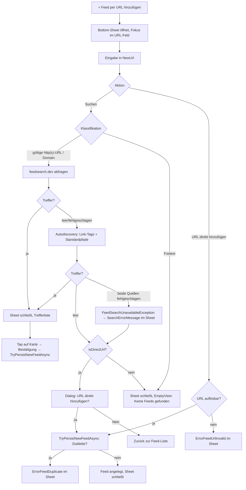

<!-- Licensed under the PolyForm Noncommercial License 1.0.0 - see the LICENSE file in the project root for details. -->

← [Zurück zur Übersicht](index.md)

# Feed-Suche — Technischer Ablauf

## Übersicht

Die `FeedsPage` ist eine reine Listenansicht: Die Feed-Liste füllt den Seitenbereich (`Grid`-Row `*`), darüber sitzt nur der Primär-Button `ActionAddFeed`. Das Hinzufügen-Formular ist ein In-Page-Bottom-Sheet-`Grid`-Overlay (halbtransparenter `BoxView`-Backdrop mit `TapGestureRecognizer` + unten angedockte `Border`-Karte, Sichtbarkeit per `DataTrigger` auf `ShowAddForm`). Das Sheet kennt seit dem Umzug der Feed-Aktionen in die Feeddetailansicht nur noch den **Add-Modus** (`Entry NewUrl` + „Suchen" + „URL direkt hinzufügen") — der frühere `IsEditMode` samt URL-/Benachrichtigungs-Bearbeitung ist ins Edit-Sheet der `FeedDetailPage` gewandert. Die Suche läuft über `IFeedSearchService` und umfasst zwei Quellen in einem gemeinsamen Zeitbudget: die öffentliche Verzeichnis-API **feedsearch.dev** und eine clientseitige Autodiscovery auf der eingegebenen Website. Treffer werden als `FeedSearchResult`-Liste an das `FeedsViewModel` zurückgegeben; die Trefferansicht ersetzt weiterhin die Feed-Liste auf Seitenebene, das Sheet schließt sich automatisch (`ShowAddForm = false`), sobald `ShowSearchResults = true` wird.

Neue Feeds werden mit festen Defaults persistiert (`CategoryId = null`, `NotificationsEnabled = true`, `HealthStatus = FeedHealth.Ok`) und erhalten ohne bekannten Titel einen Platzhalter aus `FeedTitleFallback` (letztes nicht-leeres, URL-dekodiertes Pfadsegment → `Host` → URL), den `FeedSyncService` beim ersten Sync durch `SyndicationFeed.Title` ersetzt. Bei bestehender Verbindung ermittelt die Anlage außerdem über `IFeedIconService` das Favicon der Feed-Website und speichert es in `Feed.FaviconUrl`; fehlt es, holt `FeedSyncService` es beim nächsten erfolgreichen Sync nach. Der Tap auf eine Feed-Karte (`OnFeedTapped`) navigiert per `Shell.Current.GoToAsync($"feeddetail?feedId={feed.Id}")` auf die `FeedDetailPage` — dort leben jetzt „Aktualisieren", „Umbenennen", „Kategorie ändern", „Bearbeiten", „Meldung anzeigen" (bei `HealthStatus == FeedHealth.Error` oder `FeedHealth.Warning`) und „Löschen" hinter dem Button **Aktionen**; Details siehe [Feeddetailansicht — Technischer Ablauf](feeddetailansicht-technisch.md).

## Beteiligte Komponenten

| Komponente | Typ | Rolle |
|------------|-----|-------|
| `IFeedSearchService` (`src/Reporter.Core/Interfaces`) | Interface | Vertrag: `SearchAsync(string query, CancellationToken)` → geordnete `IReadOnlyList<FeedSearchResult>`; wirft `FeedSearchUnavailableException`, wenn beide Quellen scheitern. |
| `FeedSearchService` (`src/Reporter.Core/Services`) | Service | Implementierung: Verzeichnisabfrage + Autodiscovery, Mapping, Dedupe, Sortierung. Konstruktor-Dep `HttpClient` (DI-Singleton, 30 s Timeout). Singleton in `MauiProgram`. |
| `FeedSearchResult` (`src/Reporter.Core/Models`) | Datenmodell | In-Memory-Treffer: `Title`, `Description`, `SiteName`, `SiteUrl`, `FeedUrl` (required), `Score`, `MatchKind`, `DisplayTitle` (= `Title`, Fallback `FeedUrl` — gebunden als Karten-Überschrift und `SemanticProperties.Description`). Wird nie persistiert. |
| `FeedSearchMatchKind` (`src/Reporter.Core/Models`) | Enum | Trefferart in Sortierreihenfolge: `ExactUrl`, `Directory`, `Discovered`. |
| `FeedSearchUnavailableException` (`src/Reporter.Core/Services`) | Exception | Einheitlicher Fehler: Verzeichnis **und** Autodiscovery fehlgeschlagen. |
| `FeedTitleFallback` (`src/Reporter.Core/Services`) | Statische Hilfsklasse | `GetFallbackTitle(url)` — letztes nicht-leeres, URL-dekodiertes Pfadsegment → `Host` → URL; `IsFileNamePlaceholderTitle(title, url)` — `OrdinalIgnoreCase`-Vergleich Titel vs. Dateiname für die Sync-Platzhalter-Erkennung. |
| `IFeedIconService` / `FeedIconService` (`src/Reporter.Core`) | Interface + Service | Favicon-Discovery: `FindFaviconUrlAsync(siteUrl)` lädt das Website-HTML, wertet `<link rel="icon|shortcut icon|apple-touch-icon">` im `<head>` per Regex aus, löst relative URLs auf, ergänzt den Fallback `{Origin}/favicon.ico` und verifiziert jeden Kandidaten per Request (nur erfolgreiche Antworten zählen) → verifizierte absolute URL oder `null`. `TryFindFaviconUrlAsync(feedUrl, siteUrl)` löst vorher die Site-URL auf (`FeedSiteResolver`) und ist strikt fehlerisoliert — jeder Fehler wird zu `null` statt zu werfen. `HttpClient`-basiert (DI-Singleton, 30 s Timeout); Singleton in `MauiProgram`. |
| `FeedSiteResolver` (`src/Reporter.Core/Services`) | Statische Hilfsklasse | `ResolveSiteUrl(feedUrl, siteUrl)` — liefert `siteUrl`, fällt bei leerem Wert auf die Authority (Schema + Host) der Feed-URL zurück; `null`, wenn keine Site-URL ermittelbar ist. |
| `FeedAvatar` (`src/Reporter.Core/Models`) | Statische Hilfsklasse (internal) | `Initial(title)` — erster Buchstabe des Feed-Titels in Großschreibung, `"?"` bei leerem Titel; treibt die berechneten Eigenschaften `ItemListItem.FeedInitial` (aus `FeedTitle`) und `FeedListItem.FeedInitial` (aus `Title`) für den Initialen-Kreis. |
| `FakeFeedIconService` (`src/Reporter.Tests`) | Test-Double | `IFeedIconService`-Fake für ViewModel-/Sync-Tests. |
| `FeedsViewModel` (`FeedsViewModel.cs` + `FeedsViewModel.Search.cs`) | ViewModel | Sheet-Zustand (`ShowAddForm`, `OpenAddFormCommand`, `CloseAddFormCommand` → `ResetForm`), Eingabe-Klassifikation, Suchzustand (`SearchResults`, `ShowSearchResults`, `IsSearching`, `SearchErrorMessage`/`HasSearchError`), Commands `SearchCommand`, `DirectAddCommand`, `SubscribeResultCommand`, `CloseSearchResultsCommand`, `RefreshAllCommand`, Callback `ConfirmDirectAddAsync`, gemeinsame Helfer `TryPersistNewFeedAsync`, `TryFindFaviconUrlAsync`, `FinishAddFlowAsync`, `SyncAsync` (über `BaseViewModel.RunFeedSyncAsync`). Hält `IFeedIconService`- und `IFeedSearchService`-Abhängigkeiten. Die früheren Feed-Aktionsmember (`RefreshCommand`, `EditCommand`, `DeleteCommand`, `SaveCommand`, `RenameFeedAsync`, `ChangeFeedCategoryAsync`, `GetFeedMessage`, `MakeUniqueOptionLabels`, `ToFeed`, `SelectedFeed`, `NewTitle`, `FeedNotificationsEnabled`, `IsEditMode`, `NotificationsSupported`, `ILocalNotificationService`-Dep) sind ins `FeedDetailViewModel` umgezogen. |
| `FeedsPage` (`src/Reporter/Views`) | Page/Code-Behind | XAML für Sheet-Overlay, Treffer-`CollectionView` (Karten binden `DisplayTitle`), Attribution, Offline-/Fehlerhinweise (auf Seitenebene **und** identisch gebunden im Sheet-Hinweisblock); Feed-Karten zeigen den `HealthStatus` als Micro-Pill-Badge (`Status*Tint`/`Status*`/`Status*Text` per `DataTrigger`) und links eine Bild-Spalte: `Image` auf `FaviconUrl` (nur sichtbar bei nicht-leerem `FaviconUrl` **und** `IsOnline`, `MultiTrigger` via `x:Reference` auf die Page), darunter ein 40-pt-Kreis-`Border` (`RoundRectangle 20`) mit `Label FeedInitial`, sichtbar bei leerem `FaviconUrl` oder offline. `OnFeedTapped` navigiert per `Shell.Current.GoToAsync($"feeddetail?feedId={feed.Id}")` auf die `FeedDetailPage` (try/catch + `Debug.WriteLine`), `OnSearchResultTapped`, `ConfirmDirectAddAsync`, `OnBackButtonPressed`-Override (schließt offenes Sheet), `PropertyChanged`-Handler für `NewUrlEntry.Focus()` beim Öffnen. `SemanticProperties` auf Karten (Feed-Karten: Hint `AccessibilityOpenFeedDetails`), Backdrop (`AccessibilityDismissSheet`) und `NewUrlEntry`. |
| `FeedSyncService` (`src/Reporter.Core/Services`) | Service | Ersetzt beim ersten Sync einen Platzhalter-Titel durch `SyndicationFeed.Title` (Erkennung: leer, `== Url`, `IsHostPlaceholderTitle`, `FeedTitleFallback.IsFileNamePlaceholderTitle`). Hält eine `IFeedIconService`-Abhängigkeit für die Favicon-Nachrüstung (Abschnitt 8). Klassifiziert Sync-Fehlschläge via `FeedSyncErrorKind.Classify` und Warnungsursachen via `FeedSyncWarningKind` und persistiert Kategorie + Rohmeldung in `Feed.LastMessageKind`/`LastMessage` (Abschnitt 9). |
| `FeedSyncErrorKind` (`src/Reporter.Core/Services`) | Statische Klasse | String-Konstanten `InsecureHttpBlocked`, `HttpStatus`, `Network`, `Parse`, `Unknown` (Muster `FeedHealth`) plus `Classify(ex, feedUrl)` — bildet die Sync-Exception auf die persistierte Fehlerkategorie ab. |
| `FeedSyncWarningKind` (`src/Reporter.Core/Services`) | Statische Klasse | String-Konstanten `FewerItems`, `NoRecentItems` für die beiden Warnungsauslöser aus `DetermineHealth` — schreibt in dasselbe `LastMessageKind`-Feld wie die Fehlerkinds; die Schwere ergibt sich aus `HealthStatus`. |
| `FeedHealthUpdate` (`src/Reporter.Core/Services`) | Record | Bündelt die optionalen Felder des `UpdateFeedHealthAsync`-Aufrufs: `ResolvedTitle`, `FaviconUrl`, `MessageKind`, `Message` (je `null` = leeren/nicht gesetzt). |
| `FakeFeedSearchService` (`src/Reporter.Tests`) | Test-Double | `IFeedSearchService`-Fake: `NextResults`, `NextException`, `LastQuery`, `CallCount`. |

## Externe Schnittstelle

`FeedSearchService` ruft `GET https://feedsearch.dev/api/v1/search?url={query}&info=true&favicon=false&opml=false&skip_crawl=true` auf (Endpunkt als Konstante `DirectoryEndpoint`). `skip_crawl=true` verhindert, dass das Verzeichnis unbekannte Domains live crawlt (> 2 s) — diese Fälle deckt die eigene Autodiscovery ab. Die API liefert ein JSON-Array; genutzt werden `url` (→ `FeedUrl`), `title`, `description`, `site_name`, `site_url`, `score`; Einträge ohne `url` oder mit `bozo == 1`/`true` werden verworfen. Nutzungsbedingung: sichtbare Attribution in der UI (`FeedSearchAttribution`).

## Ablauf

### 1. Sheet öffnen und schließen

- `OpenAddFormCommand` → `OpenAddForm`: ruft zuerst `ResetForm` (das Sheet startet stets mit sauberem Add-Zustand), dann `ShowAddForm = true`.
- `CloseAddFormCommand` → `ResetForm`: `NewUrl` leeren (der `NewUrl`-Setter räumt zusätzlich den Suchzustand ab), `ShowAddForm = false`, `ErrorMessage`/`SearchErrorMessage` leeren.
- Backdrop-Tap (`TapGestureRecognizer` → `CloseAddFormCommand`), „Abbrechen"-Button im Sheet und `OnBackButtonPressed` (gibt bei offenem Sheet `true` zurück, Seite bleibt) schließen auf demselben Weg.
- Fokus: `FeedsPage` abonniert `viewModel.PropertyChanged` in `OnAppearing` (Abmeldung in `OnDisappearing` — Singleton-VM × Transient-Page); bei `ShowAddForm`-Wechsel auf `true` wird `NewUrlEntry.Focus()` via `Dispatcher.Dispatch` aufgerufen.

### 2. Eingabe klassifizieren (`FeedsViewModel.SearchAsync`)

- Leere Eingabe oder `!IsOnline` → Abbruch ohne Fehler.
- `TryResolveSearchUrl`: `FeedUrlValidator.IsValidFeedUrl` (absolute http/https-URL — gemeinsame Hilfsklasse mit der Feeddetailansicht) → direkt an den Service, `isDirectUrl = true`. Sonst `TryNormalizeDomainUrl` (kein `://`, kein Whitespace, `https://`-Host mit Punkt) → `https://{eingabe}` an den Service. Sonst (Freitext) → `SearchResults` leeren, `ShowSearchResults = true` **und `ShowAddForm = false`** (EmptyView), kein Service-Aufruf.

### 3. Suche ausführen (`FeedSearchService.SearchAsync`)

1. Gelinkte `CancellationTokenSource` mit `CancelAfter(2 s)` (Konstante `SearchTimeout`) — gemeinsames Budget für alle folgenden Requests.
2. `SearchDirectoryAsync`: Verzeichnis-GET, JSON parsen, Mapping auf `FeedSearchResult` (`MatchKind = ExactUrl`, wenn `FeedUrl` der Query entspricht, sonst `Directory`).
3. Nur bei leerem Ergebnis: `DiscoverFeedsAsync`:
   - `GET {query}` mit `Accept: text/html`.
   - Antwort mit Feed-Content-Type (`application/rss+xml`, `application/atom+xml`, `application/feed+json`, `application/xml`, `text/xml`) → die eingegebene URL ist selbst ein Feed → ein `ExactUrl`-Treffer.
   - HTML-Antwort → `ExtractFeedLinks` parst `<link>`-Tags im `<head>` per Regex (`rel="alternate"` + Feed-Medientyp; relative `href`s werden gegen die Basis-URI aufgelöst) → `Discovered`-Treffer.
   - Keine Link-Tags → `ProbeStandardPathsAsync` prüft `/feed`, `/rss`, `/rss.xml`, `/atom.xml`, `/feed.xml`, `/index.xml` relativ zum Origin auf Feed-Content-Type → `Discovered`-Treffer.
4. Merge und Dedupe nach `FeedUrl` (`OrdinalIgnoreCase`); Sortierung: `MatchKind` aufsteigend, `Score` absteigend, `FeedUrl` ordinal.
5. Scheitern **beide** Quellen → `FeedSearchUnavailableException`. Fehler einer einzelnen Quelle (HTTP-Status, Timeout, Parse-/Netzwerkfehler) gelten nur als Quellausfall; vom Aufrufer angeforderte Abbrüche propagieren.

Zurück im ViewModel: `IsStaleInput(input)` verwirft Ergebnis wie Fehler, wenn `NewUrl` zwischenzeitlich geändert wurde. Trefferpfad: `SearchResults` befüllen, `ShowSearchResults = true`, `ShowAddForm = false`; `offerDirectAdd = results.Count == 0 && isDirectUrl`. Fehlerpfad (`HandleSearchFailure`): `SearchErrorMessage` = `FeedSearchUnavailable` bei `isDirectUrl`, sonst `FeedSearchUnavailableRetry`; `ShowSearchResults = false`, `ShowAddForm` bleibt `true` — der Fehler ist im Sheet-Hinweisblock sichtbar.

### 4. Treffer abonnieren (`SubscribeResultAsync`)

1. Tap auf Trefferkarte → `OnSearchResultTapped` (`TapGestureRecognizer`, `CommandParameter="{Binding .}"`).
2. `DisplayAlertAsync` (`ConfirmSubscribeFeedTitle`/`ConfirmSubscribeFeedMessage` mit Treffer-Titel bzw. `FeedUrl`, `ButtonYes`/`ButtonNo`).
3. `SubscribeResultAsync`: `Title = result.Title` (getrimmt) oder bei leerem Treffer-Titel `FeedTitleFallback.GetFallbackTitle(result.FeedUrl)`; Persistenz über `TryPersistNewFeedAsync(result.FeedUrl, title, result.SiteUrl)` (Dublettenprüfung `GetByUrlAsync` → `ErrorFeedDuplicate`, Defaults `CategoryId = null`, `NotificationsEnabled = true`, `HealthStatus = FeedHealth.Ok`, `FaviconUrl` aus der Icon-Ermittlung — siehe unten); bei Erfolg `FinishAddFlowAsync` (`SearchResults` leeren, `ShowSearchResults = false`, `ResetForm`, `LoadAsync`).

### 5. URL direkt hinzufügen

Zwei Einstiegspfade teilen sich `TryPersistNewFeedAsync` + `FinishAddFlowAsync`:

- **`DirectAddAsync`** (Button `ButtonDirectAdd` → `DirectAddCommand`, `CanExecute = !IsSearching`): leere/unauflösbare Eingabe (`TryResolveSearchUrl` — inkl. Domain-Normalisierung `https://…`) → `ErrorMessage = ErrorFeedUrlInvalid`, Sheet bleibt offen; sonst persistiert die URL sofort mit `FeedTitleFallback.GetFallbackTitle(url)` — kein Dialog, auch offline möglich. Die Direkt-Pfade übergeben `siteUrl: null` an `TryPersistNewFeedAsync` — die Site-URL fällt dann auf die Authority der Feed-URL zurück.
- **Favicon bei der Anlage:** `TryPersistNewFeedAsync` ruft nach der Dublettenprüfung `TryFindFaviconUrlAsync(url, siteUrl)` auf — bei `IsOnline` `IFeedIconService.TryFindFaviconUrlAsync` (strikt isoliert, Fehler → `null`), offline wird der Lookup übersprungen und `FaviconUrl` bleibt `null` (Nachrüstung siehe Abschnitt 8).
- **`OfferDirectAddAsync`** (aus `SearchAsync` bei 0 Treffern oder `FeedSearchUnavailableException` mit `isDirectUrl`): `ConfirmDirectAddAsync`-Callback → `DisplayAlertAsync` (`FeedSearchNoResultsTitle`/`FeedSearchNoResultsAddUrl` mit `{0}` = eingegebene Adresse). Dialog-Exception wird geloggt und geschluckt. Bei Ablehnung nur Suchzustand leeren; bei Bestätigung direkte Persistenz — scheitert sie (Dublette), wird `ShowSearchResults = false` und `ShowAddForm = true` gesetzt, sodass `ErrorFeedDuplicate` als einzige Meldung im Sheet-Hinweisblock steht (`TryPersistNewFeedAsync` leert im Dubletten-Fall `SearchErrorMessage`).

### 6. Feed-Aktionen (umgezogen in die Feeddetailansicht)

Umbenennen (`RenameFeedAsync` + `DisplayPromptAsync`), Kategorie ändern (`ChangeFeedCategoryAsync` + `DisplayActionSheetAsync` inkl. `CategoryNone`-Pseudo-Eintrag und `MakeUniqueOptionLabels`-Disambiguierung) und Bearbeiten (eigenes Edit-Bottom-Sheet `ShowEditForm` mit URL-`Entry` und Benachrichtigungs-`Switch`, Validierung via `FeedUrlValidator.IsValidFeedUrl` + `GetByUrlAsync`-Dublettenprüfung) leben seit Issue #115 nicht mehr in `FeedsPage`/`FeedsViewModel`, sondern in `FeedDetailPage`/`FeedDetailViewModel` hinter dem Button **Aktionen** — Ablauf und Komponenten siehe [Feeddetailansicht — Technischer Ablauf](feeddetailansicht-technisch.md).

### 7. Titel-Auflösung beim ersten Sync (`FeedSyncService.RunSyncAsync`)

- `resolvedTitle` wird nur an `UpdateFeedHealthAsync` übergeben, wenn der gespeicherte Titel ein Platzhalter ist — `IsNullOrWhiteSpace(feed.Title)`, `Title == feed.Url` (`OrdinalIgnoreCase`), `IsHostPlaceholderTitle(feed)` (Titel `== Host`) **oder `FeedTitleFallback.IsFileNamePlaceholderTitle(feed.Title, feed.Url)`** (Titel `==` letztes nicht-leeres, URL-dekodiertes Pfadsegment) — **und** `syndicationFeed.Title?.Text` nicht leer ist. Sonst `null`, der Titel bleibt unverändert. Nutzer- und trefferseitig gesetzte Titel werden nie überschrieben.

### 8. Favicon-Nachrüstung beim Sync (`FeedSyncService.RunSyncAsync`)

Feeds ohne `FaviconUrl` — offline angelegt oder aus Bestandsdaten vor der Icon-Ermittlung — werden beim nächsten erfolgreichen Sync nachgerüstet:

1. Nach erfolgreichem Sync-Lauf bestimmt `TryFindFaviconUrlAsync(feed.Url, syndicationFeed)` die Site-URL aus dem Feed-Dokument: `SyndicationFeed.Links` mit `RelationshipType == "alternate"` (`OrdinalIgnoreCase`); `FeedSiteResolver` fällt sonst auf die Authority der Feed-URL zurück.
2. `IFeedIconService.TryFindFaviconUrlAsync` führt die Discovery aus — strikt fehlerisoliert (Fehler → `null`, Sync-Ergebnis unberührt).
3. Der Aufruf steht in `RunSyncAsync` als `feed.FaviconUrl ?? await TryFindFaviconUrlAsync(...)`: Bei vorhandenem Favicon entfällt der Lookup ganz; die Auflösung liegt bewusst im Aufrufer, damit `UpdateFeedHealthAsync` reine Persistenz bleibt.
4. `UpdateFeedHealthAsync(feed, status, new FeedHealthUpdate(resolvedTitle, faviconUrl))` persistiert `FaviconUrl = faviconUrl ?? feed.FaviconUrl` mit demselben `UpdateAsync` — kein separater Backfill-Job.

### 9. Sync-Meldung anzeigen (`FeedDetailPage` → `ShowFeedMessageAsync`)

**Persistenz der Ursache (Sync-Pfad):** Fehler- und Warnungsgrund teilen sich die gemeinsamen Felder `Feed.LastMessageKind`/`Feed.LastMessage` — der letzte `Error`-/`Warning`-Status gewinnt, `Ok` leert die Felder.

1. `FeedSyncService.SyncFeedAsync` fängt Sync-Fehler im bestehenden `catch` (ausgenommen `OperationCanceledException` — Abbrüche/Timeouts bleiben unprotokolliert) und klassifiziert die Exception via `FeedSyncErrorKind.Classify(ex, feed.Url)`:
   - `HttpRequestException` mit gesetztem `StatusCode` → `HttpStatus` (der Server hat geantwortet — Vorrang vor der Scheme-Prüfung, auch bei `http`-URLs).
   - `HttpRequestException` ohne `StatusCode` bei `http`-Feed-URL → `InsecureHttpBlocked` (blockierter/verweigerter Klartext — u. a. der ATS-Fall).
   - `HttpRequestException` ohne `StatusCode` bei anderer URL → `Network`.
   - `XmlException` → `Parse`; alles andere → `Unknown`.
2. `UpdateFeedHealthAsync` erhält die Werte über `new FeedHealthUpdate(MessageKind: errorKind, Message: message)` und schreibt `Feed.LastMessageKind`/`Feed.LastMessage` (Rohmeldung `"Synchronization failed: {ex.Message}"` — identisch zum `SyncLog.Message`-Text).
3. Warnungen entstehen nicht im `catch`, sondern in `RunSyncAsync`: `DetermineHealth` liefert dazu das private `sealed record HealthDecision` (Status, Kind, Message) — beim Artikel-Einbruch (`fetchedCount < existingCount * 0.5 && existingCount > 0`) `FeedSyncWarningKind.FewerItems` mit der gelieferten/gespeicherten Artikelzahl als technischer Meldung, beim veralteten Feed (`newItems == 0` und jüngster Artikel älter als 30 Tage) `FeedSyncWarningKind.NoRecentItems` mit dem Datum des jüngsten Artikels; der `Ok`-Zweig liefert `null`-Werte und leert damit die Felder beim nächsten erfolgreichen Abruf. `RunSyncAsync` reicht `decision.Kind`/`decision.Message` über `new FeedHealthUpdate(resolvedTitle, faviconUrl, MessageKind: …, Message: …)` an `UpdateFeedHealthAsync` durch.
4. `FeedRepository` mappt die Felder in `MapToEntity`/`MapToModel`/`UpdateAsync` und projiziert sie in `GetAllWithDetailsAsync` auf `FeedListItem`; `FeedDetailViewModel.ToFeed` reicht sie bei Teil-Updates durch, damit Umbenennen/Kategorie/Bearbeiten die gespeicherte Ursache nicht verwerfen. Die Spalten `feeds.last_message_kind` (max. 50) / `last_message` kamen als `last_error_*` per Migration `AddFeedLastError` hinzu und wurden per `RenameColumn`-Migration `RenameFeedLastErrorToLastMessage` datenerhaltend umbenannt.

**Anzeige (UI-Pfad):**

1. `FeedDetailPage.OnFeedActionsClicked` setzt die Action-Sheet-Einträge dynamisch zusammen (`List<string>`): `ButtonRefresh`, `ButtonRename`, `ButtonChangeCategory`, `ButtonEdit`; bei `feed.HealthStatus is FeedHealth.Error or FeedHealth.Warning` folgt `ButtonShowMessage`, danach `ButtonDelete`.
2. Auswahl von `ButtonShowMessage` → `ShowFeedMessageAsync(feed)` → `DisplayAlertAsync` mit Titel `FeedMessageDetailsTitle` und `ButtonOk`.
3. `FeedDetailViewModel.GetFeedMessage(feed)` mappt `feed.LastMessageKind` flach per `switch` auf `FeedErrorKindInsecureHttpBlocked`/`FeedErrorKindHttpStatus`/`FeedErrorKindNetwork`/`FeedErrorKindParse` bzw. `FeedWarningKindFewerItems`/`FeedWarningKindNoRecentItems` (Fallback je nach `feed.HealthStatus`: `FeedWarningKindUnknown` bei `Warning`, sonst `FeedErrorKindUnknown` — deckt auch Alt-Datensätze im `Warning`-Status ohne gespeicherte Meldung ab) und hängt — falls nicht leer — `feed.LastMessage` per `"\n\n"` als zweiten Absatz an. Die Kategorie wird zur Anzeigezeit lokalisiert (Sprachwechsel-sicher); die Rohmeldung bleibt technisch/englisch — bei Fehlern ist sie identisch zum `SyncLog.Message`-Text (die Exception steckt zusätzlich im `IDebugLogService`-Eintrag und damit im Debugbericht), bei Warnungen liegt die Kennzahl ausschließlich in `LastMessage`, während `SyncLog.Message` die generische Zeile „… Health warning triggered." trägt.

## Diagramm

## Fehlerbehandlung

- **`FeedSearchUnavailableException`** (oder unerwartete Exception, geloggt via `Debug.WriteLine`): `HandleSearchFailure` setzt `SearchErrorMessage` = `FeedSearchUnavailable` bei `isDirectUrl`, sonst `FeedSearchUnavailableRetry`; `ShowAddForm` bleibt `true`, der Fehler erscheint im Sheet-Hinweisblock; bei gültiger URL zusätzlich der `ConfirmDirectAddAsync`-Dialog.
- **Dubletten** in allen drei Anlage-Pfaden (`SubscribeResultAsync`, `OfferDirectAddAsync`, `DirectAddAsync`): `TryPersistNewFeedAsync` setzt `ErrorMessage = ErrorFeedDuplicate`, leert `SearchErrorMessage` und persistiert nichts. Beim bestätigten Dialog-Pfad öffnet das Sheet anschließend über der Feed-Liste (`ShowSearchResults = false`, `ShowAddForm = true`).
- **Ungültige URL** (`DirectAddAsync`; in der Feeddetailansicht `SaveEditAsync`): `ErrorFeedUrlInvalid`, Sheet bleibt offen.
- **Leerer Titel** beim Umbenennen (Feeddetailansicht): `ErrorFeedTitleEmpty` auf Seitenebene.
- **Während der Suche geänderte Eingabe**: `IsStaleInput` verwirft Ergebnisse und Fehlermeldungen der verlassenen Query.
- **`NewUrl`-Setter** leert `SearchResults`, setzt `ShowSearchResults = false` und leert `SearchErrorMessage`.
- **Dialog-Exception** in `OfferDirectAddAsync` wird geloggt und geschluckt — kein zweiter Dialog, keine Persistenz.

## Offline-Verhalten

- `SearchCommand.CanExecute` = `IsOnline && !IsSearching`; `DirectAddCommand.CanExecute` = `!IsSearching` — der Direkt-Add bleibt bewusst **offline aktiv** (kein `IsOnline` im CanExecute, kein Netzwerkzugriff im Pfad).
- `OnConnectivityChanged` leert `SyncErrorMessage`/`SearchErrorMessage` und ruft `SearchCommand.NotifyCanExecuteChanged()`.
- `FeedsPage.xaml`: Offline-Label `FeedSearchOfflineHint` per `DataTrigger` (`IsOnline == false`) auf Seitenebene und im Sheet.

## Regeln im Überblick

- **Eingabe-Klassifikation:** Nur absolute http(s)-URLs und domain-artige Eingaben erreichen den Such-Service; den Dialog „URL direkt hinzufügen?" gibt es nur bei gültiger URL — der `ButtonDirectAdd` normalisiert Domain-Eingaben zu `https://…`.
- **Fehlerkontrakt:** `FeedSearchUnavailableException` nur bei Ausfall **beider** Quellen; eine leere Trefferliste ist kein Fehler.
- **Sortierung:** `ExactUrl` → `Directory` → `Discovered`, dann `Score` absteigend, dann `FeedUrl` ordinal.
- **Anlage-Defaults:** Neue Feeds erhalten fest `CategoryId = null`, `NotificationsEnabled = true`, `HealthStatus = FeedHealth.Ok` — Kategorie und Benachrichtigungen sind nachträglich über „Kategorie ändern" bzw. „Bearbeiten" erreichbar. `FaviconUrl` wird bei Online-Anlage ermittelt, bleibt sonst `null` und wird beim nächsten erfolgreichen Sync nachgerüstet.
- **Feed-Symbol-Anzeige:** Artikelkarten zeigen `ItemListItem.ImageUrl` → `FeedFaviconUrl` → `FeedInitial`-Kreis (Kaskade per `MultiTrigger` in `ArticleCardView`; `FeedFaviconUrl` wird in `ItemRepository.SelectListItemRows`/`MapToListItem` aus `i.Feed.FaviconUrl` projiziert und in `CopyWith` mitgeführt); Feed-Karten auf der `FeedsPage` und der Kopfbereich der `FeedDetailPage` zeigen `FaviconUrl` → `FeedInitial`-Kreis (offline stets der Kreis). `FeedDetailViewModel.ToFeed` führt `FaviconUrl` sowie `LastMessageKind`/`LastMessage` in den Update-Pfaden (`RenameFeedAsync`, `ChangeFeedCategoryAsync`, `SaveEditAsync`) mit — ohne Mitnahme gingen Symbol und gespeicherte Fehlerursache bei jedem Teil-Update verloren.
- **Sync-Meldung am Feed:** `LastMessageKind` (String-Konstante aus `FeedSyncErrorKind` oder `FeedSyncWarningKind`, persistiert statt zur Sync-Zeit lokalisierter Text — sprachwechselfest) + `LastMessage` (technische Rohmeldung) werden bei `HealthStatus == Error` oder `Warning` gesetzt und bei jedem erfolgreichen Sync zurückgesetzt; die Anzeige läuft ausschließlich über das Menü **Feed-Aktionen** der Feeddetailansicht (Abschnitt 9), keine Inline-Darstellung auf der Karte.
- **Sync-Serialisierung:** `SyncAllAsync` läuft singleton unter `_syncAllLock` (`SemaphoreSlim`); `SyncFeedAsync` serialisiert zusätzlich parallele Abrufe **desselben Feeds** über `_feedSyncLocks` (`ConcurrentDictionary<Guid, SemaphoreSlim>`, `GetOrAdd` + `WaitAsync`/`Release` in `try`/`finally`) — ein manueller Einzelabruf (z. B. „Aktualisieren" in der Feeddetailansicht) kann dadurch nicht parallel zu einem laufenden Gesamt-Sync denselben Feed-Snapshot lesen und per Last-Writer-Wins überbieten.
- **HTTP-Feeds:** `http://`-Adressen sind in allen Pfaden zulässig (Suche, Direkt-Add, Sync); auf iOS/MacCatalyst erlaubt `NSAppTransportSecurity` → `NSAllowsArbitraryLoads` in den `Info.plist`-Dateien den Klartext-Abruf des gemeinsamen `HttpClient` — `NSExceptionDomains` wäre als statische Whitelist für beliebige Nutzer-Domains ungeeignet.
- **Platzhalter-Titel:** `Title` leer, `== Url`, `== Host` oder `==` Dateiname der Feed-URL gilt als Platzhalter und wird beim ersten Sync durch `SyndicationFeed.Title` ersetzt; manuell vergebene Titel nie.
- **Kategorie/Beschreibung:** `CategoryId` ist bei Neuanlage fest `null` (kein Picker im Add-Sheet); `Description` wird nur angezeigt, nie persistiert — `Feed` bleibt unverändert, keine Migration nötig.
- **Fehler-/Hinweis-Labels** existieren an zwei Stellen (Seitenebene + Sheet-Hinweisblock) mit identischen Bindings — nie gleichzeitig sichtbar, da der Backdrop die Seitenebene bei offenem Sheet verdeckt; XAML-Änderungen an diesen Labels sind an beiden Stellen mitzuziehen.

## Ressourcenschlüssel

Neu mit dem Sheet-Umbau (`AppResources.resx` EN + `AppResources.de.resx` DE, Designer regeneriert): `ActionAddFeed`, `FeedAddSheetTitle`, `FeedEditSheetTitle`, `ButtonDirectAdd`, `ButtonRename`, `ButtonChangeCategory`, `PromptRenameFeedTitle`, `PromptRenameFeedMessage`; `CategoryNone` enthält jetzt Klartext („Keine Kategorie"/„No category" statt „—"). Entfernt: `PlaceholderFeedTitle` (tot); `PlaceholderFeedUrl` wurde bereits in Lauf 1 durch `PlaceholderFeedSearch` ersetzt. Weiterverwendet: `ButtonSearch`, `ButtonSave`, `ButtonCancel`, `ButtonOk`, `ButtonYes`/`ButtonNo`, `ButtonEdit`, `ButtonDelete`, `ButtonRefresh`, `ButtonCloseSearchResults`, `ActionSheetTitleFeed`, `LabelFeedCategory`, `ErrorFeedTitleEmpty`, `ErrorFeedDuplicate`, `ErrorFeedUrlInvalid`, `FeedNotificationsLabel`/`FeedNotificationsHint`, `NotificationsIosOnlyHint`, `PlaceholderFeedSearch`, `FeedSearchOfflineHint`, `FeedSearchUnavailable`, `FeedSearchUnavailableRetry`, `FeedSearchNoResults*`, `FeedSearchAttribution`, `ConfirmSubscribeFeed*`, `ConfirmDeleteFeed*`, `OfflineHint`. Mit dem Badge-/A11y-Pass (Issue #30) kamen `AccessibilityDismissSheet`, `AccessibilityTapForActions` und `AccessibilityOpenArticle` hinzu. Mit der Fehlerdetails-Anzeige (Issue #87) kamen `FeedErrorDetailsTitle` (Alert-Titel), `ButtonShowErrorDetails` (Action-Sheet-Eintrag) und die Kategorietexte `FeedErrorKindInsecureHttpBlocked`, `FeedErrorKindHttpStatus`, `FeedErrorKindNetwork`, `FeedErrorKindParse`, `FeedErrorKindUnknown` hinzu — beide Einträge wurden mit Issue #126 zu `FeedMessageDetailsTitle`/`ButtonShowMessage` umbenannt und mit neutralen Texten belegt, zugleich kamen `FeedWarningKindFewerItems`, `FeedWarningKindNoRecentItems` und `FeedWarningKindUnknown` hinzu. Mit der Feeddetailansicht (Issue #115) kamen `PageTitleFeedDetail`, `PlaceholderFeedDetailSearch`, `PlaceholderFeedDetail`, `FeedDetailSearchNoResults`, `ButtonFeedActions`, `AccessibilityOpenFeedDetails` (Hint der Feed-Karten — ersetzt dort `AccessibilityTapForActions`), `PlaceholderFeedEditUrl` und `ErrorActionFailed` hinzu.

## Tests

- `FeedTitleFallbackTests` (`src/Reporter.Tests`): `GetFallbackTitle` (letztes Pfadsegment, URL-Dekodierung, Host-Fallback bei pfadloser URL, unparsebare URL → Original-String, Trailing Slash) und `IsFileNamePlaceholderTitle` (Match/Mismatch, Case-insensitiv).
- `FeedsViewModelTests`: `RefreshAllCommand`-Fälle (Sync + Reload, Offline-Skip, `IsSyncing`-Preset durch das Refresh-Binding, Fehler → `SyncStatusError`), `LoadCommand`-Fehlerfälle, `OpenAddFormCommand`/`CloseAddFormCommand` (inkl. `CloseAddFormCommand_WhenSheetShowsErrors_ClearsErrorChannels`), Suche schließt Sheet bei Treffern, Sheet bleibt bei `FeedSearchUnavailableException` und `DirectAdd`-Validierungsfehlern offen, `DirectAddCommand`-Fälle (offline persistiert mit Defaults, Domain-Normalisierung, ungültige URL/Dublette → Fehler im offenen Sheet, Stale-`SearchErrorMessage`-Bereinigung), Direkt-Hinzufügen nach leerer/fehlgeschlagener Suche persistiert bei Bestätigung sofort mit Dateinamen-Titel, Treffer-Abonnieren nutzt `FeedTitleFallback` bei leerem Titel, Dubletten-Pfad schließt die Trefferansicht (`SearchCommand_NoResultsAndConfirmedDuplicate_ClosesResultsView`). Die früheren Aktions-/Edit-Testgruppen (`RenameFeedAsync`, `ChangeFeedCategoryAsync`, `GetFeedMessage`, `MakeUniqueOptionLabels`, Edit-Modus) sind nach `FeedDetailViewModelTests` umgezogen.
- `FeedSyncServiceTests`: Dateinamen-Platzhalter-Titel wird beim Sync durch `SyndicationFeed.Title` ersetzt; Host-/URL-Platzhalter und explizit gesetzte Titel unverändert; Favicon-Nachrüstung (`SyncFeedAsync_MissingFavicon_BackfillsFromFeedAuthority`, `_ExistingFavicon_SkipsLookup`, `_FaviconLookupFails_SyncStillSucceeds`). Meldungsursache (Issue #87/#126): `SyncFeedAsync_Failure_PersistsErrorKindAndMessage`, `SyncFeedAsync_Success_ClearsLastMessage`, `SyncFeedAsync_*_ClassifiedAs*` (`InsecureHttpBlocked` bei `http`-Netzwerkfehler, `HttpStatus` bei Nicht-2xx, `Parse` bei ungültigem XML, `Network` bei `https`-Netzwerkfehler) sowie die Warnungs-Persistenz `SyncFeedAsync_FewerItems_PersistsWarningMessage`, `SyncFeedAsync_NoNewItemsForThirtyDays_PersistsWarningMessage`, `SyncFeedAsync_SuccessAfterWarning_ClearsLastMessage`, `SyncFeedAsync_ErrorAfterWarning_OverwritesLastMessage`.
- `FeedSyncErrorKindTests` (neu): `Classify_*` ×6 — `HttpRequestException` mit `StatusCode` → `HttpStatus` (auch bei `http`-URL, Statuscode hat Vorrang), ohne `StatusCode` bei `http`-URL → `InsecureHttpBlocked`, ohne `StatusCode` sonst → `Network`, `XmlException` → `Parse`, sonstige Exception → `Unknown`.
- `FeedSyncServiceTests_Concurrency` (neu, Issue #126): `SyncFeedAsync_ConcurrentCallsOnSameFeed_AreSerialized` — zwei parallele `SyncFeedAsync`-Aufrufe auf denselben Feed laufen strikt nacheinander (`_feedSyncLocks`), statt denselben Snapshot doppelt einzuspielen.
- `FeedRepositoryTests`: zusätzlich `UpdateAsync_PersistsLastMessage` und `GetAllWithDetailsAsync_ProjectsLastMessage`; `ReporterDbContextTests_Persistence`: `Feed_PersistRoundtrip_LastMessage`; `ReporterDbContextTests_Schema`: `Feed_LastMessage_MappedToExpectedColumns`.
- `FeedDetailViewModelTests`: `GetFeedMessage_MapsKindToLocalizedText`, `GetFeedMessage_FewerItemsWarning_MapsToLocalizedText`, `GetFeedMessage_NoRecentItemsWarning_MapsToLocalizedText`, `GetFeedMessage_FallsBackToUnknown`, `GetFeedMessage_WarningFallsBackToUnknown`, `GetFeedMessage_AppendsTechnicalMessage` und `RenameFeedAsync_PreservesLastMessage` (Teil-Update verwirft die gespeicherte Meldung nicht) — bei `FeedDetailViewModel` seit Issue #115.
- `FeedIconServiceTests` (`src/Reporter.Tests`): `TryFindFaviconUrlAsync_*` — `<link>`-Auswertung (icon/shortcut icon/apple-touch-icon), relative URLs, `/favicon.ico`-Fallback, Kandidaten-Verifizierung, Fehler → `null`.
- `FeedListItemTests`: `FeedInitial`/`FeedAvatar`-Ableitung (Großschreibung, `"?"`-Fallback).
- `FeedRepositoryTests`: `GetAllWithDetailsAsync_ProjectsFaviconUrl`, `UpdateAsync_PersistsFaviconUrl`.
- `FeedsViewModelTests`: `DirectAddCommand_StoresFaviconUrl`, `_IconLookupFails_FeedStillAdded`, `_Offline_SkipsIconLookup`, `SubscribeResultCommand_UsesSiteUrlForFaviconLookup` — via `FakeFeedIconService`; `RenameFeedAsync_PreservesFaviconUrl` liegt seit Issue #115 in `FeedDetailViewModelTests`.
- `FeedSearchServiceTests`: Mapping, `bozo`-Filter, Autodiscovery-Pfade, Content-Type-Erkennung, Sortierung/Dedupe, Fehlerfälle, Timeout — via `HttpClient` auf gemocktem `HttpMessageHandler`.
- `ServiceCollectionTests`: DI-Registrierung von `IFeedSearchService` (und `IFeedIconService`).
