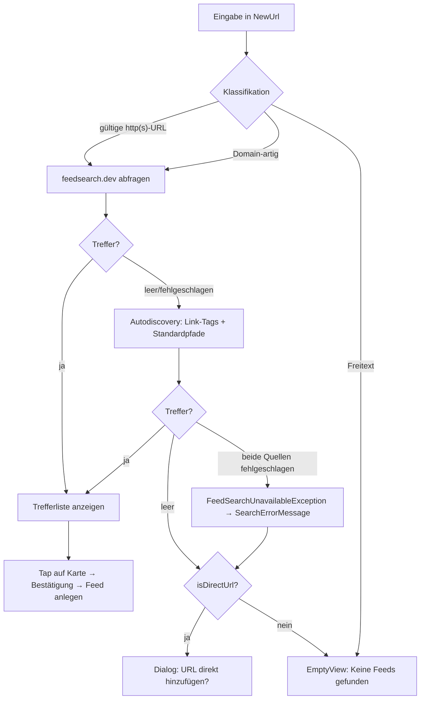

<!-- Licensed under the PolyForm Noncommercial License 1.0.0 - see the LICENSE file in the project root for details. -->

← [Zurück zur Übersicht](index.md)

# Feed-Suche — Technischer Ablauf

## Übersicht

Der Hinzufügen-Dialog auf der `FeedsPage` kombiniert Suche und direkte URL-Eingabe in einem Feld (`NewUrl`). Die Suche läuft über `IFeedSearchService` und umfasst zwei Quellen in einem gemeinsamen Zeitbudget: die öffentliche Verzeichnis-API **feedsearch.dev** und eine clientseitige Autodiscovery auf der eingegebenen Website. Treffer werden als `FeedSearchResult`-Liste an das `FeedsViewModel` zurückgegeben; die Auswahl und das Abonnieren laufen über das `FeedsPage`-Code-Behind und `SubscribeResultCommand`. Der bisherige `SaveCommand`/`SaveAsync`-Pfad bleibt für das direkte Hinzufügen und Bearbeiten unverändert.

## Beteiligte Komponenten

| Komponente | Typ | Rolle |
|------------|-----|-------|
| `IFeedSearchService` (`src/Reporter.Core/Interfaces`) | Interface | Vertrag: `SearchAsync(string query, CancellationToken)` → geordnete `IReadOnlyList<FeedSearchResult>`; wirft `FeedSearchUnavailableException`, wenn beide Quellen scheitern. |
| `FeedSearchService` (`src/Reporter.Core/Services`) | Service | Implementierung: Verzeichnisabfrage + Autodiscovery, Mapping, Dedupe, Sortierung. Konstruktor-Dep `HttpClient` (DI-Singleton, 30 s Timeout). Singleton in `MauiProgram`. |
| `FeedSearchResult` (`src/Reporter.Core/Models`) | Datenmodell | In-Memory-Treffer: `Title`, `Description`, `SiteName`, `SiteUrl`, `FeedUrl` (required), `Score`, `MatchKind`. Wird nie persistiert. |
| `FeedSearchMatchKind` (`src/Reporter.Core/Models`) | Enum | Trefferart in Sortierreihenfolge: `ExactUrl`, `Directory`, `Discovered`. |
| `FeedSearchUnavailableException` (`src/Reporter.Core/Services`) | Exception | Einheitlicher Fehler: Verzeichnis **und** Autodiscovery fehlgeschlagen. |
| `FeedsViewModel` (`FeedsViewModel.cs` + `FeedsViewModel.Search.cs`) | ViewModel | Eingabe-Klassifikation, Suchzustand (`SearchResults`, `ShowSearchResults`, `IsSearching`, `SearchErrorMessage`/`HasSearchError`), Commands `SearchCommand`, `SubscribeResultCommand`, `CloseSearchResultsCommand`, Callback `ConfirmDirectAddAsync`. |
| `FeedsPage` (`src/Reporter/Views`) | Page/Code-Behind | XAML für Treffer-`CollectionView`, Attribution, Offline-/Fehlerhinweise; `OnSearchResultTapped` und `ConfirmDirectAddAsync` als `DisplayAlertAsync`-Dialoge. |
| `FeedSyncService` (`src/Reporter.Core/Services`) | Service | Ersetzt beim ersten Sync einen Platzhalter-Titel durch `SyndicationFeed.Title`. |
| `FakeFeedSearchService` (`src/Reporter.Tests`) | Test-Double | `IFeedSearchService`-Fake: `NextResults`, `NextException`, `LastQuery`, `CallCount`. |

## Externe Schnittstelle

`FeedSearchService` ruft `GET https://feedsearch.dev/api/v1/search?url={query}&info=true&favicon=false&opml=false&skip_crawl=true` auf (Endpunkt als Konstante `DirectoryEndpoint`). `skip_crawl=true` verhindert, dass das Verzeichnis unbekannte Domains live crawlt (> 2 s) — diese Fälle deckt die eigene Autodiscovery ab. Die API liefert ein JSON-Array; genutzt werden `url` (→ `FeedUrl`), `title`, `description`, `site_name`, `site_url`, `score`; Einträge ohne `url` oder mit `bozo == 1`/`true` werden verworfen. Nutzungsbedingung: sichtbare Attribution in der UI (`FeedSearchAttribution`).

## Ablauf

### 1. Eingabe klassifizieren (`FeedsViewModel.SearchAsync`)

- Leere Eingabe oder `!IsOnline` → Abbruch ohne Fehler.
- `TryResolveSearchUrl`: `IsValidFeedUrl` (absolute http/https-URL) → direkt an den Service, `isDirectUrl = true`. Sonst `TryNormalizeDomainUrl` (kein `://`, kein Whitespace, `https://`-Host mit Punkt) → `https://{eingabe}` an den Service. Sonst (Freitext) → `SearchResults` leeren, `ShowSearchResults = true` (EmptyView), kein Service-Aufruf.

### 2. Suche ausführen (`FeedSearchService.SearchAsync`)

1. Gelinkte `CancellationTokenSource` mit `CancelAfter(2 s)` (Konstante `SearchTimeout`) — gemeinsames Budget für alle folgenden Requests.
2. `SearchDirectoryAsync`: Verzeichnis-GET, JSON parsen, Mapping auf `FeedSearchResult` (`MatchKind = ExactUrl`, wenn `FeedUrl` der Query entspricht, sonst `Directory`).
3. Nur bei leerem Ergebnis: `DiscoverFeedsAsync`:
   - `GET {query}` mit `Accept: text/html`.
   - Antwort mit Feed-Content-Type (`application/rss+xml`, `application/atom+xml`, `application/feed+json`, `application/xml`, `text/xml`) → die eingegebene URL ist selbst ein Feed → ein `ExactUrl`-Treffer.
   - HTML-Antwort → `ExtractFeedLinks` parst `<link>`-Tags im `<head>` per Regex (`rel="alternate"` + Feed-Medientyp; relative `href`s werden gegen die Basis-URI aufgelöst) → `Discovered`-Treffer.
   - Keine Link-Tags → `ProbeStandardPathsAsync` prüft `/feed`, `/rss`, `/rss.xml`, `/atom.xml`, `/feed.xml`, `/index.xml` relativ zum Origin auf Feed-Content-Type → `Discovered`-Treffer.
4. Merge und Dedupe nach `FeedUrl` (`OrdinalIgnoreCase`); Sortierung: `MatchKind` aufsteigend, `Score` absteigend, `FeedUrl` ordinal.
5. Scheitern **beide** Quellen → `FeedSearchUnavailableException`. Fehler einer einzelnen Quelle (HTTP-Status, Timeout, Parse-/Netzwerkfehler) gelten nur als Quellausfall; vom Aufrufer angeforderte Abbrüche propagieren.

### 3. Treffer abonnieren

1. Tap auf Trefferkarte → `OnSearchResultTapped` (`TapGestureRecognizer`, `CommandParameter="{Binding .}"`).
2. `DisplayAlertAsync` (`ConfirmSubscribeFeedTitle`/`ConfirmSubscribeFeedMessage` mit Treffer-Titel bzw. `FeedUrl`, `ButtonYes`/`ButtonNo`).
3. `SubscribeResultAsync`: Dublettenprüfung via `_feedRepository.GetByUrlAsync(result.FeedUrl)` → Treffer: `ErrorMessage = ErrorFeedDuplicate`, Abbruch.
4. `AddAsync(new Feed { Url = result.FeedUrl, Title = result.Title ?? result.FeedUrl (Platzhalter), CategoryId = SelectedCategory (Guid.Empty → null), HealthStatus = FeedHealth.Ok, NotificationsEnabled = FeedNotificationsEnabled, … })`.
5. `SearchResults` leeren, `ShowSearchResults = false`, `ResetForm()`, `LoadAsync`.

### 4. Titel-Befüllung beim ersten Sync (`FeedSyncService.RunSyncAsync`)

- `resolvedTitle` wird nur an `UpdateFeedHealthAsync` übergeben, wenn der gespeicherte Titel ein Platzhalter ist (`IsNullOrWhiteSpace` oder `== feed.Url`, `OrdinalIgnoreCase`) **und** `syndicationFeed.Title?.Text` nicht leer ist — sonst `null` und der Titel bleibt unverändert. Nutzer- und trefferseitig gesetzte Titel werden nie überschrieben.

## Diagramm

## Fehlerbehandlung

- **`FeedSearchUnavailableException`** (oder unerwartete Exception, geloggt via `Debug.WriteLine`): `SearchErrorMessage` = `FeedSearchUnavailable` bei `isDirectUrl`, sonst `FeedSearchUnavailableRetry`; bei gültiger URL zusätzlich der `ConfirmDirectAddAsync`-Dialog.
- **Leere Trefferliste bei gültiger URL**: `ConfirmDirectAddAsync?.Invoke(url)` → `DisplayAlertAsync` (`FeedSearchNoResultsTitle`/`FeedSearchNoResultsAddUrl` mit `{0}` = eingegebene Adresse); bei Bestätigung `NewTitle`-Vorbelegung mit dem Host, danach unveränderter `SaveAsync`-Pfad mit allen Validierungen (`ErrorFeedUrlInvalid`, `ErrorFeedTitleEmpty`, `ErrorFeedDuplicate`).
- **Während der Suche geänderte Eingabe**: Ergebnisse werden verworfen, wenn `NewUrl` nicht mehr der gestarteten Query entspricht.
- **`NewUrl`-Setter** leert `SearchResults`, setzt `ShowSearchResults = false` und leert `SearchErrorMessage`.

## Offline-Verhalten

- `SearchCommand.CanExecute` = `IsOnline && !IsSearching`; `OnConnectivityChanged` leert `SearchErrorMessage` und ruft `NotifyCanExecuteChanged()`.
- `FeedsPage.xaml`: Offline-Label `FeedSearchOfflineHint` per `DataTrigger` (`IsOnline == false`); der `SaveCommand`-Pfad bleibt unverändert verfügbar.

## Regeln im Überblick

- **Eingabe-Klassifikation:** Nur absolute http(s)-URLs und domain-artige Eingaben erreichen den Such-Service; nur bei gültiger URL wird der Direkt-Hinzufügen-Dialog angeboten.
- **Fehlerkontrakt:** `FeedSearchUnavailableException` nur bei Ausfall **beider** Quellen; eine leere Trefferliste ist kein Fehler.
- **Sortierung:** `ExactUrl` → `Directory` → `Discovered`, dann `Score` absteigend, dann `FeedUrl` ordinal.
- **Platzhalter-Titel:** `Title == Url` oder leer gilt als Platzhalter und wird beim ersten Sync ersetzt.
- **Kategorie/Beschreibung:** `CategoryId` kommt aus `SelectedCategory`; `Description` wird nur angezeigt, nie persistiert — `Feed` bleibt unverändert, keine Migration nötig.

## Tests

- `FeedSearchServiceTests` (`src/Reporter.Tests`): Mapping, `bozo`-Filter, Autodiscovery-Pfade, Content-Type-Erkennung, Sortierung/Dedupe, Fehlerfälle, Timeout — via `HttpClient` auf gemocktem `HttpMessageHandler`.
- `FeedsViewModelTests`: Suche, Trefferauswahl, Dublettenprüfung, Fallback-Dialoge, Offline-Verhalten (mit `FakeFeedSearchService`).
- `FeedSyncServiceTests`: Titel-Befüllung beim ersten Sync.
- `ServiceCollectionTests`: DI-Registrierung von `IFeedSearchService`.
