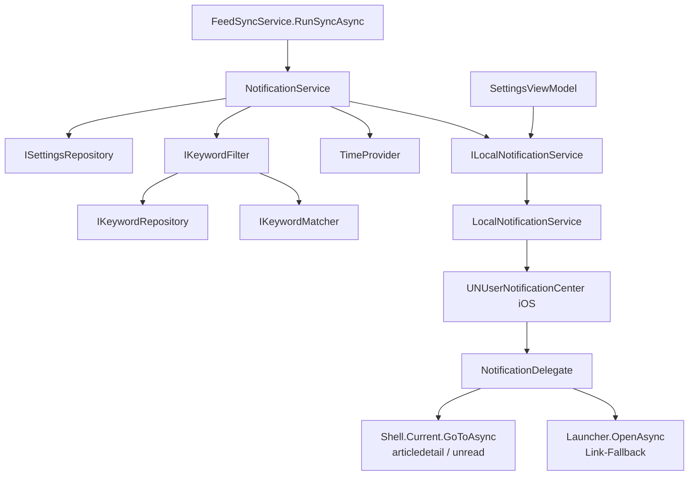

<!-- Licensed under the PolyForm Noncommercial License 1.0.0 - see the LICENSE file in the project root for details. -->

# Benachrichtigungen — Architektur

## Beteiligte Komponenten

| Komponente | Typ | Rolle |
|------------|-----|-------|
| `INotificationService` (`src/Reporter.Core/Interfaces/INotificationService.cs`) | Interface | Entscheidungsservice: `NotifyNewItemsAsync(Feed, IReadOnlyList<Item>, CancellationToken)` |
| `NotificationService` (`src/Reporter.Core/Services/NotificationService.cs`) | Klasse | Regelauswertung (Feed-Schalter, globaler Schalter, Ruhezeit via `TimeProvider`, Keyword-Filter) und Modus-Verzweigung Einzel-/Sammel-Versand inkl. Identifier-Bildung |
| `ILocalNotificationService` (`src/Reporter.Core/Interfaces/ILocalNotificationService.cs`) | Interface | Plattformabstraktion: `IsSupported`, `RequestAuthorizationAsync`, `GetAuthorizationStatusAsync` → `NotificationAuthorizationStatus` (`Unsupported`/`NotDetermined`/`Denied`/`Authorized`), `ShowAsync(title, body, identifier, userInfo?, ct)` |
| `NotificationAuthorizationStatus` (`src/Reporter.Core/Models/NotificationAuthorizationStatus.cs`) | Enum | Berechtigungsstatus für die Einstellungs-UI — unterscheidet `NotDetermined` (nie angefragt) von `Denied` (verweigert) |
| `LocalNotificationService` (`src/Reporter/Services/LocalNotificationService.cs`) | Klasse | iOS-Implementierung über `UserNotifications` (`#if IOS`); No-Op auf anderen Targets |
| `NotificationDelegate` (`src/Reporter/Platforms/iOS/NotificationDelegate.cs`) | Klasse | `UNUserNotificationCenterDelegate`: Vordergrund-Darstellung (Banner/List/Sound) und Tap-Handling mit In-App-Navigation |
| `AppDelegate` (`src/Reporter/Platforms/iOS/AppDelegate.cs`) | Klasse | Registriert den `NotificationDelegate` in `FinishedLaunching` |
| `FeedSyncService` (`Reporter.Core`) | Service | Aufrufer: sammelt neue `Item`s in `RunSyncAsync` und ruft `INotificationService` fehlerisoliert auf |
| `SettingsViewModel` (`Reporter.Core`) | ViewModel | Hauptschalter, Modus-Schalter, Berechtigungsanfrage beim Einschalten bzw. über `RequestNotificationPermissionCommand`, Status-Flags `NotificationPermissionDenied`/`NotificationPermissionNotDetermined` für die Hinweiszeilen, `NotificationsSupported`/`NotificationControlsEnabled` für die Plattform-Deaktivierung |
| `FeedsViewModel` (`Reporter.Core`) | ViewModel | Pro-Feed-Schalter `FeedNotificationsEnabled` im Feed-Formular, `NotificationsSupported` deaktiviert den Schalter auf Nicht-iOS-Plattformen |
| `AppResources` (`Reporter.Core/Resources/Strings`) | Ressourcen | Lokalisierte Labels, Hinweise und `NotificationSummaryFormat` (EN/DE) |

## Abhängigkeiten

- `NotificationService` hängt von `ISettingsRepository`, `IKeywordFilter`, `ILocalNotificationService` und `TimeProvider` ab (Standard `TimeProvider.System`; Tests injizieren `FakeTimeProvider`).
- `FeedSyncService` hat `INotificationService` als fünfte Konstruktor-Abhängigkeit.
- `SettingsViewModel` und `FeedsViewModel` haben `ILocalNotificationService` als **optionale** Abhängigkeit (nullable Parameter) — ältere Tests und Nicht-iOS-Szenarien funktionieren ohne.
- Registrierung in `MauiProgram.CreateMauiApp` als Singletons: `INotificationService → NotificationService`, `ILocalNotificationService → LocalNotificationService`.
- Externes System: ausschließlich das lokale iOS-`UserNotifications`-Framework (lokale, nicht entfernte Benachrichtigungen — kein Push-Server, kein Netzwerkzugriff). Kein NuGet-Paket erforderlich.
- `Platforms/iOS/Info.plist` benötigt keine zusätzlichen Schlüssel — die Laufzeit-Authorization genügt; `PrivacyInfo.xcprivacy` bleibt unverändert (`UserNotifications` ist keine Required-Reason-API).

## Datenfluss

Daten entstehen beim Feed-Abruf (`Item`s) — Keyword-Treffer verwirft `FeedSyncService` bereits beim Einspeichern —, werden in `NotificationService` gefiltert (Tiefenverteidigung) und — je nach Modus — als einzelne oder als Sammel-Benachrichtigung an iOS übergeben; `UserInfo` transportiert `itemId`/`link` bzw. `feedId` für das Tap-Handling zurück in die App.

## Skalierung und Zuverlässigkeit

- **Fehlerisolierung:** Der Benachrichtigungsaufruf läuft in einem eigenen `try/catch` innerhalb `RunSyncAsync` — ein iOS-Fehler beeinflusst weder Sync-Ergebnis noch Feed-Health.
- **Dedup über Identifier:** iOS ersetzt Requests mit identischem Identifier. Einzelmodus: `Item.Id` (stabil, DB-seitig ohnehin unique pro Sync). Sammelmodus: `{feedId}-{SHA256(sortierte ItemIds)}` — gleicher Artikelbestand ersetzt die bestehende Sammel-Benachrichtigung, neuer Bestand erzeugt eine neue.
- **Plattform-Trennung:** Sämtliche Entscheidungslogik liegt in `Reporter.Core` (unit-testbar); der iOS-spezifische Code ist auf `LocalNotificationService` (`#if IOS`) und `NotificationDelegate`/`AppDelegate` unter `Platforms/iOS` beschränkt.
- **Schwache Delegate-Referenz:** `UNUserNotificationCenter.Delegate` ist weak — `AppDelegate` hält die `NotificationDelegate`-Instanz in einem Feld.
