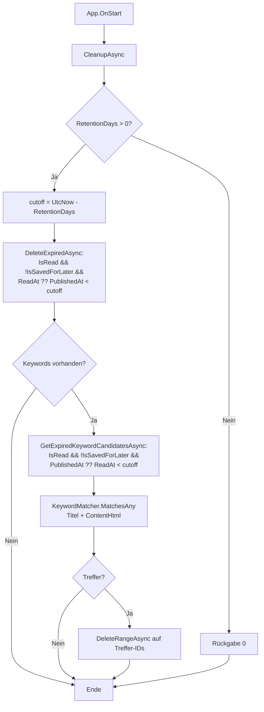

← [Zurück zur Übersicht](index.md)

# Einstellungen — Technischer Ablauf

## Übersicht

`SettingsPage` lädt beim Erscheinen den Singleton-`Settings`-Datensatz und die Keyword-Liste; `SettingsViewModel` persistiert jede Änderung sofort über `ISettingsRepository.SaveAsync`. Bei Theme- oder Auto-Refresh-Änderungen werden `IAppThemeService` bzw. `IAutoRefreshService` nachgeschaltet. Beim App-Start laufen drei fehlerisolierte Blöcke in `App.OnStart`: Retention-Cleanup (inkl. Keyword-Regel), Theme-Anwendung und Start der Hintergrund-Aktualisierung.

## Ablauf

### 1. Einstellungen laden

`SettingsPage.OnAppearing` führt `LoadCommand` aus. `SettingsViewModel.LoadAsync` setzt `_isLoading = true` (verhindert Persistierung während des Befüllens), lädt `Settings` via `ISettingsRepository.GetAsync()` und alle Keywords via `IKeywordRepository.GetAllAsync()`. Anschließend werden alle bindbaren Eigenschaften befüllt:

- `RetentionDays` wird auf `[1, 365]` geclamppt (`MinRetentionDays`/`MaxRetentionDays`).
- `SelectedRefreshInterval` fällt auf die Option mit 30 Minuten zurück (`DefaultRefreshIntervalMinutes`), wenn der gespeicherte Wert keiner `RefreshIntervalOption` entspricht.
- `AutoMarkReadEnabled` ergibt sich aus `AutoMarkReadMode != "off"`.
- `SelectedAutoMarkReadDelay` fällt auf 5 Sekunden zurück (`DefaultAutoMarkReadDelaySeconds`).
- `SelectedTheme` fällt auf `"system"` zurück, wenn der gespeicherte Wert keiner `ThemeOption` entspricht.

Beteiligte Komponenten:
- `SettingsPage.OnAppearing` — Aufrufpunkt
- `SettingsViewModel.LoadAsync` — Laden und Befüllen unter `_isLoading`-Guard
- `ISettingsRepository.GetAsync` — liest/legt den Singleton-Datensatz an
- `IKeywordRepository.GetAllAsync` — liest die Keyword-Liste

### 2. Einstellung ändern (Sofort-Persistierung)

Die Setter der Optionseigenschaften (`AutoRefreshEnabled`, `SelectedRefreshInterval`, `AutoMarkReadEnabled`, `SelectedAutoMarkReadDelay`, `NotificationsEnabled`, `QuietHoursStart`, `QuietHoursEnd`, `SelectedTheme`) rufen `PersistOnChange()` auf; während `_isLoading` wird abgebrochen.

`PersistAsync()` läuft unter einem `SemaphoreSlim` (`_persistLock`), baut eine `init`-Kopie des `Settings`-Objekts aus den ViewModel-Eigenschaften (mit Clamp von `RetentionDays` auf 1–365 und Defaults für nicht ausgewählte Optionen) und ruft `ISettingsRepository.SaveAsync`. Danach:

- `previous is null || previous.Theme != updated.Theme` → `IAppThemeService.ApplyTheme(updated.Theme)`
- `previous is null` oder Änderung an `AutoRefreshEnabled`/`RefreshIntervalMinutes` → `IAutoRefreshService.ApplySettingsAsync(updated)`

Die Aufbewahrungsdauer wird nicht bei jedem Slider-Schritt, sondern über `Slider.DragCompletedCommand` → `SaveRetentionCommand` → `SaveRetention()` (Rundung + Clamp + `PersistAsync`) persistiert.

Beteiligte Komponenten:
- `SettingsViewModel.PersistOnChange` / `PersistAsync` / `SaveRetention` — Persistierungslogik
- `SettingsRepository.SaveAsync` — schreibt alle Felder auf den Singleton-Datensatz
- `IAppThemeService.ApplyTheme` — Theme-Sofortumschaltung
- `IAutoRefreshService.ApplySettingsAsync` — Timer-Neukonfiguration

### 3. Keyword hinzufügen und entfernen

`AddKeywordCommand` (`Button "+ Hinzufügen"` oder `Entry.ReturnCommand`) validiert `NewKeywordText` nach `Trim()`:

| Prüfung | Ergebnis |
|---------|----------|
| leer | `ErrorMessage` = `ErrorKeywordEmpty`, `HasError = true`, Abbruch |
| länger als 500 Zeichen (`MaxKeywordLength`, DB-Spalte `keyword_text`) | `ErrorMessage` = `ErrorKeywordTooLong`, Abbruch |
| Dublette via `OrdinalIgnoreCase`-Vergleich gegen `Keywords` | `ErrorMessage` = `ErrorKeywordDuplicate`, Abbruch |
| sonst | `IKeywordRepository.AddAsync(new Keyword { Id = Guid.NewGuid(), KeywordText = text })`, Aufnahme in `Keywords`, Eingabefeld leeren |

`RemoveKeywordCommand` (×-Button im Chip, `CommandParameter` = `Keyword`) ruft `IKeywordRepository.DeleteAsync(keyword.Id)` und entfernt den Eintrag aus `Keywords`.

Beteiligte Komponenten:
- `SettingsViewModel.AddKeywordAsync` / `RemoveKeywordAsync`
- `IKeywordRepository.AddAsync` / `DeleteAsync`
- `Keyword` (`Id`, `KeywordText`)

### 4. Retention-Cleanup mit Keyword-Regel

`App.OnStart` ruft nach `Database.MigrateAsync()` `IRetentionCleanupService.CleanupAsync()` fehlerisoliert auf (`try/catch` + `Debug.WriteLine`).

`RetentionCleanupService.CleanupAsync`:

1. `Settings` laden; `RetentionDays <= 0` → Rückgabe `0` (Schutzregel, gilt für beide Löschregeln).
2. `cutoff = DateTime.UtcNow.AddDays(-RetentionDays)`.
3. `IItemRepository.DeleteExpiredAsync(cutoff)` löscht per `ExecuteDeleteAsync`: `IsRead && !IsSavedForLater && (ReadAt ?? PublishedAt) < cutoff` (Fristbasis = Lesezeitpunkt).
4. `IKeywordRepository.GetAllAsync` — leere Liste → Ende mit der bisherigen Löschzahl.
5. `IItemRepository.GetExpiredKeywordCandidatesAsync(cutoff)` lädt Kandidaten: `IsRead && !IsSavedForLater && (PublishedAt ?? ReadAt) < cutoff` (Fristbasis = Veröffentlichungsdatum, siehe [Business Rules](business-rules.md)).
6. `IKeywordMatcher.MatchesAny(item.Title, item.ContentHtml, keywordTexts)` filtert Treffer im Speicher (`Contains`, `OrdinalIgnoreCase`).
7. `IItemRepository.DeleteRangeAsync(matchedIds)` löscht per `ExecuteDeleteAsync` auf IDs; Rückgabewert = Summe beider Löschungen.

Beteiligte Komponenten:
- `App.OnStart` — Aufrufpunkt mit Fehlerisolierung
- `RetentionCleanupService.CleanupAsync` — Orchestrierung
- `ISettingsRepository`, `IKeywordRepository`, `IItemRepository`, `IKeywordMatcher`

### 5. Hintergrund-Aktualisierung

`App.OnStart` ruft `IAutoRefreshService.StartAsync()` fehlerisoliert auf. `StartAsync` lädt `Settings` und delegiert an `ApplySettingsAsync`.

`AutoRefreshService.ApplySettingsAsync` läuft unter `_stateLock` (`SemaphoreSlim`), stoppt einen laufenden Loop (`CancellationTokenSource` kancellieren, Task awaiten, `OperationCanceledException` erwartet) und startet bei `AutoRefreshEnabled` einen neuen Loop `RunLoopAsync` mit `PeriodicTimer(TimeSpan.FromMinutes(clamp(RefreshIntervalMinutes, 1, 1440)), _timeProvider)`.

`RunLoopAsync` wartet pro Tick auf `timer.WaitForNextTickAsync`:

- `Interlocked.Exchange(ref _syncRunning, 1) == 1` → ein Sync läuft noch, Tick wird übersprungen (Overlap-Guard).
- Sonst `IFeedSyncService.SyncAllAsync(cancellationToken)`; Exceptions werden abgefangen und per `Debug.WriteLine` protokolliert — der Timer läuft weiter.
- `finally` setzt `_syncRunning` zurück.

`StopAsync` beendet den Loop. `SettingsViewModel.PersistAsync` ruft `ApplySettingsAsync` bei jeder relevanten Änderung, sodass der Timer sofort mit dem neuen Intervall neu startet bzw. stoppt.

Beteiligte Komponenten:
- `App.OnStart` — Startpunkt
- `AutoRefreshService` (`StartAsync`, `ApplySettingsAsync`, `StopAsync`, `RunLoopAsync`) — Timer-Steuerung
- `TimeProvider` — injizierbar (Standard `TimeProvider.System`; Tests nutzen `FakeTimeProvider`)
- `IFeedSyncService.SyncAllAsync` — eigentlicher Abruf

### 6. Theme anwenden

`App.OnStart` lädt nach dem Cleanup-Block die `Settings` und ruft `IAppThemeService.ApplyTheme(settings.Theme)` fehlerisoliert auf. `AppThemeService.ApplyTheme` (im MAUI-Projekt) mappt:

| `theme` | `Application.Current.UserAppTheme` |
|---------|-------------------------------------|
| `"light"` | `AppTheme.Light` |
| `"dark"` | `AppTheme.Dark` |
| `"system"`, `null`, unbekannt | `AppTheme.Unspecified` |

Bei Änderung über den `Farbschema`-`Picker` ruft `PersistAsync` denselben Service direkt nach dem Speichern; die `AppThemeBinding`-Styles schalten sofort um. `Application.Current is null` wird in `AppThemeService` abgefangen.

### 7. Auto-Gelesen beim Öffnen

`ArticleDetailViewModel.LoadAsync` liest `settings.AutoMarkReadMode` und `settings.AutoMarkReadDelaySeconds`. Der Timer `MarkReadDelayedAsync` startet nur bei `IsAutoMarkRead && AutoMarkReadMode != "off" && !Item.IsRead`; die Verzögerung akzeptiert `>= 0` (Option „Sofort" = 0), Fallback ist `DefaultAutoMarkDelaySeconds` (5). Schlägt das Laden der Settings fehl, greift ein Fallback-`Settings` mit `"on_open"`/5 s. Der lokale `IsAutoMarkRead`-Toggle (`OnAutoMarkReadChanged`) berücksichtigt `AutoMarkReadMode` ebenfalls.

Beteiligte Komponenten:
- `ArticleDetailViewModel.LoadAsync` / `OnAutoMarkReadChanged` / `MarkReadDelayedAsync`
- `ISettingsRepository.GetAsync`
- `IItemRepository.MarkAsReadAsync`

## Fehlerbehandlung

- Alle `App.OnStart`-Blöcke (Cleanup, Theme, Auto-Refresh) sind einzeln `try/catch`-isoliert und protokollieren per `Debug.WriteLine` — kein Block darf den App-Start verhindern.
- `SettingsViewModel.PersistAsync`, `LoadAsync`, `AddKeywordAsync`, `RemoveKeywordAsync` fangen Exceptions und protokollieren per `Debug.WriteLine`; es gibt keinen anwendersichtbaren Fehlerdialog außer den Keyword-Validierungsmeldungen (`HasError`/`ErrorMessage`).
- `AutoRefreshService.RunLoopAsync` fängt Exceptions pro Tick ab (Timer läuft weiter); `OperationCanceledException` beim regulären Stoppen wird erwartet und geschluckt.
- `ArticleDetailViewModel` fällt bei nicht ladbaren Settings auf Standardwerte zurück, statt den Artikel nicht zu öffnen.
