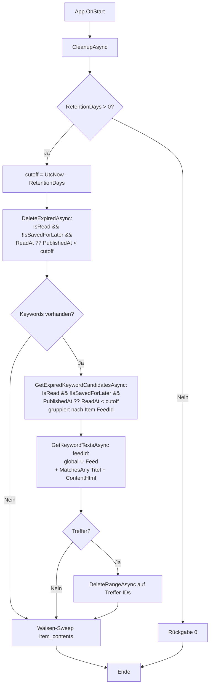
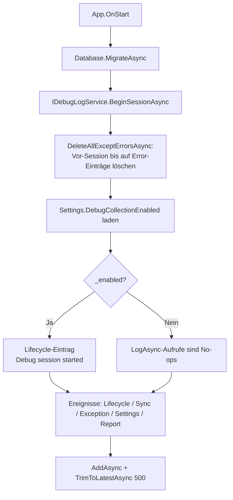

<!-- Licensed under the PolyForm Noncommercial License 1.0.0 - see the LICENSE file in the project root for details. -->

← [Zurück zur Übersicht](index.md)

# Einstellungen — Technischer Ablauf

## Übersicht

`SettingsPage` lädt beim Erscheinen den Singleton-`Settings`-Datensatz und die Keyword-Liste; `SettingsViewModel` persistiert jede Änderung sofort über `ISettingsRepository.SaveAsync`. Bei Theme- oder Auto-Refresh-Änderungen werden `IAppThemeService` bzw. `IAutoRefreshService` nachgeschaltet; die Sprachauswahl wird dagegen nur persistiert — die wirksame Kultur setzt `AppCulture` beim nächsten App-Start in `MauiProgram.ApplyPersistedLanguage` (vor `CreateWindow`). Beim Einschalten des Benachrichtigungs-Hauptschalters fragt `ILocalNotificationService` die iOS-Berechtigung an; der Status (`NotificationAuthorizationStatus`) steuert die Hinweiszeilen `NotificationPermissionDenied`/`NotificationPermissionNotDetermined`. Beim App-Start laufen drei fehlerisolierte Blöcke in `App.OnStart`: Retention-Cleanup (inkl. Keyword-Regel für Bestandstreffer), Theme-Anwendung und Start der Hintergrund-Aktualisierung — letztere löst bei eingeschalteter Option `RefreshOnStartupEnabled` zusätzlich einen einmaligen, nicht blockierenden Start-Abruf aus (Abschnitt 5). Der Keyword-Filter selbst greift bereits beim Feed-Abruf in `FeedSyncService.RunSyncAsync` (Abschnitt 4). Zusätzlich beginnt `App.OnStart` direkt nach der Migration eine Debug-Session (`IDebugLogService.BeginSessionAsync` — Abschnitt 9), und der Abschnitt **Diagnose & Support** versendet auf Anwenderaktion einen Debugbericht über den System-Mail-Client (Abschnitt 10).

## Ablauf

### 1. Einstellungen laden

`SettingsPage.OnAppearing` führt `LoadCommand` aus. `SettingsViewModel.LoadAsync` setzt `_isLoading = true` (verhindert Persistierung während des Befüllens), lädt `Settings` via `ISettingsRepository.GetAsync()` und die globalen Keywords via `IKeywordRepository.GetByFeedAsync(null)` — feed-spezifische Schlagworte (`feed_id` gesetzt) tauchen bewusst nicht in der Einstellungsliste auf; sie werden im Bearbeiten-Sheet der `FeedDetailPage` gepflegt. Anschließend werden alle bindbaren Eigenschaften befüllt:

- `RetentionDays` wird auf `[1, 365]` geclamppt (`MinRetentionDays`/`MaxRetentionDays`).
- `SelectedRefreshInterval` fällt auf die Option mit 30 Minuten zurück (`DefaultRefreshIntervalMinutes`), wenn der gespeicherte Wert keiner `RefreshIntervalOption` entspricht.
- `RefreshOnStartupEnabled` wird direkt aus `settings.RefreshOnStartupEnabled` befüllt (DB-Default `true`).
- `SelectedSortOrder` fällt auf die `SortOrderOption` mit `SettingsValues.SortOrderDescending` (`"desc"`) zurück, wenn `settings.UnreadSortOrder` keiner Option entspricht.
- `LanguageRestartHintVisible` wird nach dem Befüllen von `SelectedLanguage` auf `false` zurückgesetzt; der zuletzt persistierte Sprachwert wird in `_loadedLanguage` gehalten.
- `AutoMarkReadEnabled` ergibt sich aus `SettingsValues.IsAutoMarkReadEnabled(settings.AutoMarkReadMode)` (alle Werte außer `"off"` gelten als aktiv).
- `SelectedAutoMarkReadDelay` fällt auf 5 Sekunden zurück (`DefaultAutoMarkReadDelaySeconds`).
- `QuietHoursEnabled` ergibt sich aus `settings.QuietHoursStart is not null || settings.QuietHoursEnd is not null`; `QuietHoursStart`/`QuietHoursEnd` fallen auf die im ViewModel gehaltenen Sitzungswerte (`_quietHoursStart`/`_quietHoursEnd`) zurück, wenn die persistierten Werte `null` sind.
- `NotificationSummaryEnabled` wird aus `settings.NotificationSummaryEnabled` befüllt.
- `SelectedTheme` fällt auf `"system"` zurück, wenn der gespeicherte Wert keiner `ThemeOption` entspricht.
- `SelectedLanguage` fällt auf die `LanguageOption` mit `SettingsValues.LanguageSystem` zurück, wenn `settings.Language` keiner Option entspricht (`LanguageOptions.FirstOrDefault(o => o.Value == settings.Language) ?? …LanguageSystem`).
- `DebugCollectionEnabled` wird aus `settings.DebugCollectionEnabled` befüllt; der Setter ruft unter `_isLoading` kein `SetEnabled` auf — der Laufzeit-Zustand des Session-Logs bleibt beim Laden unverändert.

Nach dem Befüllen ruft `LoadAsync` `RefreshNotificationPermissionAsync` auf: nur wenn `ILocalNotificationService.IsSupported` und `NotificationsEnabled` aktiv sind, wird `GetAuthorizationStatusAsync` abgefragt und über `ApplyAuthorizationStatus` in die Flags `NotificationPermissionDenied` (Status `Denied`) bzw. `NotificationPermissionNotDetermined` (Status `NotDetermined`) übersetzt — die Hinweiszeilen bleiben so auch nach einem System-seitigen Widerruf der Berechtigung aktuell. Exceptions werden per `Debug.WriteLine` protokolliert und setzen beide Flags auf `false`.

Beteiligte Komponenten:
- `SettingsPage.OnAppearing` — Aufrufpunkt (subscribed außerdem `NotificationAuthorizationDenied` und `DebugReportFailed`)
- `SettingsViewModel.LoadAsync` — Laden und Befüllen unter `_isLoading`-Guard
- `SettingsViewModel.RefreshNotificationPermissionAsync` — Berechtigungsstatus ohne Dialog abfragen
- `ISettingsRepository.GetAsync` — liest/legt den Singleton-Datensatz an
- `IKeywordRepository.GetByFeedAsync(null)` — liest die globale Keyword-Liste (nur Einträge ohne Feed-Zuordnung)
- `ILocalNotificationService.IsSupported` / `GetAuthorizationStatusAsync` — Plattform- bzw. Berechtigungsstatus (`NotificationAuthorizationStatus`)

### 2. Einstellung ändern (Sofort-Persistierung)

Die Setter der Optionseigenschaften (`AutoRefreshEnabled`, `SelectedRefreshInterval`, `RefreshOnStartupEnabled`, `SelectedSortOrder`, `AutoMarkReadEnabled`, `SelectedAutoMarkReadDelay`, `NotificationsEnabled`, `NotificationSummaryEnabled`, `QuietHoursEnabled`, `QuietHoursStart`, `QuietHoursEnd`, `SelectedTheme`, `SelectedLanguage`, `DebugCollectionEnabled`) rufen `PersistOnChange()` auf; während `_isLoading` wird abgebrochen.

Der `DebugCollectionEnabled`-Setter hat zwei Nebenwirkungen: Außerhalb von `_isLoading` ruft er `_debugLogService?.SetEnabled(value)` auf — die Session-Protokollierung schaltet damit ohne Neustart um (bei der Aktivierung schreibt der Service einen `Lifecycle`-Übergangseintrag „Debug collection enabled"). Zusätzlich meldet er `OnPropertyChanged(nameof(DebugSendEnabled))`, sodass der Senden-Bereich sofort aktiviert bzw. deaktiviert wird. `DebugSendEnabled` ist `DebugEmailSupported && DebugCollectionEnabled`; `DebugEmailSupported` delegiert an `_debugReportService?.IsSupported` (d. h. `IEmailService.IsSupported` → `Email.Default.IsComposeSupported`).

Der `SelectedLanguage`-Setter hat eine Nebenwirkung auf den Neustart-Hinweis: Außerhalb von `_isLoading` setzt er `LanguageRestartHintVisible = value?.Value != _loadedLanguage` — der Hinweis-`Border` unter dem Sprach-`Picker` in `SettingsPage.xaml` ist per `IsVisible="{Binding LanguageRestartHintVisible}"` gebunden und erscheint daher erst nach einer Abweichung vom persistierten Wert und verschwindet bei Rückwahl wieder.

Die Sortierrichtung wird nicht in `PersistAsync` nachgeschaltet, sondern erst beim Lesen ausgewertet: `UnreadViewModel` hält eine `ISettingsRepository`-Abhängigkeit; `LoadPageAsync` lädt die Settings pro Seite, mappt `settings.UnreadSortOrder == SettingsValues.SortOrderAscending` auf das Bool `ascending` und ruft `IItemRepository.GetUnreadByDateAsync(page, pageSize, categoryId, ascending)` — aufsteigend `OrderBy(PublishedAt).ThenByDescending(Id)` (exakte Umkehr inkl. Tiebreaker), sonst unverändert `OrderByDescending(PublishedAt).ThenBy(Id)`. Artikel ohne `PublishedAt` folgen dem SQLite-NULL-Verhalten ohne gesonderten Handling-Code; `GetSavedForLaterAsync` (**Später**) bleibt fest absteigend.

`QuietHoursEnabled` ist ein reiner UI-Schalter ohne eigene Persistenzspalte: Beim Einschalten werden `_quietHoursStart`/`_quietHoursEnd` mit den gehaltenen Sitzungswerten oder den Defaults 22:00/07:00 (`DefaultQuietHoursStart`/`DefaultQuietHoursEnd`) befüllt. Beim Ausschalten bleiben die Werte im ViewModel erhalten — `PersistAsync` schreibt dann `QuietHoursStart = QuietHoursEnabled ? QuietHoursStart : null` (analog `QuietHoursEnd`), sodass eine ausgeschaltete Ruhezeit als `null` persistiert wird, ein Wiedereinschalten in derselben Sitzung aber die eigenen Zeiten restauriert. Die `TimePicker` in `SettingsPage.xaml` sind über `IsEnabled="{Binding QuietHoursEnabled}"` an den Schalter gekoppelt und werden per `DataTrigger` auf `Opacity` 0,4 abgedunkelt.

Der `NotificationsEnabled`-Setter hat eine Sonderrolle: Beim Wechsel auf `true` (außerhalb `LoadAsync`, `_isLoading`-Guard) startet er `_ = RequestNotificationAuthorizationAsync()` — bei `IsSupported` fragt das `ILocalNotificationService.RequestAuthorizationAsync` die iOS-Berechtigung ab. Bei `!granted` wird der Status via `GetAuthorizationStatusAsync` nachgelesen: `Denied` setzt `NotificationPermissionDenied` und feuert das Ereignis `NotificationAuthorizationDenied` — `SettingsPage.xaml.cs` zeigt daraufhin einen Dialog (`NotificationDeniedTitle`/`NotificationDeniedMessage`) mit den Schaltflächen **Einstellungen öffnen** (`AppInfo.Current.ShowSettingsUI()`) und **Abbrechen**. Beim Ausschalten werden `NotificationPermissionDenied` und `NotificationPermissionNotDetermined` zurückgesetzt. `SettingsPage.xaml` blendet die `Denied`-Hinweiszeile (`NotificationDeniedMessage` + Button `OnOpenNotificationSettingsClicked` → `AppInfo.ShowSettingsUI`) per `MultiTrigger` nur bei `NotificationsEnabled && NotificationPermissionDenied` ein; bei `NotificationsEnabled && NotificationPermissionNotDetermined` erscheint stattdessen eine neutrale Zeile (`NotificationNotDeterminedMessage`) mit dem Button **Benachrichtigungen erlauben** (`NotificationNotDeterminedAllow` → `RequestNotificationPermissionCommand`), weil iOS den Mitteilungen-Eintrag in den Systemeinstellungen erst nach einer ersten Anfrage zeigt. Auf Plattformen ohne Benachrichtigungs-Unterstützung (`NotificationsSupported == false`) sind die Schalterzeile und der Detail-`Border` (`NotificationControlsEnabled`) deaktiviert und die Zeile `NotificationsIosOnlyHint` eingeblendet.

`PersistAsync()` läuft unter einem `SemaphoreSlim` (`_persistLock`), baut eine `init`-Kopie des `Settings`-Objekts aus den ViewModel-Eigenschaften (mit Clamp von `RetentionDays` auf 1–365 und Defaults für nicht ausgewählte Optionen; die `AutoMarkReadMode`-/`Theme`-/`Language`-Strings stammen aus `SettingsValues`; `NotificationSummaryEnabled` und `DebugCollectionEnabled` werden direkt übernommen) und ruft `ISettingsRepository.SaveAsync`. Danach:

- `previous is null || previous.Theme != updated.Theme` → `IAppThemeService.ApplyTheme(updated.Theme)`
- `previous is null` oder Änderung an `AutoRefreshEnabled`/`RefreshIntervalMinutes` → `IAutoRefreshService.ApplySettingsAsync(updated)`

Für `Language` gibt es bewusst keinen nachgeschalteten Service-Aufruf: `PersistAsync` schreibt `Language = SelectedLanguage?.Value ?? SettingsValues.LanguageSystem` nur in den Datensatz — eine Laufzeit-Umschaltung ist nicht vorgesehen, die Kultur wird beim nächsten App-Start angewendet (siehe Abschnitt 7). Der Hinweis-`Border` in der Sektion **Sprache** (`AppResources.SettingsLanguageRestartHint`) weist den Anwender auf den erforderlichen Neustart hin — gesteuert über `LanguageRestartHintVisible` (siehe oben).

Die Aufbewahrungsdauer wird nicht bei jedem Slider-Schritt, sondern über `Slider.DragCompletedCommand` → `SaveRetentionCommand` → `SaveRetention()` (Rundung + Clamp + `PersistAsync`) persistiert.

Beteiligte Komponenten:
- `SettingsViewModel.PersistOnChange` / `PersistAsync` / `SaveRetention` — Persistierungslogik
- `SettingsRepository.SaveAsync` — schreibt alle Felder auf den Singleton-Datensatz
- `IAppThemeService.ApplyTheme` — Theme-Sofortumschaltung
- `IAutoRefreshService.ApplySettingsAsync` — Timer-Neukonfiguration inkl. Weiterleitung an `IBackgroundRefreshService` (OS-Hintergrundabruf, Abschnitt 5)

### 3. Keyword hinzufügen und entfernen

`AddKeywordCommand` (`Button "+ Hinzufügen"` oder `Entry.ReturnCommand`) validiert `NewKeywordText` nach `Trim()` über die geteilte Hilfsklasse `KeywordValidator.TryValidate(text, Keywords, out errorMessage)` (`Reporter.Core.Services`):

| Prüfung | Ergebnis |
|---------|----------|
| leer | `ErrorMessage` = `ErrorKeywordEmpty`, `HasError = true`, Abbruch |
| länger als 500 Zeichen (`KeywordValidator.MaxTextLength`, DB-Spalte `keyword_text`) | `ErrorMessage` = `ErrorKeywordTooLong`, Abbruch |
| Dublette via `OrdinalIgnoreCase`-Vergleich gegen `Keywords` | `ErrorMessage` = `ErrorKeywordDuplicate`, Abbruch |
| sonst | `IKeywordRepository.AddAsync(new Keyword { Id = Guid.NewGuid(), KeywordText = text })` — ohne `FeedId`, also global —, Aufnahme in `Keywords`, Eingabefeld leeren |

`RemoveKeywordCommand` (×-Button im Chip, `CommandParameter` = `Keyword`) ruft `IKeywordRepository.DeleteAsync(keyword.Id)` und entfernt den Eintrag aus `Keywords`.

`KeywordValidator` wird von `SettingsViewModel` (globale Liste) und `FeedDetailViewModel` (feed-spezifische Liste im Bearbeiten-Sheet) gemeinsam genutzt — die Dublettenprüfung gilt jeweils nur innerhalb des Zielbereichs; dieselbe Prüffolge gilt daher auch für Feed-Schlagworte (Details siehe [Feeddetailansicht — Technischer Ablauf](../anwendung/feeddetailansicht-technisch.md)).

Beteiligte Komponenten:
- `SettingsViewModel.AddKeywordAsync` / `RemoveKeywordAsync`
- `KeywordValidator.TryValidate` / `MaxTextLength` — geteilte Validierung
- `IKeywordRepository.AddAsync` / `DeleteAsync`
- `Keyword` (`Id`, `KeywordText`, `FeedId` — `null` = global)

### 4. Keyword-Filter beim Sync und Retention-Cleanup

**Format-Erkennung beim Feed-Abruf:** `FeedSyncService.RunSyncAsync` liest den Response-Stream über `XmlReader.Create` (`DtdProcessing.Ignore`) und positioniert per `MoveToContent` auf dem Root-Element — der Peek konsumiert nur Präambel/Whitespace und funktioniert auf dem nicht seekbaren HTTP-Stream. Liegt das Root-Element `feed` im Atom-0.3-Namespace `http://purl.org/atom/ns#` vor, wird der Reader in `Atom03NormalizingXmlReader` gewrappt: Der delegierende Reader biegt den Namespace auf Atom 1.0 (`http://www.w3.org/2005/Atom`) um, benennt die Elemente `tagline`→`subtitle`, `issued`→`published`, `modified`→`updated` und `copyright`→`rights` um und übersetzt `type`-Attributwerte auf den Atom-0.3-Text-/Content-Konstrukten von MIME-Typen in die Atom-1.0-Kürzel (`text/plain`→`text`, `text/html`→`html`, `application/xhtml+xml`→`xhtml`; `link`-`type` und Elemente mit `mode="base64"` bleiben unverändert). `SyndicationFeed.Load` bleibt damit die einzige Parse-Stelle und akzeptiert RSS 2.0, Atom 1.0 und Atom 0.3; nicht lesbare Dokumente laufen unverändert in den `Parse`-Fehlerpfad (`XmlException` im `catch` von `SyncFeedAsync`).

**Ingest-Filter beim Feed-Abruf:** `FeedSyncService.RunSyncAsync` lädt nach `SyndicationFeed.Load` und vor der Item-Schleife die für den Feed wirksame Keyword-Liste via `IKeywordFilter.GetKeywordTextsAsync(feed.Id)` als `keywordTexts` — `KeywordFilter` ruft dafür `IKeywordRepository.GetEffectiveForFeedAsync(feedId)` auf, das die globalen Einträge (`feed_id IS NULL`) mit den Feed-Einträgen unioniert — und übergibt sie an die ausgelagerte Sammelschleife `CollectNewItems` (Rückgabe: `newItemEntities` + `filteredCount` + `contentBackfill` + `imageCandidates`). Pro neuem `SyndicationItem` — nach der `knownKeys`-Dedup-Prüfung — ruft `CollectNewItems` `IKeywordFilter.MatchesAny(title, contentHtml, keywordTexts)` auf (`title` = `feedItem.Title?.Text`, `contentHtml` = `GetContentHtml(feedItem)`). Treffer werden nicht in `newItemEntities` aufgenommen: Sie werden weder per `IItemRepository.AddRangeAsync` gespeichert noch über `INotificationService.NotifyNewItemsAsync` benachrichtigt und erscheinen in keiner Liste. Die Anzahl verworfener Treffer wird in `filteredCount` mitgezählt und bei `filteredCount > 0` an die `SyncLog.Message`/`SyncResult.Message` angehängt (z. B. „Synchronized 6 items, 5 new, 1 filtered."). `DetermineHealth` zählt die Abrufmenge weiterhin inklusive gefilterter Items — kein Health-False-Positive. Da gefilterte Items nicht persistiert werden, werden sie bei jedem Folge-Sync erneut gematcht (deterministisch und gewollt — die Keyword-Liste kann sich geändert haben). Ein Fehler beim Keyword-Laden läuft in den bestehenden `catch` in `SyncFeedAsync` → `FeedHealth.Error` + `SyncLog`.

**Content-Backfill beim Feed-Abruf:** Bereits bekannte Items (Dedup-Treffer über `knownKeys`) werden auf Inhaltslosigkeit geprüft: `CollectNewItems` sammelt vorab alle `existingItems` mit `ContentHtml is null` als Backfill-Kandidaten (`GuidOrHash` → `Item.Id`) und nimmt bei einem erneuten Auftreten des Items im Feed — sofern `GetContentHtml(feedItem)` Inhalt liefert — einen `ItemContentEntry(existingItemId, content)` in `contentBackfill` auf. `RunSyncAsync` schreibt die Einträge anschließend per `IItemContentStore.SetRangeAsync` in den Content-Speicher (`reporter-content.db`). Damit werden Inhalte nachgeladen, die z. B. nach einem Geräte-Restore fehlen (die Nutzerdatenbank kommt aus dem iCloud-Backup zurück, die ausgeschlossene Content-Datei nicht). Der Keyword-Filter greift auf diesem Pfad bewusst nicht — das Item hat den Filter beim ursprünglichen Speichern bereits passiert — und vorhandener Inhalt wird nicht überschrieben, da nur `ContentHtml is null`-Kandidaten berücksichtigt werden. Neue Items speichern ihren Inhalt direkt beim `AddRangeAsync` über den Content-Speicher (zweistufige Persistenz im `ItemRepository`, siehe [Datenmodell](../anwendung/datenmodell.md)).

**Bild-Download und Bild-Backfill beim Feed-Abruf:** Parallel zum Inhalt ermittelt `CollectNewItems` je neuem `SyndicationItem` über `IItemImageService.ResolveImageUrl` den Bildkandidaten (Priorität Enclosure mit `image/*`-MIME → MediaRSS → `itunes:image` → erstes ``) und führt ihn als `(ItemId, ImageUrl)` in `imageCandidates`; zusätzlich werden Bestandsitems ohne gespeichertes Bild — die Menge liefert `IItemContentStore.GetImageIdsAsync(existingItems)` — zu Backfill-Kandidaten, sobald der Feed sie erneut ausliefert. `RunSyncAsync` lädt die Kandidaten anschließend sequentiell per `TryDownloadImageAsync` (fehlerisoliert: Fehlschlag → `null`, Artikel und Sync unberührt, Remote-URL bleibt Fallback; internes 5-MB-Limit) und weist neue Items das `ItemImage` per `Item.Image` zu; Backfill-Treffer werden pro `ItemId` in `contentBackfill` eingemergt — ein vorhandener Content-Backfill-Eintrag derselben `ItemId` wird zu `ItemContentEntry(id, content, image)` zusammengeführt, andernfalls kommt `ItemContentEntry(id, null, image)` hinzu (feldweiser Upsert lässt gespeicherten Inhalt unberührt). Fehlgeschlagene Downloads werden als aggregierte Warnung (`IDebugLogService`, `DebugLogCategory.Sync`) protokolliert und beim nächsten Abruf implizit erneut versucht.

**Cleanup für Bestandstreffer:** `App.OnStart` ruft nach der idempotenten Content-Migration (`MigrateContentAsync` → `IContentMigrationService` — bewusst vor `Database.MigrateAsync()`, weil diese die Legacy-Spalte `items.content_html` entfernt) und der Haupt-Datenbankmigration `IRetentionCleanupService.CleanupAsync()` fehlerisoliert auf (`try/catch` + `Debug.WriteLine`). Der Keyword-Zweig bleibt bestehen und bereinigt Artikel, die vor Anlage des Schlagworts gespeichert wurden, fristbasiert — für Neuzugänge ist er durch den Ingest-Filter gegenstandslos.

`RetentionCleanupService.CleanupAsync`:

1. `Settings` laden; `RetentionDays <= 0` → Rückgabe `0` (Schutzregel, gilt für beide Löschregeln).
2. `cutoff = DateTime.UtcNow.AddDays(-RetentionDays)`.
3. `IItemRepository.DeleteExpiredAsync(cutoff)` löscht per `ExecuteDeleteAsync`: `IsRead && !IsSavedForLater && (ReadAt ?? PublishedAt) < cutoff` (Fristbasis = Lesezeitpunkt).
4. `IKeywordFilter.HasKeywordsAsync` (`IKeywordRepository.AnyAsync` — beliebiges Schlagwort, global oder feed-spezifisch) — `false` → Ende mit der bisherigen Löschzahl.
5. `IItemRepository.GetExpiredKeywordCandidatesAsync(cutoff)` lädt Kandidaten: `IsRead && !IsSavedForLater && (PublishedAt ?? ReadAt) < cutoff` (Fristbasis = Veröffentlichungsdatum, siehe [Business Rules](business-rules.md)) und gruppiert sie nach `Item.FeedId`.
6. Pro Feed-Gruppe lädt `IKeywordFilter.GetKeywordTextsAsync(feedId)` die wirksame Liste (Union aus globalen und Feed-Schlagworten); `IKeywordFilter.MatchesAny(item.Title, item.ContentHtml, keywordTexts)` filtert Treffer im Speicher (`Contains`, `OrdinalIgnoreCase`). Feed-Schlagworte wirken nur auf die eigene Gruppe — ein Keyword eines anderen Feeds entfernt keine Artikel dieses Feeds.
7. `IItemRepository.DeleteRangeAsync(matchedIds)` löscht per `ExecuteDeleteAsync` auf IDs; Rückgabewert = Summe beider Löschungen.
8. Waisen-Sweep im Content-Speicher: `IItemContentStore.GetItemIdsAsync` × `IItemRepository.GetAllIdsAsync` — `IItemContentStore.DeleteRangeAsync` entfernt `item_contents`-Zeilen ohne zugehöriges `items`-Item (Sicherheitsnetz, fließt nicht in den Rückgabewert ein); Details siehe [Aufbewahrung](../anwendung/aufbewahrung.md).

Beteiligte Komponenten:
- `FeedSyncService.RunSyncAsync` / `FeedSyncService.CollectNewItems` — Ingest-Filter, Content- und Bild-Backfill beim Feed-Abruf
- `IItemImageService` / `ItemImageService` — Bild-URL-Auflösung und fehlerisolierter Download (5-MB-Limit)
- `Atom03NormalizingXmlReader` — normalisierender `XmlReader`-Wrapper für Atom-0.3-Dokumente
- `App.OnStart` — Aufrufpunkt mit Fehlerisolierung
- `RetentionCleanupService.CleanupAsync` — Orchestrierung inkl. Content-Waisen-Sweep
- `ISettingsRepository`, `IItemRepository`, `IKeywordFilter`, `IItemContentStore`

### 5. Hintergrund-Aktualisierung

`App.OnStart` ruft `IAutoRefreshService.StartAsync()` fehlerisoliert auf. `StartAsync` lädt `Settings` und delegiert an `ApplySettingsAsync`.

Zusätzlich startet `StartAsync` bei `settings.RefreshOnStartupEnabled && _networkStatusService.IsOnline` einen einmaligen Start-Abruf: `RunStartupSyncAsync` ruft `IFeedSyncService.SyncAllAsync` fire-and-forget auf (`_ = …`, eigener `try/catch` mit `Debug.WriteLine` `"AutoRefreshService startup sync failed"`) — der App-Start wird weder blockiert noch kann ein Sync-Fehler ihn beeinträchtigen; offline wird der Start-Abruf übersprungen.

`AutoRefreshService.ApplySettingsAsync` läuft unter `_stateLock` (`SemaphoreSlim`), stoppt einen laufenden Loop (`CancellationTokenSource` kancellieren, Task awaiten, `OperationCanceledException` erwartet) und startet bei `AutoRefreshEnabled` einen neuen Loop `RunLoopAsync` mit `PeriodicTimer(TimeSpan.FromMinutes(SettingsValues.ClampRefreshIntervalMinutes(RefreshIntervalMinutes)), _timeProvider)` — die Grenzen 1–1440 liegen zentral in `SettingsValues` (`MinRefreshIntervalMinutes`/`MaxRefreshIntervalMinutes`) und werden vom Timer-Loop und dem OS-Hintergrundabruf gemeinsam genutzt.

Nach `StopLoopAsync` und **vor** der `AutoRefreshEnabled`-Prüfung leitet `ApplySettingsAsync` das `Settings`-Objekt in einem eigenen `try/catch` an `IBackgroundRefreshService.ApplySettingsAsync` weiter — nur wenn `IBackgroundRefreshService.IsSupported` greift (nur iOS; Fehler → `Debug.WriteLine` + `IDebugLogService`, Kategorie `Sync`, Level `Warning`). `BackgroundRefreshService` (`src/Reporter/Services`, `#if IOS`) plant daraufhin den OS-seitigen Hintergrundabruf: bei `AutoRefreshEnabled` `BGTaskScheduler.Shared.Submit(new BGAppRefreshTaskRequest(RefreshTaskIdentifier) { EarliestBeginDate = now + SettingsValues.ClampRefreshIntervalMinutes(RefreshIntervalMinutes) })`, sonst `BGTaskScheduler.Shared.Cancel(RefreshTaskIdentifier)` — ein ausgeschalteter Schalter meldet den Task also ab. Die Registrierung des Tasks erfolgt in `AppDelegate.FinishedLaunching` (`RegisterBackgroundFetchTask`); der Launch-Handler (`HandleRefreshTaskAsync`) setzt den `ExpirationHandler` (Kancellation via `CancellationTokenSource`), löst `IScheduledSyncRunner` lazy über `IPlatformApplication.Current.Services` auf, ruft `RunAsync` (fehlerisolierter `SyncAllAsync` in `ScheduledSyncRunner` aus `Reporter.Core` + Neuplanung des Folgeabrufs aus den persistierten Settings via `IBackgroundRefreshService.ApplySettingsAsync`) auf und schließt mit `task.SetTaskCompleted(success)` ab; Fehler des Handlers werden per `Debug.WriteLine` und `IDebugLogService`-`Warning` protokolliert. iOS steuert die tatsächliche Ausführungshäufigkeit systemseitig — `EarliestBeginDate` ist nur eine Untergrenze. Auf Nicht-iOS-Targets ist das Gateway ein No-Op und wird wegen `IsSupported == false` gar nicht erst aufgerufen. Details zum Benachrichtigungs-Zusammenhang siehe [Benachrichtigungen — Technischer Ablauf](../benachrichtigungen/ablauf-technisch.md).

`RunLoopAsync` wartet pro Tick auf `timer.WaitForNextTickAsync` und ruft anschließend `IFeedSyncService.SyncAllAsync(cancellationToken)` auf. Da jeder Tick den Sync sequenziell awaitet, können sich Abrufe nicht überlappen; während eines laufenden Syncs verstrichene Perioden fasst der `PeriodicTimer` zusammen. Exceptions pro Tick werden abgefangen und per `Debug.WriteLine` protokolliert — der Timer läuft weiter.

`StopAsync` beendet den Loop. `SettingsViewModel.PersistAsync` ruft `ApplySettingsAsync` bei jeder relevanten Änderung, sodass der Timer sofort mit dem neuen Intervall neu startet bzw. stoppt — und der OS-Hintergrundabruf über die Weiterleitung mitgeplant bzw. abgemeldet wird.

Beteiligte Komponenten:
- `App.OnStart` — Startpunkt
- `AutoRefreshService` (`StartAsync`, `RunStartupSyncAsync`, `ApplySettingsAsync`, `StopAsync`, `RunLoopAsync`) — Timer-Steuerung, einmaliger Start-Abruf und Weiterleitung an das Hintergrundabruf-Gateway
- `IBackgroundRefreshService` / `BackgroundRefreshService` (`IsSupported`, `ApplySettingsAsync`) — OS-Hintergrundabruf-Scheduling (nur iOS)
- `IScheduledSyncRunner` / `ScheduledSyncRunner` (`RunAsync`) — Sync-Ausführung und Neuplanung des Folgeabrufs (plattformneutral in `Reporter.Core`)
- `AppDelegate` (`RegisterBackgroundFetchTask`, `HandleRefreshTaskAsync`) — `BGTaskScheduler`-Registrierung und Task-Lebenszyklus (iOS)
- `INetworkStatusService.IsOnline` — Guard für den Start-Abruf (und die Timer-Ticks)
- `TimeProvider` — injizierbar (Standard `TimeProvider.System`; Tests nutzen `FakeTimeProvider`)
- `IFeedSyncService.SyncAllAsync` — eigentlicher Abruf

### 6. Theme anwenden

`App.OnStart` lädt nach dem Cleanup-Block die `Settings` und ruft `IAppThemeService.ApplyTheme(settings.Theme)` fehlerisoliert auf. `AppThemeService.ApplyTheme` (im MAUI-Projekt) mappt:

| `theme` | `Application.Current.UserAppTheme` |
|---------|-------------------------------------|
| `"light"` | `AppTheme.Light` |
| `"dark"` | `AppTheme.Dark` |
| `"system"`, `null`, unbekannt | `AppTheme.Unspecified` |

Bei Änderung über den `Farbschema`-`Picker` ruft `PersistAsync` denselben Service direkt nach dem Speichern; die `AppThemeBinding`-Styles schalten sofort um. `Application.Current is null` wird in `AppThemeService` abgefangen.

### 7. Sprachanwendung beim App-Start

Die persistierte Sprachwahl muss wirksam sein, bevor `App.CreateWindow` die `AppShell` erzeugt — `AppShell` liest die lokalisierten Tab-Titel (`AppResources.Tab*`) und instanziiert dabei alle Pages inklusive des Singleton-`SettingsViewModel`, der seine Options-Labels (`LanguageOptions` u. a.) im Konstruktor aus `AppResources` liest. `App.OnStart` läuft dafür zu spät. Daher hängt die Anwendung in `MauiProgram.CreateMauiApp`: nach `builder.Build()` und vor `return app` ruft die private Methode `ApplyPersistedLanguage(app)` in einem eigenen try/catch-Block (`Debug.WriteLine` bei Fehler — der Start darf nicht verhindert werden):

1. `app.Services.CreateScope()` — eigener Service-Scope.
2. `ReporterDbContext.Database.Migrate()` — synchron; stellt sicher, dass die Spalte `settings.language` auch bei aktualisierten Datenbanken existiert, bevor gelesen wird.
3. `ISettingsRepository.GetAsync().GetAwaiter().GetResult()` — liest den Singleton-`Settings`-Datensatz.
4. `AppCulture.Apply(settings.Language)` — setzt die prozessweite Kultur.

`AppCulture` (`Reporter.Core.Localization`, statisch) kapselt die Logik: `ResolveCulture(string? language)` mappt `"de"`/`"en"` auf `new CultureInfo(value)` und liefert für `"system"`, `null` und jeden unbekannten Wert `null`. `Apply` ist bei `null` ein No-Op (die Prozess-Defaults folgen ohnehin der Systemkultur) und setzt sonst `CultureInfo.CurrentUICulture`, `CurrentCulture`, `DefaultThreadCurrentUICulture` und `DefaultThreadCurrentCulture` — letztere decken Hintergrund-Threads ab, die nicht vom UI-Thread erben (z. B. `NotificationService`). `AppResources.Culture` bleibt unangetastet (`null` → folgt `CurrentUICulture`). `App.OnStart` bleibt unverändert; das dortige `MigrateAsync` ist ein idempotenter Zweitaufruf.

Beteiligte Komponenten:
- `MauiProgram.ApplyPersistedLanguage` — Aufrufpunkt im Composition Root, fehlerisoliert
- `AppCulture.ResolveCulture` / `AppCulture.Apply` — Mapping und Anwendung der Kultur
- `ReporterDbContext.Database.Migrate` — synchrone Migration vor dem Lesen
- `ISettingsRepository.GetAsync` — liest `Settings.Language`

### 8. Auto-Gelesen beim Öffnen

`ArticleDetailViewModel.LoadAsync` liest `settings.AutoMarkReadMode` und `settings.AutoMarkReadDelaySeconds` und setzt `IsAutoMarkReadAvailable = SettingsValues.IsAutoMarkReadEnabled(settings.AutoMarkReadMode)`. Diese Eigenschaft steuert in `ArticleDetailPage.xaml` `IsEnabled` und Opazität (0,4 via `DataTrigger`) des lokalen `IsAutoMarkRead`-`Switch`; bei deaktivierter globaler Option lautet das Label `AppResources.ArticleAutoMarkReadDisabled` („Auto-Gelesen (in den Einstellungen deaktiviert)"), sonst `Auto-Gelesen ({delay} s)` — das Label dient zugleich als `SemanticProperties.Description` des Schalters. Der Timer `MarkReadDelayedAsync` startet nur bei `IsAutoMarkRead && IsAutoMarkReadAvailable && !Item.IsRead`; die Verzögerung akzeptiert `>= 0` (Option „Sofort" = 0), Fallback ist `DefaultAutoMarkDelaySeconds` (5). Schlägt das Laden der Settings fehl, greift ein Fallback-`Settings` mit `SettingsValues.AutoMarkReadOnOpen`/5 s. Der lokale Toggle (`OnAutoMarkReadChanged`) berücksichtigt `IsAutoMarkReadAvailable` ebenfalls.

Beteiligte Komponenten:
- `ArticleDetailViewModel.LoadAsync` / `OnAutoMarkReadChanged` / `MarkReadDelayedAsync`
- `ISettingsRepository.GetAsync`
- `IItemRepository.MarkAsReadAsync`

### 9. Session-Debug-Log (Beginn, Ereignisse, Reset)

`App.OnStart` löst direkt nach `context.Database.MigrateAsync()` das `IDebugLogService`-Singleton aus dem DI-Scope auf und ruft `await BeginSessionAsync()`:

1. `IDebugLogRepository.DeleteAllExceptErrorsAsync()` löscht per `ExecuteDeleteAsync` alle Einträge der Vor-Session außer `DebugLogLevel.Error`-Einträgen — Absturz- und Fehlerberichte bleiben nach einem Neustart versendbar.
2. `ISettingsRepository.GetAsync()` lädt den Singleton-`Settings`-Datensatz; `_enabled = settings.DebugCollectionEnabled` wird als `volatile`-Flag im Speicher gehalten (kein DB-Zugriff pro Log-Ereignis).
3. Bei `_enabled == true` schreibt der Service einen `Lifecycle`-Eintrag „Debug session started" (`DebugLogLevel.Info`).

Eigene Fehler (DB nicht bereit o. ä.) werden in `BeginSessionAsync`/`LogAsync` intern auf `Debug.WriteLine` abgefangen — der Logger sitzt in Fehlerpfaden und darf nie selbst eine Ausnahmequelle sein; ein Logging-Fehler verhindert den App-Start nicht.

Anschließend abonniert `App.OnStart` die globalen Hooks `AppDomain.CurrentDomain.UnhandledException` → `OnUnhandledException` und `TaskScheduler.UnobservedTaskException` → `OnUnobservedTaskException`; beide rufen fire-and-forget `_ = debugLogService.LogAsync(DebugLogCategory.Exception, …, DebugLogLevel.Error)` (Details = `exception.ToString()`). Die Overrides `App.OnSleep`/`OnResume` schreiben `Lifecycle`-Einträge („App suspended" / „App resumed"), und die vier `OnStart`-Catch-Blöcke (Retention-Cleanup, Theme, Netzwerk-Status, Auto-Refresh) loggen neben `Debug.WriteLine` zusätzlich `Error`-Einträge der Kategorie `Lifecycle`.

Pro Ereignis ruft `IDebugLogService.LogAsync(category, message, details, level)`:

- `IsEnabled == false` oder Abbruch-Token gesetzt → sofortige Rückkehr (No-op, kein Schreibzugriff).
- Sonst `DebugLogEntry { Id = Guid.NewGuid(), Timestamp = _timeProvider.GetUtcNow().UtcDateTime, Level, Category, Message, Details }` → `IDebugLogRepository.AddAsync` → `IDebugLogRepository.TrimToLatestAsync(MaxStoredEntries = 500)`. Der Trim ist per `CountAsync`-Vorprüfung ein No-op unterhalb des Limits; oberhalb löscht er alle Einträge außer den jüngsten `maxEntries` (Sortierung `Timestamp` desc, Tiebreaker `Id` desc) per `ExecuteDeleteAsync`.

Schreibstellen: `FeedSyncService.SyncFeedAsync`-Catch (`DebugLogCategory.Sync`, `Error`) und der Notification-Catch (`Sync`, `Warning`) sowie `AutoRefreshService.RunStartupSyncAsync`/`RunLoopAsync`-Catches (`Sync`, `Error`) — jeweils über den optionalen Konstruktorparameter `IDebugLogService?` (letzter Parameter, `= null`). `SettingsViewModel` protokolliert Fehlversand unter `DebugLogCategory.Report`, `DebugReportService` das Compose-Ergebnis ebenfalls (`Info` bei Erfolg, `Error` bei `IsSupported == false`/`ComposeAsync == false`).

Beteiligte Komponenten:
- `App.OnStart` / `OnSleep` / `OnResume` / `OnUnhandledException` / `OnUnobservedTaskException` — Session-Beginn und Instrumentierung
- `IDebugLogService` / `DebugLogService` (`BeginSessionAsync`, `SetEnabled`, `LogAsync`, `IsEnabled`, `MaxStoredEntries = 500`) — Schreibseite des Session-Logs
- `IDebugLogRepository` / `DebugLogRepository` (`GetAllAsync`, `GetLatestAsync`, `AddAsync`, `DeleteAllExceptErrorsAsync`, `TrimToLatestAsync`) — Datenzugriff auf `debug_log_entries`
- `DebugLogEntry` (Core-Modell + Entity), `DebugLogLevel`, `DebugLogCategory`, `TimeProvider`
- `FeedSyncService` / `AutoRefreshService` — optionale `IDebugLogService?`-Abhängigkeit

### 10. Debugbericht versenden

1. Der Anwender tippt **Senden** (`SendDebugReportCommand` → `SettingsViewModel.SendDebugReportAsync`). Der Senden-`Border` ist an `DebugSendEnabled` gebunden (`IsEnabled` + `Opacity = 0.4` per `DataTrigger`); `DebugSendEnabled == DebugEmailSupported && DebugCollectionEnabled`.
2. `SendDebugReportAsync` guardet in der Methode selbst (nicht per `CanExecute` — `IAsyncRelayCommand.ExecuteAsync` wertet `CanExecute` nicht aus): `_debugReportService is null` oder `!DebugCollectionEnabled` → Rückkehr ohne Versand und ohne Event.
3. `DebugReportService.SendReportAsync` prüft `IEmailService.IsSupported` (`Email.Default.IsComposeSupported`); bei `false` → `Error`-`Report`-Logeintrag, Rückgabe `false`.
4. Der Service sammelt: `IDeviceInfoProvider.GetSnapshot()` (`AppDeviceInfo`: `AppName`, `AppVersion`, `AppBuild`, `DeviceModel`, `DeviceManufacturer`, `Platform`, `OsVersion` aus `AppInfo.Current`/`DeviceInfo.Current`), `INetworkStatusService.IsOnline`, `ISettingsRepository.GetAsync()` (vollständiger Settings-Snapshot), `IFeedRepository.GetAllAsync()` (`Title`, `Url`, `HealthStatus`, `LastCheckedAt`, `HealthLastChange` je Feed), `ISyncLogRepository.GetLatestAsync(MaxSyncLogEntries = 50)` (absteigend nach `StartedAt`, `Take` in der Abfrage) und `IDebugLogRepository.GetLatestAsync(MaxDebugLogEntries = 200)` (absteigend nach `Timestamp`).
5. `BuildBody` formatiert den Plain-Text-Body mit sieben lokalisierten Abschnitts-Headern (`AppResources.DebugReportSectionAppInfo`/`Device`/`Network`/`Settings`/`FeedHealth`/`SyncLog`/`SessionLog`) plus Report-Zeitstempel aus `TimeProvider`; der Betreff ist `DebugReportEmailSubject` mit `{0}` = `"{AppName} {AppVersion}"`. Es gibt keinen `EmailAttachment` und keine Artikeldaten (`Item.Title`, `ContentHtml` sind nicht Teil des Reports).
6. `IEmailService.ComposeAsync(DebugReportRecipient, subject, body, ct)` → `EmailService` baut `EmailMessage { To = { "debug@example.com" }, Subject, Body, BodyFormat = PlainText }` und ruft `Email.Default.ComposeAsync`; der System-Mail-Client öffnet den Entwurf, der Anwender sendet selbst. Plattformfehler (`FeatureNotSupportedException` u. ä., z. B. kein eingerichteter Mail-Account) werden im Gateway abgefangen → `false`. `DebugReportRecipient` wird aus der gleichnamigen MSBuild-Property gelesen (Default `"debug@example.com"` in `Directory.Build.props`, als `AssemblyMetadata`-Attribut eingebettet) — ein dokumentierter Platzhalter, den der Maintainer vor der Auslieferung durch die tatsächliche Support-Adresse ersetzt; Forks setzen die Property auf ihre eigene Adresse.
7. Nach dem Compose-Aufruf schreibt der Service einen `Report`-Logeintrag (`Info` „Debug report composed" / `Error` „Debug report compose failed"). Unerwartete Exceptions (Repository-Zugriff, `ComposeAsync`) propagieren zum Aufrufer.
8. Rückgabe `false` oder Exception → `SettingsViewModel` löst `DebugReportFailed` aus → `SettingsPage.OnDebugReportFailed` zeigt `DisplayAlertAsync` (`DebugReportFailedTitle`/`DebugReportFailedMessage`/`ButtonOk`); Exceptions werden zusätzlich per `Debug.WriteLine` und als `Report`-`Error`-Eintrag protokolliert.

Permanente Hinweise in der Sektion: `DataTrigger` auf `DebugCollectionEnabled == False` blendet `SettingsDebugCollectionRequiredHint` ein (Sammlung vor dem Versand aktivieren; Protokoll = aktuelle Sitzung + übernommene Absturzinformationen), `DataTrigger` auf `DebugEmailSupported == False` blendet `SettingsDebugEmailUnsupportedHint` ein (keine E-Mail-App verfügbar).

Beteiligte Komponenten:
- `SettingsPage.xaml` (Sektion **Diagnose & Support**) / `SettingsPage.xaml.cs` (`OnDebugReportFailed`)
- `SettingsViewModel` (`SendDebugReportCommand`, `SendDebugReportAsync`, `DebugCollectionEnabled`, `DebugEmailSupported`, `DebugSendEnabled`, Event `DebugReportFailed`)
- `IDebugReportService` / `DebugReportService` (`SendReportAsync`, `BuildBody`, `IsSupported`, `DebugReportRecipient`, `MaxSyncLogEntries`, `MaxDebugLogEntries`)
- `IEmailService` / `EmailService` (`IsSupported`, `ComposeAsync`)
- `IDeviceInfoProvider` / `DeviceInfoProvider` (`GetSnapshot` → `AppDeviceInfo`)
- `INetworkStatusService`, `ISettingsRepository`, `IFeedRepository`, `ISyncLogRepository.GetLatestAsync`, `IDebugLogRepository.GetLatestAsync`, `IDebugLogService`
- `AppResources` (Betreff, Abschnitts-Header, Hinweis-/Fehlertexte)

## Fehlerbehandlung

- Alle `App.OnStart`-Blöcke (Cleanup, Theme, Auto-Refresh) sind einzeln `try/catch`-isoliert und protokollieren per `Debug.WriteLine` — kein Block darf den App-Start verhindern. Gleiches gilt für `MauiProgram.ApplyPersistedLanguage` (Meldung `MauiProgram.ApplyPersistedLanguage failed`): Bei einem Fehler bleibt es beim bisherigen Systemverhalten.
- `SettingsViewModel.PersistAsync`, `LoadAsync`, `AddKeywordAsync`, `RemoveKeywordAsync` fangen Exceptions und protokollieren per `Debug.WriteLine`; es gibt keinen anwendersichtbaren Fehlerdialog außer den Keyword-Validierungsmeldungen (`HasError`/`ErrorMessage`).
- `AutoRefreshService.RunLoopAsync` fängt Exceptions pro Tick ab (Timer läuft weiter); `OperationCanceledException` beim regulären Stoppen wird erwartet und geschluckt.
- Die Weiterleitung an `IBackgroundRefreshService.ApplySettingsAsync` läuft in einem eigenen `try/catch` — ein Fehler des Hintergrundabruf-Gateways beeinträchtigt weder die Persistierung noch den Timer-Loop (`Debug.WriteLine` + `IDebugLogService`, `Sync`/`Warning`). Der iOS-Task-Handler selbst ist ebenfalls fehlerisoliert: `SetTaskCompleted` läuft im `finally`, der `ExpirationHandler` kancelliert den Sync bei Ablauf des iOS-Zeitbudgets, und `ScheduledSyncRunner` plant den Folgeabruf auch im Fehlerfall neu.
- `ArticleDetailViewModel` fällt bei nicht ladbaren Settings auf Standardwerte zurück, statt den Artikel nicht zu öffnen.
- `RequestNotificationAuthorizationAsync`/`RefreshNotificationPermissionAsync` fangen Exceptions per `Debug.WriteLine` ab; ein Fehler setzt `NotificationPermissionDenied` und `NotificationPermissionNotDetermined` auf `false` — die Hinweiszeilen erscheinen nie aufgrund eines Auslesefehlers.
- `DebugLogService.LogAsync`/`BeginSessionAsync`/`SetEnabled` werfen niemals — eigene Fehler gehen ausschließlich an `Debug.WriteLine` (der Logger sitzt selbst in Fehlerpfaden). Der Session-Reset in `BeginSessionAsync` läuft auch bei ausgeschalteter Sammlung; `SetEnabled` schreibt den Übergangseintrag fire-and-forget.
- Die `UnhandledException`/`UnobservedTaskException`-Handler rufen `LogAsync` bewusst ohne `await` — bei einem harten Absturz kann der letzte Eintrag verloren gehen (blockierendes Warten im Absturzpfad wäre riskanter).
- `EmailService.ComposeAsync` kapselt alle Plattformfehler (`FeatureNotSupportedException` u. ä.) auf `false`; `DebugReportService.SendReportAsync` bildet nur `IsSupported == false`/`ComposeAsync == false` auf `false` ab — unerwartete Exceptions propagieren zu `SettingsViewModel.SendDebugReportAsync`, werden dort per `Debug.WriteLine` + `Report`-`Error`-Logeintrag protokolliert und über das `DebugReportFailed`-Event als `DisplayAlertAsync` (`DebugReportFailedTitle`/`DebugReportFailedMessage`) sichtbar gemacht.
