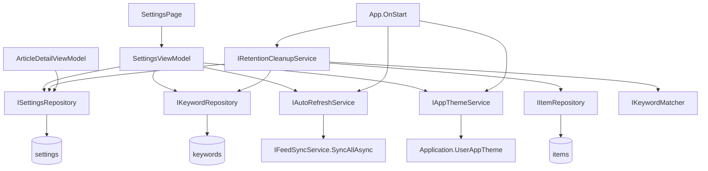

← [Zurück zur Übersicht](index.md)

# Einstellungen — Architektur

## Beteiligte Komponenten

| Komponente | Typ | Rolle |
|------------|-----|-------|
| `SettingsPage` (`src/Reporter/Views/SettingsPage.xaml`) | View | Formularseite mit fünf Sektions-Karten (Slider, Entry, Chips via `FlexLayout`/`BindableLayout`, Switches, Picker, TimePicker) |
| `SettingsViewModel` (`src/Reporter.Core/ViewModels/SettingsViewModel.cs`) | ViewModel | Bindbare Optionen, Sofort-Persistierung, Keyword-Verwaltung mit Validierung |
| `RefreshIntervalOption` / `AutoMarkReadDelayOption` / `ThemeOption` (`Reporter.Core/ViewModels/`) | Datenmodellklassen | `ItemsSource`-Einträge (Wert + lokalisiertes Label) für die drei `Picker` |
| `ISettingsRepository` / `SettingsRepository` | Repository | Singleton-`Settings` lesen (`GetAsync`, legt Datensatz bei Bedarf an) und schreiben (`SaveAsync`) |
| `IKeywordRepository` / `KeywordRepository` | Repository | Keyword-Liste lesen, anlegen, löschen (`keywords`-Tabelle, `keyword_text` max. 500) |
| `IKeywordMatcher` / `KeywordMatcher` (`Reporter.Core`) | Service | Zentrales Matching: `Contains` mit `OrdinalIgnoreCase` auf `Title` und `ContentHtml`; Wiederverwendung durch Cleanup und späteres Benachrichtigungs-Paket |
| `IAutoRefreshService` / `AutoRefreshService` (`Reporter.Core`) | Service | `PeriodicTimer`-Loop über `TimeProvider`, ruft `IFeedSyncService.SyncAllAsync`, Overlap-Guard via `Interlocked` |
| `IAppThemeService` (`Reporter.Core`) / `AppThemeService` (`src/Reporter/Services/`) | Interface + Implementierung | Setzt `Application.Current.UserAppTheme`; Abstraktion nötig, da `Reporter.Core` (`net10.0`) keine MAUI-Referenz hat |
| `IRetentionCleanupService` / `RetentionCleanupService` (`Reporter.Core`) | Service | Start-Cleanup; löscht abgelaufene gelesene Artikel und keyword-gefilterte Kandidaten |
| `ArticleDetailViewModel` (`src/Reporter/ViewModels/`) | ViewModel | Wertet `AutoMarkReadMode`/`AutoMarkReadDelaySeconds` beim Öffnen eines Artikels aus |
| `ReporterDbContext` (`Reporter.Data`) | EF Core | Tabellen `settings` (Singleton) und `keywords`; Migration `AddSettingsAutoRefreshAndTheme` für die neuen Spalten |

## Abhängigkeiten

- Alle Services werden in `MauiProgram.CreateMauiApp` als Singletons registriert: `IKeywordMatcher → KeywordMatcher`, `IAutoRefreshService → AutoRefreshService`, `IAppThemeService → AppThemeService`.
- `AutoRefreshService` hängt von `ISettingsRepository`, `IFeedSyncService` und `TimeProvider` ab (Standard `TimeProvider.System`; Tests injizieren `FakeTimeProvider` aus `Microsoft.Extensions.TimeProvider.Testing`).
- `RetentionCleanupService` hängt von `ISettingsRepository`, `IItemRepository`, `IKeywordRepository` und `IKeywordMatcher` ab.
- `SettingsViewModel` hängt von `ISettingsRepository`, `IKeywordRepository`, `IAutoRefreshService` und `IAppThemeService` ab.
- `Reporter.Data` nutzt `IDbContextFactory<ReporterDbContext>` pro Operation; `IItemRepository` wurde um `GetExpiredKeywordCandidatesAsync` und `DeleteRangeAsync` erweitert.

## Datenfluss

## Skalierung und Zuverlässigkeit

- **Fehlerisolierung:** Die drei Startblöcke in `App.OnStart` (Cleanup, Theme, Auto-Refresh) sind einzeln abgefangen — kein Fehler darf den App-Start blockieren.
- **Overlap-Guard:** `AutoRefreshService` überspringt Ticks, solange ein Sync läuft (`Interlocked`-Flag) — kein gestapelter Sync.
- **Serialisierung:** `PersistAsync` läuft unter `_persistLock`; parallele Control-Änderungen erzeugen keine überlappenden `SaveAsync`-Aufrufe.
- **In-Memory-Matching:** Das Keyword-Matching läuft bewusst im Speicher (`OrdinalIgnoreCase` ist in SQLite/`LIKE` nur für ASCII zuverlässig); die Kandidatenmenge ist durch die Frist- und Gelesen-Bedingung klein und lokal.
- **Timer-Lebensdauer:** Der Auto-Refresh-Loop lebt nur solange die App läuft — es gibt keinen OS-seitigen Background-Fetch.
