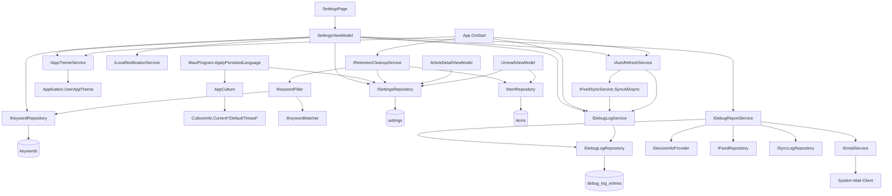

<!-- Licensed under the PolyForm Noncommercial License 1.0.0 - see the LICENSE file in the project root for details. -->

← [Zurück zur Übersicht](index.md)

# Einstellungen — Architektur

## Beteiligte Komponenten

| Komponente | Typ | Rolle |
|------------|-----|-------|
| `SettingsPage` (`src/Reporter/Views/SettingsPage.xaml`) | View | Formularseite mit sieben Sektions-Karten (Slider, Entry, Chips via `FlexLayout`/`BindableLayout`, Switches, Picker, TimePicker, Debug-Senden-Aktion) |
| `SettingsViewModel` (`src/Reporter.Core/ViewModels/SettingsViewModel.cs`) | ViewModel | Bindbare Optionen, Sofort-Persistierung, Keyword-Verwaltung mit Validierung |
| `RefreshIntervalOption` / `AutoMarkReadDelayOption` / `ThemeOption` / `LanguageOption` / `SortOrderOption` (`Reporter.Core/ViewModels/`) | Datenmodellklassen | `ItemsSource`-Einträge (Wert + lokalisiertes Label) für die fünf `Picker` |
| `ISettingsRepository` / `SettingsRepository` | Repository | Singleton-`Settings` lesen (`GetAsync`, legt Datensatz bei Bedarf an) und schreiben (`SaveAsync`) |
| `IKeywordRepository` / `KeywordRepository` | Repository | Keyword-Liste lesen, anlegen, löschen (`keywords`-Tabelle, `keyword_text` max. 500) |
| `IKeywordMatcher` / `KeywordMatcher` (`Reporter.Core`) | Service | Zentrales Matching: `Contains` mit `OrdinalIgnoreCase` auf `Title` und `ContentHtml` |
| `IKeywordFilter` / `KeywordFilter` (`Reporter.Core`) | Service | Kapselt `IKeywordRepository` + `IKeywordMatcher` (`GetKeywordTextsAsync` lädt die Liste einmal pro Lauf, `MatchesAny` prüft Titel/`ContentHtml`); Wiederverwendung durch `FeedSyncService` (Ingest-Filter beim Abruf), `RetentionCleanupService` (Bestandstreffer) und `NotificationService` (Tiefenverteidigung) |
| `IAutoRefreshService` / `AutoRefreshService` (`Reporter.Core`) | Service | `PeriodicTimer`-Loop über `TimeProvider`, ruft `IFeedSyncService.SyncAllAsync` sequenziell awaitend auf (keine überlappenden Abrufe); `StartAsync` löst zusätzlich bei `RefreshOnStartupEnabled && IsOnline` einen fehlerisolierten, nicht abgewarteten Start-Abruf (`RunStartupSyncAsync`) aus |
| `IAppThemeService` (`Reporter.Core`) / `AppThemeService` (`src/Reporter/Services/`) | Interface + Implementierung | Setzt `Application.Current.UserAppTheme`; Abstraktion nötig, da `Reporter.Core` (`net10.0`) keine MAUI-Referenz hat |
| `ILocalNotificationService` (`Reporter.Core`) / `LocalNotificationService` (`src/Reporter/Services/`) | Interface + Implementierung | iOS-Benachrichtigungsberechtigung anfragen (`RequestAuthorizationAsync`) und Status abfragen (`GetAuthorizationStatusAsync` → `NotificationAuthorizationStatus`); `IsSupported` ist nur unter iOS `true` — Details siehe [Benachrichtigungen — Architektur](../benachrichtigungen/architektur.md) |
| `SettingsValues` (`Reporter.Core/Models`) | statische Klasse | Zentrale Konstanten für persistierte Setting-Werte (`AutoMarkReadOnOpen`/`AutoMarkReadOnScroll`/`AutoMarkReadOff`, `ThemeSystem`/`ThemeLight`/`ThemeDark`, `LanguageSystem`/`LanguageGerman`/`LanguageEnglish`, `SortOrderDescending`/`SortOrderAscending`) und die Prüfmethode `IsAutoMarkReadEnabled` |
| `AppCulture` (`Reporter.Core/Localization`) | statische Klasse | `ResolveCulture` mappt `"de"`/`"en"` auf `CultureInfo` (`"system"`/`null`/unbekannt → `null`); `Apply` setzt `CurrentUICulture`/`CurrentCulture` und `DefaultThreadCurrentUICulture`/`DefaultThreadCurrentCulture`. Kein Interface nötig — `CultureInfo` ist reine BCL |
| `IRetentionCleanupService` / `RetentionCleanupService` (`Reporter.Core`) | Service | Start-Cleanup; löscht abgelaufene gelesene Artikel und bereits gespeicherte keyword-gefilterte Bestandstreffer |
| `IDebugLogService` / `DebugLogService` (`Reporter.Core`) | Service | Schreibseite des Session-Debug-Logs: `BeginSessionAsync` (Reset via `DeleteAllExceptErrorsAsync`, `_enabled` aus `Settings.DebugCollectionEnabled`, Start-Eintrag), `SetEnabled` (Laufzeit-Umschaltung inkl. Übergangseintrag), `LogAsync` (No-op bei deaktiviert, nie werfend, `TrimToLatestAsync(500)` nach jedem Eintrag) |
| `IDebugLogRepository` / `DebugLogRepository` (`Reporter.Data`) | Repository | Datenzugriff auf `debug_log_entries` (`GetAllAsync`/`GetLatestAsync` absteigend nach `Timestamp`, `AddAsync`, `DeleteAllExceptErrorsAsync` per `ExecuteDeleteAsync`, `TrimToLatestAsync` mit Count-Vorprüfung) |
| `IDebugReportService` / `DebugReportService` (`Reporter.Core`) | Service | Orchestriert den Debugbericht: sammelt `AppDeviceInfo`, Online-Status, Settings-Snapshot, Feed-Health, `ISyncLogRepository.GetLatestAsync(50)` und `IDebugLogRepository.GetLatestAsync(200)`, formatiert Betreff/Plain-Text-Body (7 lokalisierte `DebugReportSection*`-Header) und ruft `IEmailService.ComposeAsync`; Konstanten `MaxSyncLogEntries`, `MaxDebugLogEntries`; Empfänger `DebugReportRecipient` aus MSBuild-Property gleichen Namens (Default `"debug@example.com"` in `Directory.Build.props`, via `AssemblyMetadata` gelesen) |
| `IEmailService` (`Reporter.Core`) / `EmailService` (`src/Reporter/Services/`) | Interface + Implementierung | Gateway zum System-Mail-Client via `Email.Default`: `IsSupported` → `IsComposeSupported`, `ComposeAsync` → `EmailMessage` (PlainText) + `ComposeAsync`; Plattformfehler werden auf `false` gekapselt |
| `IDeviceInfoProvider` (`Reporter.Core`) / `DeviceInfoProvider` (`src/Reporter/Services/`) | Interface + Implementierung | Gateway für App-/Geräte-/OS-Angaben: `GetSnapshot` liest `AppInfo.Current` (`Name`, `VersionString`, `BuildString`) und `DeviceInfo.Current` (`Model`, `Manufacturer`, `Platform`, `VersionString`) in `AppDeviceInfo` |
| `AppDeviceInfo` / `DebugLogEntry` (`Reporter.Core/Models`) | Datenmodellklassen | `AppDeviceInfo`: Snapshot-Value-Object für den Report (entkoppelt die Formatierung von den MAUI-Typen); `DebugLogEntry`: Session-Log-Eintrag (`Id`, `Timestamp` UTC, `Level`, `Category`, `Message`, `Details`) |
| `DebugLogLevel` / `DebugLogCategory` (`Reporter.Core/Services`) | Konstantenklassen | `Info`/`Warning`/`Error` bzw. `Lifecycle`/`Sync`/`Exception`/`Settings`/`Report` (Muster `FeedHealth`) |
| `ArticleDetailViewModel` (`src/Reporter/ViewModels/`) | ViewModel | Wertet `AutoMarkReadMode`/`AutoMarkReadDelaySeconds` beim Öffnen eines Artikels aus |
| `UnreadViewModel` (`Reporter.Core/ViewModels/`) | ViewModel | Hält eine `ISettingsRepository`-Abhängigkeit; `LoadPageAsync` wertet `Settings.UnreadSortOrder` aus und reicht sie als `ascending`-Parameter an `IItemRepository.GetUnreadByDateAsync` |
| `ReporterDbContext` (`Reporter.Data`) | EF Core | Tabellen `settings` (Singleton), `keywords` und `debug_log_entries`; Migrationen `AddSettingsAutoRefreshAndTheme`, `AddSettingsLanguage` (Spalte `settings.language`), `AddSettingsStartupRefreshAndSortOrder` (Spalten `settings.refresh_on_startup_enabled`, `settings.unread_sort_order`), `AddSettingsDebugCollection` (Spalte `settings.debug_collection_enabled`, Default `false`) und `AddDebugLogEntries` (Tabelle `debug_log_entries` mit Index `IX_debug_log_entries_timestamp`) |
| `App` (`src/Reporter/App.xaml.cs`) | Application | Startet die Debug-Session in `OnStart` (`BeginSessionAsync` nach `MigrateAsync`), abonniert `AppDomain.CurrentDomain.UnhandledException`/`TaskScheduler.UnobservedTaskException` und schreibt `Lifecycle`-Einträge in `OnSleep`/`OnResume` |

## Abhängigkeiten

- Alle Services werden in `MauiProgram.CreateMauiApp` als Singletons registriert: `IKeywordMatcher → KeywordMatcher`, `IKeywordFilter → KeywordFilter`, `IAutoRefreshService → AutoRefreshService`, `IAppThemeService → AppThemeService` sowie für die Diagnose `IDebugLogRepository → DebugLogRepository`, `IDebugLogService → DebugLogService`, `IEmailService → EmailService`, `IDeviceInfoProvider → DeviceInfoProvider` und `IDebugReportService → DebugReportService`.
- `MauiProgram.CreateMauiApp` ruft nach `builder.Build()` `ApplyPersistedLanguage(app)` auf: synchroner Scope → `ReporterDbContext.Database.Migrate()` → `ISettingsRepository.GetAsync()` → `AppCulture.Apply(settings.Language)` — vor `CreateWindow`, damit `AppShell` und die eager erzeugten Pages/ViewModels bereits in der gewählten Kultur lesen. `AppCulture` ist statisch und benötigt keine DI-Registrierung.
- `AutoRefreshService` hängt von `ISettingsRepository`, `IFeedSyncService`, `INetworkStatusService` und `TimeProvider` ab (Standard `TimeProvider.System`; Tests injizieren `FakeTimeProvider` aus `Microsoft.Extensions.TimeProvider.Testing`).
- `RetentionCleanupService` hängt von `ISettingsRepository`, `IItemRepository` und `IKeywordFilter` ab.
- `FeedSyncService` hängt ebenfalls von `IKeywordFilter` ab — `RunSyncAsync` lädt die Keyword-Liste pro Lauf und verwirft Treffer, bevor sie gespeichert werden (Ingest-Filter).
- `SettingsViewModel` hängt von `ISettingsRepository`, `IKeywordRepository`, `IAutoRefreshService`, `IAppThemeService` und optional `ILocalNotificationService`, `IDebugReportService` und `IDebugLogService` ab (nullable Konstruktor-Parameter — die Berechtigungslogik ist nur bei `IsSupported` aktiv; bei `null` meldet `DebugEmailSupported` `false` und `SendDebugReportAsync` kehrt sofort zurück).
- `FeedSyncService` und `AutoRefreshService` halten eine optionale `IDebugLogService?`-Abhängigkeit (letzter Konstruktorparameter, `= null`) für `Sync`-/`Warning`-Logeinträge in den Fehlerpfaden.
- `DebugLogService` hängt von `IDebugLogRepository`, `ISettingsRepository` und `TimeProvider` ab; `DebugReportService` von `ISettingsRepository`, `ISyncLogRepository`, `IFeedRepository`, `IDebugLogRepository`, `IDeviceInfoProvider`, `INetworkStatusService`, `IEmailService` und optional `TimeProvider`/`IDebugLogService`.
- `UnreadViewModel` hängt seit der Ungelesen-Sortierung ebenfalls von `ISettingsRepository` ab (Auswertung von `UnreadSortOrder` pro geladener Seite).
- `Reporter.Data` nutzt `IDbContextFactory<ReporterDbContext>` pro Operation; `IItemRepository` wurde um `GetExpiredKeywordCandidatesAsync` und `DeleteRangeAsync` erweitert, `ISyncLogRepository` um `GetLatestAsync(maxEntries)` (begrenzte Abfrage für den Debugbericht; `GetAllAsync` bleibt bestehen).

## Datenfluss

## Skalierung und Zuverlässigkeit

- **Fehlerisolierung:** Die drei Startblöcke in `App.OnStart` (Cleanup, Theme, Auto-Refresh) sowie `MauiProgram.ApplyPersistedLanguage` sind einzeln abgefangen — kein Fehler darf den App-Start blockieren.
- **Sequenzieller Sync-Loop:** `AutoRefreshService` awaitet jeden `SyncAllAsync`-Aufruf pro Timer-Tick; während eines laufenden Syncs verstrichene Perioden fasst der `PeriodicTimer` zusammen — keine parallelen oder gestapelten Abrufe.
- **Serialisierung:** `PersistAsync` läuft unter `_persistLock`; parallele Control-Änderungen erzeugen keine überlappenden `SaveAsync`-Aufrufe.
- **In-Memory-Matching:** Das Keyword-Matching läuft bewusst im Speicher (`OrdinalIgnoreCase` ist in SQLite/`LIKE` nur für ASCII zuverlässig) — beim Ingest in `FeedSyncService` über die kleine Abrufmenge pro Feed sowie im Cleanup über die durch Frist- und Gelesen-Bedingung kleine Kandidatenmenge.
- **Timer-Lebensdauer:** Der Auto-Refresh-Loop lebt nur solange die App läuft — es gibt keinen OS-seitigen Background-Fetch.
- **Debug-Logger als Nicht-Fehlerquelle:** `DebugLogService` fängt eigene Fehler intern ab und wirft nie (`volatile bool _enabled` als speicherinterner Schalter — kein DB-Zugriff pro Ereignis); `BeginSessionAsync` verhindert nie den App-Start.
- **Begrenztes Log-Wachstum:** `debug_log_entries` wird nach jedem Eintrag auf `MaxStoredEntries = 500` getrimmt (No-op per Count-Prüfung unterhalb des Limits); der Report liest höchstens 200 Session-Log- und 50 Sync-Log-Einträge.
- **Fire-and-forget im Absturzpfad:** Die `UnhandledException`/`UnobservedTaskException`-Handler loggen ohne `await` — bei einem harten Absturz kann der letzte Eintrag verloren gehen.
- **Versand nur über den System-Mail-Client:** Es gibt keinen SMTP-Direktversand; ohne Mail-App meldet `IEmailService.IsSupported` `false` und der Versand endet als sichtbarer Fehlerpfad (`DebugReportFailed`-Alert).
