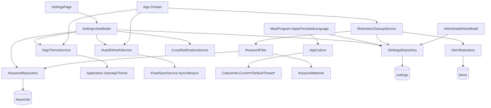

<!-- Licensed under the PolyForm Noncommercial License 1.0.0 - see the LICENSE file in the project root for details. -->

← [Zurück zur Übersicht](index.md)

# Einstellungen — Architektur

## Beteiligte Komponenten

| Komponente | Typ | Rolle |
|------------|-----|-------|
| `SettingsPage` (`src/Reporter/Views/SettingsPage.xaml`) | View | Formularseite mit sechs Sektions-Karten (Slider, Entry, Chips via `FlexLayout`/`BindableLayout`, Switches, Picker, TimePicker) |
| `SettingsViewModel` (`src/Reporter.Core/ViewModels/SettingsViewModel.cs`) | ViewModel | Bindbare Optionen, Sofort-Persistierung, Keyword-Verwaltung mit Validierung |
| `RefreshIntervalOption` / `AutoMarkReadDelayOption` / `ThemeOption` / `LanguageOption` (`Reporter.Core/ViewModels/`) | Datenmodellklassen | `ItemsSource`-Einträge (Wert + lokalisiertes Label) für die vier `Picker` |
| `ISettingsRepository` / `SettingsRepository` | Repository | Singleton-`Settings` lesen (`GetAsync`, legt Datensatz bei Bedarf an) und schreiben (`SaveAsync`) |
| `IKeywordRepository` / `KeywordRepository` | Repository | Keyword-Liste lesen, anlegen, löschen (`keywords`-Tabelle, `keyword_text` max. 500) |
| `IKeywordMatcher` / `KeywordMatcher` (`Reporter.Core`) | Service | Zentrales Matching: `Contains` mit `OrdinalIgnoreCase` auf `Title` und `ContentHtml` |
| `IKeywordFilter` / `KeywordFilter` (`Reporter.Core`) | Service | Kapselt `IKeywordRepository` + `IKeywordMatcher` (`GetKeywordTextsAsync` lädt die Liste einmal pro Lauf, `MatchesAny` prüft Titel/`ContentHtml`); Wiederverwendung durch `FeedSyncService` (Ingest-Filter beim Abruf), `RetentionCleanupService` (Bestandstreffer) und `NotificationService` (Tiefenverteidigung) |
| `IAutoRefreshService` / `AutoRefreshService` (`Reporter.Core`) | Service | `PeriodicTimer`-Loop über `TimeProvider`, ruft `IFeedSyncService.SyncAllAsync` sequenziell awaitend auf (keine überlappenden Abrufe) |
| `IAppThemeService` (`Reporter.Core`) / `AppThemeService` (`src/Reporter/Services/`) | Interface + Implementierung | Setzt `Application.Current.UserAppTheme`; Abstraktion nötig, da `Reporter.Core` (`net10.0`) keine MAUI-Referenz hat |
| `ILocalNotificationService` (`Reporter.Core`) / `LocalNotificationService` (`src/Reporter/Services/`) | Interface + Implementierung | iOS-Benachrichtigungsberechtigung anfragen (`RequestAuthorizationAsync`) und Status abfragen (`GetAuthorizationStatusAsync` → `NotificationAuthorizationStatus`); `IsSupported` ist nur unter iOS `true` — Details siehe [Benachrichtigungen — Architektur](../benachrichtigungen/architektur.md) |
| `SettingsValues` (`Reporter.Core/Models`) | statische Klasse | Zentrale Konstanten für persistierte Setting-Werte (`AutoMarkReadOnOpen`/`AutoMarkReadOnScroll`/`AutoMarkReadOff`, `ThemeSystem`/`ThemeLight`/`ThemeDark`, `LanguageSystem`/`LanguageGerman`/`LanguageEnglish`) und die Prüfmethode `IsAutoMarkReadEnabled` |
| `AppCulture` (`Reporter.Core/Localization`) | statische Klasse | `ResolveCulture` mappt `"de"`/`"en"` auf `CultureInfo` (`"system"`/`null`/unbekannt → `null`); `Apply` setzt `CurrentUICulture`/`CurrentCulture` und `DefaultThreadCurrentUICulture`/`DefaultThreadCurrentCulture`. Kein Interface nötig — `CultureInfo` ist reine BCL |
| `IRetentionCleanupService` / `RetentionCleanupService` (`Reporter.Core`) | Service | Start-Cleanup; löscht abgelaufene gelesene Artikel und bereits gespeicherte keyword-gefilterte Bestandstreffer |
| `ArticleDetailViewModel` (`src/Reporter/ViewModels/`) | ViewModel | Wertet `AutoMarkReadMode`/`AutoMarkReadDelaySeconds` beim Öffnen eines Artikels aus |
| `ReporterDbContext` (`Reporter.Data`) | EF Core | Tabellen `settings` (Singleton) und `keywords`; Migrationen `AddSettingsAutoRefreshAndTheme` und `AddSettingsLanguage` (Spalte `settings.language`) für die neuen Spalten |

## Abhängigkeiten

- Alle Services werden in `MauiProgram.CreateMauiApp` als Singletons registriert: `IKeywordMatcher → KeywordMatcher`, `IKeywordFilter → KeywordFilter`, `IAutoRefreshService → AutoRefreshService`, `IAppThemeService → AppThemeService`.
- `MauiProgram.CreateMauiApp` ruft nach `builder.Build()` `ApplyPersistedLanguage(app)` auf: synchroner Scope → `ReporterDbContext.Database.Migrate()` → `ISettingsRepository.GetAsync()` → `AppCulture.Apply(settings.Language)` — vor `CreateWindow`, damit `AppShell` und die eager erzeugten Pages/ViewModels bereits in der gewählten Kultur lesen. `AppCulture` ist statisch und benötigt keine DI-Registrierung.
- `AutoRefreshService` hängt von `ISettingsRepository`, `IFeedSyncService` und `TimeProvider` ab (Standard `TimeProvider.System`; Tests injizieren `FakeTimeProvider` aus `Microsoft.Extensions.TimeProvider.Testing`).
- `RetentionCleanupService` hängt von `ISettingsRepository`, `IItemRepository` und `IKeywordFilter` ab.
- `FeedSyncService` hängt ebenfalls von `IKeywordFilter` ab — `RunSyncAsync` lädt die Keyword-Liste pro Lauf und verwirft Treffer, bevor sie gespeichert werden (Ingest-Filter).
- `SettingsViewModel` hängt von `ISettingsRepository`, `IKeywordRepository`, `IAutoRefreshService`, `IAppThemeService` und optional `ILocalNotificationService` ab (nullable Konstruktor-Parameter — die Berechtigungslogik ist nur bei `IsSupported` aktiv).
- `Reporter.Data` nutzt `IDbContextFactory<ReporterDbContext>` pro Operation; `IItemRepository` wurde um `GetExpiredKeywordCandidatesAsync` und `DeleteRangeAsync` erweitert.

## Datenfluss

## Skalierung und Zuverlässigkeit

- **Fehlerisolierung:** Die drei Startblöcke in `App.OnStart` (Cleanup, Theme, Auto-Refresh) sowie `MauiProgram.ApplyPersistedLanguage` sind einzeln abgefangen — kein Fehler darf den App-Start blockieren.
- **Sequenzieller Sync-Loop:** `AutoRefreshService` awaitet jeden `SyncAllAsync`-Aufruf pro Timer-Tick; während eines laufenden Syncs verstrichene Perioden fasst der `PeriodicTimer` zusammen — keine parallelen oder gestapelten Abrufe.
- **Serialisierung:** `PersistAsync` läuft unter `_persistLock`; parallele Control-Änderungen erzeugen keine überlappenden `SaveAsync`-Aufrufe.
- **In-Memory-Matching:** Das Keyword-Matching läuft bewusst im Speicher (`OrdinalIgnoreCase` ist in SQLite/`LIKE` nur für ASCII zuverlässig) — beim Ingest in `FeedSyncService` über die kleine Abrufmenge pro Feed sowie im Cleanup über die durch Frist- und Gelesen-Bedingung kleine Kandidatenmenge.
- **Timer-Lebensdauer:** Der Auto-Refresh-Loop lebt nur solange die App läuft — es gibt keinen OS-seitigen Background-Fetch.
