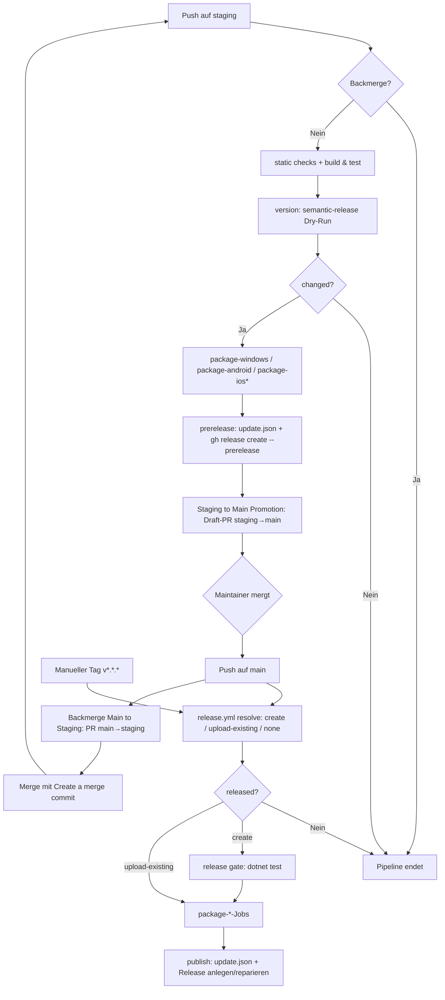

<!-- Licensed under the PolyForm Noncommercial License 1.0.0 - see the LICENSE file in the project root for details. -->

← [Zurück zur Übersicht](index.md)

# Release-Management — Technischer Ablauf

## Übersicht

Die Pipeline besteht aus drei verzahnten Pfaden: (1) Push auf `staging` erzeugt nach den Quality Gates ein RC-Pre-Release `vX.Y.Z-rc.N` und löst danach die Promotion nach `main` aus; (2) Push auf `main` oder manueller Tag `v*.*.*` erzeugt bzw. repariert das stabile Release; (3) Push auf `main` öffnet zusätzlich den Backmerge-PR nach `staging`. PRs gegen `staging` laufen durch dieselben Gates ohne Release-Erzeugung. Alle Packaging-Jobs liefern Artefakte an einen Aggregations-Job, der `update.json` baut und das GitHub-Release anlegt.

## Ablauf 1: RC-Pre-Release auf `staging` (`.github/workflows/staging-ci.yml`, Workflow `Pre-Release`)

Trigger: `push → branches: [staging]`, `concurrency: staging-ci` mit `cancel-in-progress: true`. Permissions: `contents: write`, `checks: write`, `pull-requests: write`.

### 1. Backmerge-Erkennung (`detect-backmerge`, `ubuntu-latest`)

Prüft, ob der Head-Commit ein reiner Backmerge von `main` ist, und setzt den Output `is_backmerge`:

- `git fetch origin main:refs/remotes/origin/main --no-tags`, dann Vergleich aller Parents von `HEAD` (`git show -s --format=%P`) mit `origin/main` → Treffer = Backmerge.
- Andernfalls `git diff --quiet origin/main HEAD` → identischer Baum = Backmerge.

### 2. Quality Gates (`static-checks`, `build-and-test`, `windows-latest`)

Beide Jobs hängen an `needs: detect-backmerge` mit `if: is_backmerge != 'true'` und laufen parallel. Beide setzen `IncludeIosTarget: false` und `IncludeAndroidTarget: false` als Umgebungsvariablen.

- `static-checks` (Anzeigename `static checks`): `dotnet workload restore Reporter.sln`, `dotnet restore Reporter.sln -r win-x64`, `dotnet format --verify-no-changes --severity error`, Composite Action `./.github/actions/security-scan` (Artifact `vulnerable-packages-staging`), Static-Analysis-Build `dotnet build -c Release -p:TreatWarningsAsErrors=true`.
- `build-and-test` (Anzeigename `build & test`): Build `Release`, `dotnet test src/Reporter.Tests/Reporter.Tests.csproj --settings src/Reporter.Tests/coverlet.runsettings` mit XPlat Code Coverage, ReportGenerator `5.5.11`, Coverage-Gate 70 % (awk-Vergleich auf `coverage-report/Summary.txt`), Artefakt-Uploads `coverage-report-staging` und `test-results-staging` (Retention 14 Tage, `if: always()`).

### 3. Versionsermittlung (`version`, `ubuntu-latest`)

`needs: [detect-backmerge, static-checks, build-and-test]`, `if: is_backmerge != 'true'`.

- `npx semantic-release --dry-run --no-ci --branches staging` mit `RESOLVE_DRY_RUN: 'true'` (schaltet `release.config.js` auf die Dry-Run-Pluginliste um) → Regex `the next release version is (X.Y.Z…)` → Outputs `version`, `changed`.
- RC-Nummer: `rc_number = count(git tag --list "v<version>-rc.*") + 1` → Outputs `rc_tag = v<version>-rc.<N>`, `rc_version = <version>-rc.<N>`.

### 4. Plattform-Packaging (`package-windows`, `package-android`, `package-ios`)

Alle drei `needs: version`, `if: needs.version.outputs.changed == 'true'`, parallel:

- `package-windows` (`windows-latest`): Composite Action `./.github/actions/build-and-package` mit `release-version: rc_version`, `release-tag: rc_tag` → `dotnet publish` `net10.0-windows10.0.19041.0`/`win-x64` self-contained (`PublishReadyToRun=false`) → `Compress-Archive` → Upload-Artefakt `release-win-x64` (`release-win-x64.zip`).
- `package-android` (`windows-latest`): Composite Action `./.github/actions/package-android` → `dotnet publish` `net10.0-android -p:AndroidPackageFormat=apk` mit `IncludeAndroidTarget: true` → Collect-Step bevorzugt `*-Signed.apk` → Upload-Artefakt `release-android` (`release-android.apk`).
- `package-ios` (`macos-latest`, zusätzlich `if: vars.IOS_SIGNING_ENABLED == 'true'`): Composite Action `./.github/actions/package-ios` mit `codesign-key: secrets.IOS_CODESIGN_KEY`, `provisioning-profile: secrets.IOS_PROVISIONING_PROFILE` → `dotnet publish` `net10.0-ios -p:RuntimeIdentifier=ios-arm64 -p:ArchiveOnBuild=true` → Upload-Artefakt `release-ios` (`release-ios.ipa`).

### 5. Aggregation und Pre-Release (`prerelease`, `ubuntu-latest`)

`needs: [version, package-windows, package-android, package-ios]`, `if: needs.version.outputs.changed == 'true' && !failure() && !cancelled()` — ein übersprungener `package-ios`-Job gilt nicht als Fehlschlag.

1. `actions/download-artifact` mit `pattern: release-*`, `merge-multiple: true` → alle Pakete liegen flach im Arbeitsverzeichnis.
2. `node scripts/release-assets.mjs` (Env `IOS_SIGNING_ENABLED: ${{ vars.IOS_SIGNING_ENABLED }}`) schreibt `RELEASE_ASSETS` (`name:platform:runtimeIdentifier`, `;`-getrennt), `RELEASE_ASSET_PATHS` (`;`-getrennt) und `RELEASE_ASSET_FILES` (leerzeichengetrennt) nach `$GITHUB_ENV`.
3. `node scripts/create-update-manifest.mjs` (Env `RELEASE_VERSION: rc_version`, `RELEASE_TAG: rc_tag`) erzeugt `update.json`.
4. `gh release create "$rc_tag" $RELEASE_ASSET_FILES update.json --target "$GITHUB_SHA" --title "$rc_tag" --prerelease --generate-notes`.

### 6. Promotion (`.github/workflows/staging-to-main-promotion.yml`, Workflow `Staging to Main Promotion`)

Trigger: `workflow_run` auf den Workflow-Namen `Pre-Release`, `types: [completed]`, `branches: [staging]`. Job `promote` nur bei `conclusion == 'success'`:

1. Checkout von `workflow_run.head_sha` (`fetch-depth: 0`), `git fetch origin main`.
2. `git diff --name-only origin/main HEAD` leer → `commits_ahead=0` → kein PR; sonst `git rev-list origin/main..HEAD --count`.
3. `gh label create automated-promotion --color 0E8A16 --force` (idempotent).
4. `gh pr create --base main --head staging --draft --label automated-promotion` — nur wenn `gh pr list --base main --head staging --state open` leer ist.

Beteiligte Komponenten: `staging-ci.yml`, `staging-to-main-promotion.yml`, `.github/actions/build-and-package`, `.github/actions/package-android`, `.github/actions/package-ios`, `scripts/release-assets.mjs`, `scripts/create-update-manifest.mjs`, `release.config.js`.

## Ablauf 2: Stabiles Release auf `main` (`.github/workflows/release.yml`, Workflow `Release`)

Trigger: `push → branches: [main]` oder `tags: ['v*.*.*']`, `concurrency: release` mit `cancel-in-progress: false`. Permissions: `contents: write`, `issues: write`, `pull-requests: write`.

### 1. Release-Entscheidung (`resolve`, `ubuntu-latest`)

Checkout mit `fetch-depth: 0`/`fetch-tags: true`, Node 24, `npm ci`, Entfernen lokaler `v*-rc.*`-Tags, dann `node scripts/resolve-release-version.mjs` (Env `GITHUB_TOKEN`, `IOS_SIGNING_ENABLED: ${{ vars.IOS_SIGNING_ENABLED }}`).

`resolveReleaseVersion()` klassifiziert den Ref über `classifyWorkflowRef` (`GITHUB_REF_TYPE`/`GITHUB_REF_NAME`): `tag` → `manual` (Tag muss `v` + SemVer sein, `parseManualTag`/`VERSION_PATTERN`), Branch in `AUTOMATIC_RELEASE_BRANCHES = ["main"]` → `automatic`, sonst Fehler.

- **Manuell (`resolveManualRelease`):** Release zum Tag existiert → vollständige Assets (`releaseHasExpectedAsset`, `EXPECTED_ASSETS` aus `buildReleaseAssets` + `update.json`) → `released=false`/`release_action=none`; unvollständig → `release_action=upload-existing`. Release fehlt → `release_action=create`, `release_kind=manual`.
- **Automatisch (`resolveAutomaticRelease`):** `semantic-release --dry-run --no-ci` (mit `RESOLVE_DRY_RUN=true`) liefert Version → Tag `v<version>`; Existenz-/Vollständigkeitsprüfung wie oben → `create` / `upload-existing` / `none`. Kein neuer Stand → `listGitHubReleases` (paginiert, `per_page=100`) → `incompleteReleases` filtert nicht-Prerelease-Releases ohne vollständige Assets (Prerelease-Guard) → ältestes wird per `repairIncompleteRelease` als `upload-existing` repariert; keine Treffer → `none`.

Outputs: `released`, `reason`, `version`, `tag`, `release_kind`, `release_action`.

### 2. Release-Gate (`release-gate`, `windows-latest`)

`needs: resolve`, `if: released == 'true' && release_action == 'create'` — beim Repair-Pfad entfällt das Gate, weil der getaggte Stand bereits geprüft wurde. `actions/setup-dotnet` `10.0.x`, `dotnet test src/Reporter.Tests/Reporter.Tests.csproj -c Release`.

### 3. Plattform-Packaging (`package-windows`, `package-android`, `package-ios`)

`needs: [resolve, release-gate]`, `if: released == 'true' && !failure() && !cancelled()` (iOS zusätzlich `vars.IOS_SIGNING_ENABLED == 'true'`). Jeder Job:

1. Bei `release_action == 'upload-existing'`: Composite Action `./.github/actions/checkout-release-tag` — `git fetch origin "+refs/tags/<tag>:refs/tags/<tag>"`, `git checkout --detach <tag>`, Abbruch wenn `HEAD` nicht dem Tag-Commit entspricht. Damit wird das Artefakt exakt aus dem getaggten Stand gebaut.
2. Packaging wie in Ablauf 1, aber mit `release-version`/`release-tag` aus dem `resolve`-Job (stabile Version ohne `-rc.N`).
3. Upload-Artefakte `release-win-x64`, `release-android`, `release-ios`.

### 4. Veröffentlichung (`publish`, `ubuntu-latest`)

`needs: [resolve, package-windows, package-android, package-ios]`, `if: released == 'true' && !failure() && !cancelled()`. `npm ci`, Entfernen lokaler `v*-rc.*`-Tags, Download aller `release-*`-Artefakte, `scripts/release-assets.mjs`, `scripts/create-update-manifest.mjs` (Env `RELEASE_VERSION`, `RELEASE_TAG`). Danach genau einer von drei Pfaden:

- `create` + `release_kind == 'automatic'`: `npm run release` → semantic-release erzeugt Tag, GitHub-Release und lädt die Assets gemäß `release.config.js` hoch (`RELEASE_ASSET_PATHS` → Basename-Mapping plus `RELEASE_MANIFEST_PATH: update.json` → `update.json`; `successComment`/`failComment: false`).
- `create` + `release_kind == 'manual'`: `gh release create "$tag" $RELEASE_ASSET_FILES update.json --title "$tag" --generate-notes`.
- `upload-existing`: `gh release upload "$tag" $RELEASE_ASSET_FILES update.json --clobber`.

### 5. Backmerge (`.github/workflows/sync-staging-with-main.yml`, Workflow `Backmerge Main to Staging`)

Trigger: `push → branches: [main]` (läuft parallel zum `Release`-Workflow). Job `backmerge`:

1. `git fetch origin staging`, `commits_behind = git rev-list origin/staging..HEAD --count`.
2. `commits_behind > 0` → `gh label create automated-backmerge --color 1D76DB --force`, dann `gh pr create --base staging --head main --label automated-backmerge` (kein Draft), falls kein PR `main` → `staging` offen ist. Der PR-Body weist auf Merge per „Create a merge commit" hin.

## Ablauf 3: PR-Gates und Quellenprüfung

- `pr-staging-ci.yml` (`PR CI for Staging`): `pull_request → staging` (`opened`/`synchronize`/`reopened`), `concurrency: pr-staging-<pr-number>`. `detect-backmerge` wie in Ablauf 1; `static-checks`/`build-and-test` mit `if: is_backmerge != 'true'` (Artefakte `vulnerable-packages-pr`, `coverage-report-pr`, `test-results-pr`); `back-merge-skip` (`if: is_backmerge == 'true'`) meldet für Backmerge-PRs ein grünes Ergebnis, ohne die Gates zu durchlaufen.
- `verify-pr-source.yml` (`Verify PR Source`): `pull_request → main`; Job `verify-source` bricht ab, wenn `github.head_ref != 'staging'`.

## `update.json`-Schema (`scripts/create-update-manifest.mjs`)

`parseReleaseAssets` parst `RELEASE_ASSETS` (`name:platform:runtimeIdentifier`, `;`-getrennt) und wirft bei leerer/ungültiger Liste. `createUpdateManifest` verlangt `RELEASE_VERSION`, `RELEASE_TAG`, `GITHUB_REPOSITORY`; pro Asset muss die Datei existieren und nicht leer sein. Ergebnis:

```json
{
  "version": "<RELEASE_VERSION>",
  "releaseNotes": "Reporter release <RELEASE_TAG>",
  "publishedAt": "<ISO-8601 ohne Millisekunden>",
  "assets": [
    {
      "platform": "windows | android | ios",
      "runtimeIdentifier": "win-x64 | android | ios",
      "assetName": "<Dateiname>",
      "assetUrl": "https://github.com/<owner>/<repo>/releases/download/<tag>/<assetName>",
      "sha256": "<Hex>",
      "sizeBytes": 0
    }
  ]
}
```

## Diagramm



\* `package-ios` nur bei `vars.IOS_SIGNING_ENABLED == 'true'`.

## Fehlerbehandlung

- `resolve-release-version.mjs`: ungültige/unterstützte Refs, fehlendes `GITHUB_OUTPUT` und `gh api`-Fehler (außer `HTTP 404` → Release nicht vorhanden) führen zum Abbruch des `resolve`-Jobs.
- `create-update-manifest.mjs`: fehlende Umgebungsvariablen (`RELEASE_ASSETS`, `RELEASE_VERSION`, `RELEASE_TAG`, `GITHUB_REPOSITORY`), fehlende oder leere Asset-Dateien → Fehlerwurf, `publish`-Job schlägt fehl statt ein unvollständiges Release anzulegen.
- `package-android`: kein `.apk` oder mehrere Kandidaten → Abbruch; kein signiertes `*-Signed.apk`, aber genau ein unsigniertes → Warnung + Fallback.
- `package-ios`: kein oder mehrere `.ipa` unter `src/Reporter/bin/Release` → Abbruch.
- `checkout-release-tag`: HEAD nach dem Detach-Checkout ≠ Tag-Commit → Abbruch.
- Coverage-Gate: `Line coverage` nicht ermittelbar oder `< 70 %` → `build-and-test` schlägt fehl; Test-/Coverage-Artefakte werden trotzdem hochgeladen (`if: always()`).
- `concurrency`-Gruppen: `staging-ci` und `pr-staging-<nr>` brechen Vorgängerläufe ab; `release` läuft ohne Abbruch zu Ende (`cancel-in-progress: false`).
