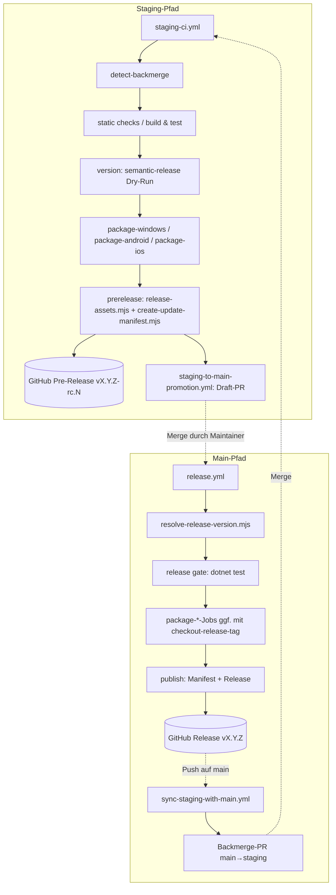

<!-- Licensed under the PolyForm Noncommercial License 1.0.0 - see the LICENSE file in the project root for details. -->

# Release-Management — Architektur

## Beteiligte Komponenten

| Komponente | Typ | Rolle |
|------------|-----|-------|
| `.github/workflows/staging-ci.yml` (`Pre-Release`) | GitHub-Actions-Workflow | Gates, Versionsermittlung, Plattform-Packaging und RC-Pre-Release bei Push auf `staging` |
| `.github/workflows/pr-staging-ci.yml` (`PR CI for Staging`) | GitHub-Actions-Workflow | Gates für PRs gegen `staging`, inkl. Backmerge-Erkennung |
| `.github/workflows/release.yml` (`Release`) | GitHub-Actions-Workflow | Versionsauflösung, Release-Gate, Packaging und Veröffentlichung/Reparatur auf `main` bzw. bei manuellen Tags |
| `.github/workflows/staging-to-main-promotion.yml` (`Staging to Main Promotion`) | GitHub-Actions-Workflow | Draft-PR `staging` → `main` nach erfolgreichem `Pre-Release`-Lauf (`workflow_run`) |
| `.github/workflows/sync-staging-with-main.yml` (`Backmerge Main to Staging`) | GitHub-Actions-Workflow | PR `main` → `staging` bei jedem `main`-Push |
| `.github/workflows/verify-pr-source.yml` (`Verify PR Source`) | GitHub-Actions-Workflow | Lehnt PRs nach `main` ab, die nicht aus `staging` stammen |
| `.github/workflows/security-scan.yml` | GitHub-Actions-Workflow | Unverändert: geplanter Security-Scan (Schedule/Dispatch) |
| `.github/actions/build-and-package` | Composite Action | Windows-Publish `net10.0-windows10.0.19041.0`/`win-x64` → `release-win-x64.zip` |
| `.github/actions/package-android` | Composite Action | Android-Publish `net10.0-android` → `release-android.apk` |
| `.github/actions/package-ios` | Composite Action | iOS-Publish `net10.0-ios`/`ios-arm64` auf `macos-latest` → `release-ios.ipa` |
| `.github/actions/checkout-release-tag` | Composite Action | Detach-Checkout des Release-Tags für den Asset-Repair-Pfad |
| `.github/actions/security-scan` | Composite Action | Prüfung auf verwundbare NuGet-Pakete (in den Gates eingebunden) |
| `scripts/resolve-release-version.mjs` | Node-Skript | Klassifiziert den Ref und entscheidet `create` / `upload-existing` / `none` |
| `scripts/release-assets.mjs` | Node-Skript | Baut die konditionale Asset-Liste und emittiert `RELEASE_ASSETS`/`RELEASE_ASSET_PATHS`/`RELEASE_ASSET_FILES` |
| `scripts/create-update-manifest.mjs` | Node-Skript | Erzeugt `update.json` inkl. `sha256`/`sizeBytes`/`assetUrl` pro Asset |
| `release.config.js` | semantic-release-Konfiguration | `branches: ["main"]`, `tagFormat: "v${version}"`, Plugin-Umschaltung via `RESOLVE_DRY_RUN` |
| `package.json` / `package-lock.json` | npm-Manifest | Gepinnte `semantic-release`-Toolchain (25.x) und `npm test` für `scripts/*.test.mjs` |
| `src/Reporter/Reporter.csproj` | MSBuild-Projekt | `TargetFrameworks` konditional über `IncludeIosTarget` (Default `true` auf Windows) und `IncludeAndroidTarget` (Default `false`) |

## Abhängigkeiten

- **GitHub Actions** (`ubuntu-latest`, `windows-latest`, `macos-latest`): Ausführungsumgebung; iOS-Packaging benötigt zwingend `macos-latest`.
- **GitHub Releases & Pull Requests API** via `gh` CLI (`GH_TOKEN` = `github.token`): Release-Erzeugung/-Upload, Asset-Vollständigkeitsprüfung (paginierte Listenabfrage), PR-/Label-Verwaltung. Erforderliche Permissions stehen in den Workflows (`contents`/`pull-requests`/`issues`/`checks`).
- **semantic-release** (npm, `npx`/`npm run release`): Versionsermittlung per Dry-Run (`--branches staging` bzw. Default `main`) und Tag-/Release-Erzeugung im automatischen Pfad; Commit-Analyse über Preset `conventionalcommits`.
- **.NET SDK 10.0.x + MAUI-Workloads** (`dotnet workload restore Reporter.sln`): Build, Tests und `dotnet publish` pro Zielplattform; die TFM-Auswahl läuft über die Schalter `IncludeIosTarget`/`IncludeAndroidTarget`.
- **Git-Tags** als Versionsgedächtnis: RC-Zählung über `git tag --list "v<version>-rc.*"`; stabile Tags `vX.Y.Z` werden von semantic-release bzw. `gh release create` angelegt und müssen per Backmerge auf `staging` erreichbar bleiben.

## Datenfluss

1. **Version:** Conventional-Commit-Historie → `semantic-release --dry-run` → `version`/`rc_version`/`rc_tag` (staging) bzw. `version`/`tag`/`release_action` (main).
2. **Artefakte:** `dotnet publish` pro Plattform-Job → `actions/upload-artifact` (`release-win-x64`, `release-android`, `release-ios`) → `actions/download-artifact` (`pattern: release-*`, `merge-multiple`) im Aggregations-Job.
3. **Asset-Liste:** `vars.IOS_SIGNING_ENABLED` → `release-assets.mjs` → `GITHUB_ENV` (`RELEASE_ASSETS`, `RELEASE_ASSET_PATHS`, `RELEASE_ASSET_FILES`) → `create-update-manifest.mjs`, `gh release …` und `release.config.js` konsumieren dieselbe Liste.
4. **Manifest:** `create-update-manifest.mjs` liest die Artefaktdateien, berechnet `sha256`/`sizeBytes` und schreibt `update.json` mit Download-URLs `https://github.com/<repo>/releases/download/<tag>/<asset>`.
5. **Release:** Aggregations-Job → `gh release create --prerelease` (staging) bzw. `npm run release` / `gh release create` / `gh release upload --clobber` (main).

## Diagramm

## Skalierung und Zuverlässigkeit

- **Idempotenz:** `resolve-release-version.mjs` erkennt vollständige Releases (`release_action: none`) und unvollständige (`upload-existing` inkl. `--clobber`-Upload); Labels und PRs werden per `--force`/Existenzprüfung nicht doppelt angelegt.
- **Parallelität:** Die drei `package-*`-Jobs laufen parallel auf getrennten Runnern; `concurrency`-Gruppen verhindern gleichzeitige `staging-ci`-/`release`-Läufe.
- **Fehlertoleranz:** Ein übersprungener `package-ios`-Job blockiert die Aggregation nicht (`!failure() && !cancelled()`); `cancel-in-progress: false` beim Release verhindert halb veröffentlichte Releases durch Abbruch.
- **Repair-Pfad:** `checkout-release-tag` baut Ersatz-Artefakte exakt aus dem getaggten Commit — kein Re-Tag nötig.
