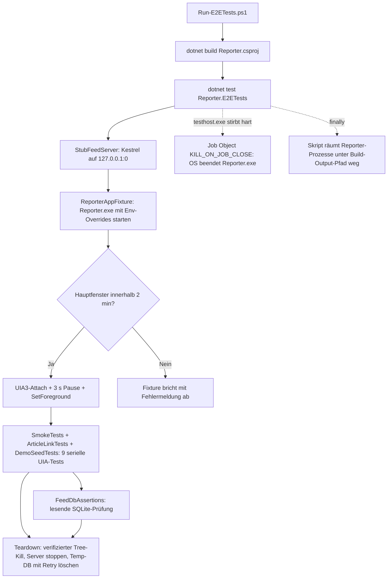

<!-- Licensed under the PolyForm Noncommercial License 1.0.0 - see the LICENSE file in the project root for details. -->

← [Zurück zur Übersicht](index.md)

# Tests — Technischer Ablauf

## Übersicht

Die E2E-Suite läuft in drei Phasen: `scripts/Run-E2ETests.ps1` übersetzt die App und startet `dotnet test`; das xunit-Collection-Fixture `ReporterAppFixture` fährt den Kestrel-Stubserver `StubFeedServer` und die zuvor gebaute `Reporter.exe` mit den Umgebungsvariablen `REPORTER_FEEDSEARCH_ENDPOINT`, `REPORTER_DB_PATH` und `REPORTER_DISABLE_DEMO_SEED` hoch und attacht per FlaUI (UIA3) aufs Hauptfenster; die sieben `SmokeTests` und der Test in `ArticleLinkTests` steuern diese App-Instanz seriell über UIA und verifizieren UI-Zustände sowie die isolierte SQLite-Datenbank, während `DemoSeedTests` eine eigene `Reporter.exe`-Instanz mit frischer Temp-DB und bewusst ohne `REPORTER_DISABLE_DEMO_SEED` startet, um den Demo-Seed des allerersten Starts nachzuweisen. Der Prozess-Lebenszyklus ist dreifach abgesichert: `E2EProcessGuard` weist jede gestartete `Reporter.exe` einem Windows-Job-Objekt mit `KILL_ON_JOB_CLOSE` zu, alle Teardown-Pfade töten verifiziert per `KillAndWaitAsync` (Tree-Kill plus `WaitForExit` mit Timeout), und das Skript-`finally` räumt verbliebene Prozesse unter dem Build-Output-Pfad weg. Am Ende stoppt das Fixture den Server und löscht das Temp-Verzeichnis mit Retry.

## Ablauf

### 1. App-Build und Suite-Start (`scripts/Run-E2ETests.ps1`)

Das Skript setzt `IncludeIosTarget=false`, baut `src/Reporter/Reporter.csproj` in der Konfiguration `Debug` für `net10.0-windows10.0.19041.0`/`win-x64`, prüft, dass `Reporter.exe` im Output liegt, setzt `REPORTER_APP_PATH` auf diese Datei und führt `dotnet test src/Reporter.E2ETests/Reporter.E2ETests.csproj -c Debug -f net10.0-windows10.0.19041.0` aus. Der Testlauf läuft in `try`/`finally`: Der Exit-Code wird unmittelbar nach dem Lauf gemerkt, und das `finally` beendet verbliebene `Reporter`-Prozesse per `Stop-Process -Force` — eingegrenzt über einen `Path`-Vergleich auf den Build-Output `$appOutput`, damit eine parallel laufende Nutzer-Installation aus einem anderen Verzeichnis nicht getroffen wird; Treffer werden protokolliert. Anschließend wird der gemerkte Exit-Code weitergereicht.

Beteiligte Komponenten:
- `scripts/Run-E2ETests.ps1` — Build, `REPORTER_APP_PATH`, Testaufruf

### 2. Stubserver-Start (`StubFeedServer.InitializeAsync`)

`WebApplication.CreateSlimBuilder` (Framework-Referenz `Microsoft.AspNetCore.App`) startet Kestrel auf `http://127.0.0.1:0`; nach `StartAsync` wird der vergebene Port aus `IServerAddressesFeature` gelesen und als `BaseUrl` bereitgestellt (`DirectoryUrl` = `BaseUrl + "/directory"`). Die Routen liefern die Fixture-Dateien aus `Fixtures/` (als `Content` mit `CopyToOutputDirectory` im Output) bzw. dynamisch erzeugte Directory-JSON-Antworten; alle übrigen Pfade beantwortet `MapFallback` mit 404.

Beteiligte Komponenten:
- `StubFeedServer.InitializeAsync` / `DisposeAsync` — Lebenszyklus des Servers
- `StubFeedServer.BaseUrl` / `DirectoryUrl` — Basis- und Directory-Endpunkt des Stubs
- `Fixtures/stub-feed.xml`, `site-feed.xml`, `site.html`, `empty.html`, `link-feed.xml` — statische Antwortkörper bzw. Feed-Templates

### 3. App-Start mit E2E-Overrides (`ReporterAppFixture.InitializeAsync`)

`StartAppProcess` legt ein Temp-Verzeichnis an (`%TEMP%/reporter-e2e-{guid}`), setzt `DatabasePath` auf `{tempDir}/reporter.db`, löst den Exe-Pfad über `REPORTER_APP_PATH` bzw. den Konventionspfad `src/Reporter/bin/Debug/net10.0-windows10.0.19041.0/win-x64/Reporter.exe` auf (Vorfahren-Suche ab dem Test-Output) und startet den Prozess mit `UseShellExecute = false` und den drei Env-Overrides — `REPORTER_DISABLE_DEMO_SEED=1` hält den Demo-Seed fern, der wegen der frischen Temp-DB sonst in jedem Lauf greifen würde (zusätzliche „News"-Kategorie und Feed-Karte plus echter apple.com-Abruf des Start-Syncs). Unmittelbar nach `Process.Start` wird die PID in `_appProcessId` gemerkt und der Prozess per `E2EProcessGuard.TrackProcess` dem Kill-on-Close-Job zugewiesen — damit stirbt die App automatisch mit dem Test-Host, selbst wenn `DisposeAsync` nie läuft.

Alle Schritte nach dem Start laufen in `AttachAndWaitForMainWindowAsync` unter einem umschließenden `try`/`catch`: FlaUI `Application.Attach` bindet den Prozess an eine `UIA3Automation`; ein Hintergrund-Task protokolliert einen unerwarteten Prozess-Exit (`[E2E] Reporter.exe exited …`). `GetMainWindow` wartet bis zu zwei Minuten aufs Hauptfenster (erster Start inkl. Migration), danach folgt eine feste 3-Sekunden-Bedienpause und `SetForeground()`. Schlägt irgendein Schritt fehl, beendet der `catch`-Backstop den Prozess über `KillAppProcessAsync` → `E2EProcessGuard.KillAndWaitAsync` und wirft erneut — bisher war nur der Attach-Fehler abgesichert, und vor der `App`-Zuweisung sieht `DisposeAsync` den Prozess nicht.

App-seitig wirken die Overrides in `MauiProgram.CreateMauiApp`: `REPORTER_DB_PATH` ersetzt vor `Directory.CreateDirectory` den Standardpfad `FileSystem.AppDataDirectory/reporter.db`; die zweite SQLite-Datei `reporter-content.db` (re-downloadbare Artikelinhalte, Tabelle `item_contents`) wird aus dem absoluten Verzeichnis des aufgelösten Hauptpfads abgeleitet und landet damit automatisch im selben Temp-Verzeichnis — die E2E-Isolation erfasst beide Datenbanken. `REPORTER_FEEDSEARCH_ENDPOINT` wird über `ResolveFeedSearchEndpoint` validiert (nur absolute `http`/`https`-URIs, sonst `null`) und per Factory-Lambda an den `FeedSearchService`-Konstruktor übergeben — `ApplyPersistedLanguage`/`Migrate` laufen dadurch automatisch gegen die isolierte Test-DB. `REPORTER_DISABLE_DEMO_SEED` wird über `ResolveDemoSeedSuppressed` ausgewertet (gesetzt und nicht `"0"`/`"false"` → unterdrückt) und fließt als `FirstRunState.DemoSeedSuppressed` in die DI — `IDemoContentService.EnsureSeededAsync` wird in `App.OnStart` damit zum No-op.

Beteiligte Komponenten:
- `ReporterAppFixture.InitializeAsync` / `StartAppProcess` / `AttachAndWaitForMainWindowAsync` / `ResolveAppPath` — Prozess-Start, Exe-Auflösung, Fenster-Attach
- `E2EProcessGuard.TrackProcess` — Job-Zuweisung des gestarteten App-Prozesses (best-effort mit `[E2E]`-Warnung)
- `MauiProgram.CreateMauiApp` / `ResolveFeedSearchEndpoint` / `ResolveDemoSeedSuppressed` — Env-Override-Auswertung und DI-Registrierung
- `FeedSearchService(HttpClient, string?)` — übernimmt den Directory-Endpoint (`_directoryEndpoint`), `SearchDirectoryAsync` baut die Request-URI daraus

### 4. Testausführung (`SmokeTests`, `ArticleLinkTests` und `DemoSeedTests` in `E2ETestCollection`)

Alle neun Tests liegen in der einen xunit-`E2ETestCollection` und laufen daher seriell; es gibt keinen `ITestCaseOrderer`. Die `SmokeTests` und `ArticleLinkTests` teilen sich den Fixture-App-Prozess; `DemoSeedTests` startet für den Seed-Nachweis eine eigene `Reporter.exe`-Instanz. Elemente werden über den UIA-Namen gefunden — MAUI propagiert `SemanticProperties.Description` als UIA-`Name` — oder über AutomationIds; lokalisierte Beschriftungen lösen die Tests über `AppResources.*` auf. `UiRetry` kapselt das Polling (Standard-Timeout 20 s, Intervall 200 ms), `InvokeOrClick` nutzt Invoke- → SelectionItem-Pattern → echten Mausklick, `SetText` das Value-Pattern bzw. Tastatureingabe; die Tab-Auswahl (`SelectTab`, inkl. `TopNavOverflowButton`-Overflow) und die Karten-Suche (`WaitForCard`, Group-first mit Fallback) sind geteilte `UiRetry`-Helfer. Die Seiten-Helfer `SelectTab` (inkl. Anker-Warte auf dem Ziel-Tab), `OpenAddSheet` und `WaitForUrlEntry` liegen in `E2EPageHelpers`, damit `SmokeTests` und `ArticleLinkTests` denselben Ablauf teilen. Dialoge (`DisplayActionSheetAsync`, `DisplayPromptAsync`, `DisplayAlertAsync`) werden über `WaitForElementInScope` gesucht, das pro Poll das Hauptfenster neu auflöst und alle Top-Level-Elemente des Prozesses am Desktop durchsucht (Popup-Roots). Da die App auf dem Unread-Tab startet, aktiviert jeder Feeds-Test den Feeds-Tab als Arrange-Schritt über `SelectTab(AppResources.TabFeeds)` — liegen Tab-Einträge im Overflow (`TopNavOverflowButton`), wird das Flyout geöffnet. `ResetUiState` räumt am Testende Popups, Dialoge und das Add-Sheet auf.

Die neun Tests im Einzelnen:

- `AppStarts_FeedListRenders` — Feeds-Tab aktivieren; zustandsagnostisch auf Feed-Karten (`AccessibilityTapForActions`-HelpText) **oder** den `EmptyView`-Platzhalter (`PlaceholderFeeds`) warten.
- `AddButton_OpensSheet_FocusesUrlEntry` — „+"-Button (`ActionAddFeed`) → Add-Sheet; `WaitForUrlEntry` findet das Adressfeld per `PlaceholderFeedSearch`-Name bzw. `ControlType.Edit`; `WaitForFocus` prüft den Tastaturfokus.
- `DirectAdd_FeedAppearsInListAndDatabase` — `AddFeedViaUi("direct-add")` (Sheet öffnen, `{BaseUrl}/feeds/direct-add.xml` eintippen, `ButtonDirectAdd`) → Karte sichtbar; `FeedDbAssertions.FeedExistsAsync` pollt die `feeds`-Tabelle (bis 15 s, `Mode=ReadOnly`, rein lesend).
- `FeedActionSheet_Rename_UpdatesTitle` — eigener Feed via `AddFeedViaUi("rename-target")`; Karten-Tap → `DisplayActionSheetAsync`; `ButtonRename`-Eintrag → `DisplayPromptAsync`; neuen Titel ins Edit-Feld tippen, `ButtonOk` → Karte zeigt den neuen Titel.
- `FeedActionSheet_ChangeCategory_IncludingNone` — Kategorie per UI auf dem Kategorien-Tab anlegen (`LabelCategoryName`-Entry + `ButtonSave`), Feed via `AddFeedViaUi("category-target")`; über `ButtonChangeCategory` die Kategorie zuweisen (Name erscheint auf der Karte), danach `CategoryNone` wählen (Zuordnung verschwindet).
- `Search_SubscribesResult_PersistsFeed` — `NewUrlEntry` = `{BaseUrl}` → `ButtonSearch` → Directory-Treffer „Stub Search Hit" (`/feeds/search-hit.xml`); Karten-Tap → `DisplayAlertAsync`-Bestätigung `ButtonYes` → Karte in der Liste und `feeds`-Zeile in der Test-DB.
- `Search_SiteUrl_DiscoversFeedViaLinkTag` — `NewUrlEntry` = `{BaseUrl}/site` → `ButtonSearch` → Directory liefert `[]` → Autodiscovery lädt `/site`, wertet das `<link rel="alternate">` im `<head>` aus → Ergebniskarte „Stub Site Feed" sichtbar.
- `DemoSeedTests.FirstStart_SeedsNewsCategoryAndDemoFeed` — Startet eine eigene `Reporter.exe` mit frischer Temp-DB (`REPORTER_DB_PATH` auf `%TEMP%/reporter-e2e-demo-{guid}/reporter.db`), `REPORTER_FEEDSEARCH_ENDPOINT` auf den Stub und `REPORTER_DISABLE_DEMO_SEED` gezielt aus dem Prozess-Environment entfernt; direkt nach dem Start weist `E2EProcessGuard.TrackProcess` die Instanz dem Kill-on-Close-Job zu. `FeedDbAssertions.FeedExistsAsync`/`CategoryExistsAsync` pollen die `feeds`-/`categories`-Zeilen des Seeds; danach attacht FlaUI, aktiviert `UiRetry.SelectTab` den Feeds-Tab und `UiRetry.WaitForCard` findet die Karte „Apple Newsroom". Die Assertions hängen nicht am Sync-Erfolg — der Start-Abruf darf apple.com real erreichen oder offline scheitern. Im `finally` beendet `E2EProcessGuard.KillAndWaitAsync` den Prozess über die beim Start gemerkte PID (FlaUI kann das `Process`-Objekt beim Attach ersetzen) und `TryDeleteDirectoryAsync` räumt das Temp-Verzeichnis mit Retry auf.
- `ArticleLinkTests.ExternalLinkInArticle_OpensSystemBrowser` — Nachweis, dass ein externer Link im Artikel-WebView nicht in der App navigiert, sondern den System-Browser öffnet: Der `link-feed`-Stub-Feed (eigene `Fixtures/link-feed.xml`, deren Artikel-HTML einen `<a href="{baseUrl}/external-link">`-Link enthält) wird per UI direkt hinzugefügt, über den Refresh-Button auf `Ungelesen` synchronisiert (`FeedDbAssertions.ItemExistsAsync` pollt die `items`-Zeile) und die Artikelkarte angetippt. Im WebView2-UIA-Subtree wird das `Hyperlink`-Element aktiviert; Assert ist `StubFeedServer.ExternalLinkHitCount > 0` (der System-Browser hat die Stub-URL abgerufen) plus die geöffnet bleibende Detailansicht (Anker `ArticleOpenInBrowser`). Karten-Tap und Link-Aktivierung laufen in Retry-Schleifen, weil die `CollectionView` nach dem Sync neu rendert und Proxies veralten können.

Beteiligte Komponenten:
- `E2ETestCollection` (`CollectionDefinition("E2E")`, `ICollectionFixture<ReporterAppFixture>`) — geteiltes Fixture, serielle Ausführung
- `UiRetry` (`WaitForElement*`, `TryFindElement*`, `WaitFor`, `InvokeOrClick`, `SetText`, `SelectTab`, `WaitForCard`) — Polling und Interaktion
- `E2EPageHelpers` (`SelectTab` mit Seiten-Anker, `OpenAddSheet`, `WaitForUrlEntry`) — geteilte Seiten-Helfer von `SmokeTests` und `ArticleLinkTests`
- `FeedDbAssertions.FeedExistsAsync` / `CategoryExistsAsync` / `ItemExistsAsync` — lesende SQLite-Verifikation (`PollUntilExistsAsync` + parametrisierbare `ExistsCoreAsync`-COUNT-Abfrage)
- `SmokeTests` (`EnterUrl`, `AddFeedViaUi`, `ResetUiState` u. a.) — Testflüsse und private Helfer
- `ArticleLinkTests` — externer-Link-Nachweis gegen den geteilten Fixture-App-Prozess; `DescribeLinkState` protokolliert im Fehlerfall UIA-Zustand des Links sowie die Sichtbarkeit von Offline-Alert und Fehlerzeile
- `DemoSeedTests` — Seed-Nachweis über eine eigene App-Instanz; nutzt `ReporterAppFixture.ResolveAppPath` (jetzt `internal`) und `fixture.Server.DirectoryUrl`

### 5. Teardown (`ReporterAppFixture.DisposeAsync`)

`KillAppProcessAsync` beendet den App-Prozess verifiziert: Die PID kommt aus `App?.ProcessId` mit Fallback auf die beim Start gemerkte `_appProcessId` (FlaUI kann das interne `Process`-Objekt ersetzt haben oder `App` ist nie zugewiesen worden); `E2EProcessGuard.KillAndWaitAsync` führt `Kill(entireProcessTree: true)` aus und wartet per `WaitForExitAsync` bis zu 30 s auf den bestätigten Exit — ein Überlebender wird als `[E2E]`-Warnung auf der Konsole gemeldet statt still geschluckt. Danach folgen `App.Dispose()`, `UIA3Automation.Dispose()` und `StubFeedServer.DisposeAsync`; das Temp-Verzeichnis löscht `E2EProcessGuard.TryDeleteDirectoryAsync` mit bis zu fünf Versuchen à 200 ms — eine frisch gekillte App kann ihre Dateien (z. B. die SQLite-DB) noch einen Moment sperren; ein verbleibender Leichnam ist toleriert.

## Diagramm

## Fehlerbehandlung

- **Fehlende Exe:** `ResolveAppPath` wirft `FileNotFoundException` mit dem Hinweis, die App zuerst zu bauen bzw. `REPORTER_APP_PATH` zu setzen.
- **Kein Hauptfenster:** Nach zwei Minuten wirft das Fixture `InvalidOperationException` — typische Ursache ist eine fehlende interaktive Desktop-Session.
- **Ungültiger `REPORTER_FEEDSEARCH_ENDPOINT`:** `ResolveFeedSearchEndpoint` ignoriert den Wert still und fällt auf den Standard-Endpunkt zurück (kein App-Fehler).
- **Ungültiger `REPORTER_DB_PATH`:** Nur `IsNullOrWhiteSpace` wird geprüft — ein ungültiger Pfad führt bewusst zu einer sichtbaren Ausnahme beim App-Start.
- **Transiente UIA-Ausfälle:** Alle `UiRetry`-Find-Methoden schlucken Exceptions während des Pollings — der UIA-Baum kann beim Rendern oder bei Dialogwechseln kurzzeitig nicht erreichbar sein.
- **Verschluckter Karten-Klick:** `SmokeTests.OpenFeedActions` wiederholt den Tap auf die Feed-Karte samt Warten auf den erwarteten Action-Sheet-Eintrag bis zu dreimal — der echte Mausklick kann verloren gehen, während das Add-Sheet noch schließt oder die `CollectionView` die Karte neu rendert.
- **Unerwarteter App-Exit:** Ein Watcher-Task schreibt `[E2E] Reporter.exe exited at … with code N` auf die Konsole; `GetMainWindow` wirft bei beendetem Prozess eine `InvalidOperationException`.
- **Beliebiger Fehler nach `Process.Start`:** Der umschließende `catch` in `InitializeAsync` (nicht nur der Attach-Fehler) beendet den gestarteten Prozess über `KillAndWaitAsync` und wirft erneut, damit keine verwaiste `Reporter.exe` zurückbleibt.
- **Überlebender App-Prozess:** Verlässt der Prozess nach dem Tree-Kill nicht innerhalb des 30-s-Timeouts, meldet `KillAndWaitAsync` eine `[E2E]`-Warnung (`did not exit within …`) — der Teardown hängt nicht ewig und der Leck-Fall bleibt sichtbar.
- **Harter Test-Host-Abbruch:** Stirbt `testhost.exe`, bevor `DisposeAsync` lief, terminiert das Windows-Job-Objekt (`KILL_ON_JOB_CLOSE`) alle zugewiesenen `Reporter.exe`-Instanzen; lief der Lauf über `Run-E2ETests.ps1`, räumt zusätzlich das `finally` Reste unter `$appOutput` weg. Scheitert die Job-Zuweisung (Test-Host läuft selbst in einem restriktiven Job), warnt `TrackProcess` per `[E2E]`-Meldung — Kill-Backstop und Skript-Cleanup bleiben als zweite Linie.
- **Gesperrte Temp-Dateien:** `FeedDbAssertions` öffnet seine ReadOnly-Verbindung mit `Pooling=False`, damit keine gepoolte Verbindung `reporter.db` im Test-Host offen hält; `TryDeleteDirectoryAsync` federt kurzzeitige Sperren einer frisch gekillten App über Retries ab.
