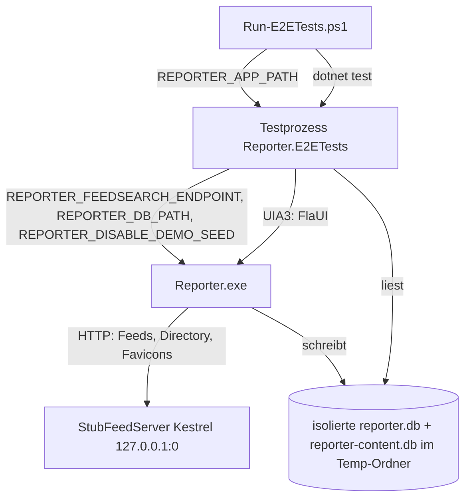

<!-- Licensed under the PolyForm Noncommercial License 1.0.0 - see the LICENSE file in the project root for details. -->

# Tests — Architektur

## Beteiligte Komponenten

Die E2E-Infrastruktur besteht aus dem Testprozess (`src/Reporter.E2ETests`), der realen App (`Reporter.exe`) und dem in-process Stub-Webserver. Zusätzlich wirken die drei Env-Overrides in `MauiProgram` und die Compiled Bindings auf den XAML-Views als Compile-Zeit-Ebene.

| Komponente | Typ | Rolle |
|------------|-----|-------|
| `scripts/Run-E2ETests.ps1` | PowerShell-Skript | Einstiegspunkt: baut die App (Debug, `net10.0-windows10.0.19041.0`, win-x64), setzt `REPORTER_APP_PATH`, ruft `dotnet test` auf das E2E-Projekt; beendet im `finally` verbliebene `Reporter`-Prozesse — per `Path`-Vergleich auf den Build-Output `$appOutput` eingegrenzt |
| `SmokeTests` | xunit-Testklasse | Die fünf FlaUI-Smoke-Tests (App-Start/Feed-Liste, Add-Sheet-Fokus, Direct-Add-Persistenz, Directory-Abonnieren, Site-Discovery) plus UI-Helfer gegen die geteilte Fixture-Instanz |
| `FeedDetailTests` | xunit-Testklasse | Die fünfzehn FlaUI-Tests der Feeddetailansicht gegen die geteilte Fixture-Instanz: Navigation per Karten-Tap, Titelsuche, Rename-Prompt, Kategorie-Zuordnung inkl. `CategoryNone`, Edit-Sheet-URL-Persistenz, Single-Feed-Refresh, Infinite-Scroll-Nachladen, Sync-Meldung nur bei `HealthStatus == Error` oder `Warning` (`FeedDetail_Message_ForErrorFeed`/`FeedDetail_Message_ForWarningFeed`, Fixture `stale-feed.xml`), fünf Stichwort-Tests (Hinzufügen/Entfernen/Validierung, Feed-Scoping des Filters, Abgrenzung zur globalen Liste) sowie Löschen mit Rücksprung; räumt per `FeedDbAssertions.DeleteAllFeedsAsync`/`MarkAllItemsReadAsync` auf, damit virtualisierte Listen erreichbar bleiben |
| `ArticleLinkTests` | xunit-Testklasse | Nachweis des externen-Link-Verhaltens im Artikel-WebView: aktiviert einen `Hyperlink` im WebView2-UIA-Subtree und assertet über `StubFeedServer.ExternalLinkHitCount`, dass der System-Browser die URL abgerufen hat |
| `ArticleImageTests` | xunit-Testklasse | Nachweis der lokalen Artikelbilder gegen den Fixture-App-Prozess: `ArticleImage_StoredLocally_AndShownOnCardAndDetail` abonniert `image-feed` per UI, assertet die `image_data`-Zeile in `reporter-content.db` (`FeedDbAssertions.ItemImageExistsAsync`), das sichtbare Karten-Thumbnail (`AutomationId="ArticleCardThumbnail"`) und ein gerendertes `Image` (≥ 40 px) im WebView-`Document`-Subtree; `BrokenImage_DoesNotFailSync_StoresNoImage` abonniert `broken-image-feed` (`/not-an-image` → `text/plain`, MIME-Reject) und assertet `items`-Zeile ohne `image_data`-Zeile |
| `DemoSeedTests` | xunit-Testklasse | Seed-Nachweis des allerersten Starts: startet eine eigene `Reporter.exe` mit frischer Temp-DB ohne `REPORTER_DISABLE_DEMO_SEED`, prüft DB-Zeilen und die „Apple Newsroom"-Karte |
| `E2ETestCollection` | xunit `CollectionDefinition` | Teilt `ReporterAppFixture` über alle Tests; serielle Ausführung innerhalb der Collection |
| `ReporterAppFixture` | Collection-Fixture (`IAsyncLifetime`) | Startet `Reporter.exe` mit den Env-Overrides (inkl. `REPORTER_DISABLE_DEMO_SEED=1` für hermetische Smoke-Tests), attacht per FlaUI-UIA3, stellt `MainWindow`/`DatabasePath`/`ContentDatabasePath`/`Server` bereit; merkt die gestartete PID (`_appProcessId`) und beendet den Prozess im Teardown verifiziert (`KillAppProcessAsync` → `E2EProcessGuard.KillAndWaitAsync`); `ResolveAppPath` ist `internal` und wird von `DemoSeedTests` wiederverwendet |
| `E2EProcessGuard` | interne statische Helferklasse | Prozess-Lebenszyklus-Absicherung: prozessweites Windows-Job-Objekt mit `JOB_OBJECT_LIMIT_KILL_ON_JOB_CLOSE` (kernel32-P/Invoke, lazy) — `TrackProcess` weist gestartete App-Prozesse zu (best-effort mit `[E2E]`-Warnung); `KillAndWaitAsync` (`Process` oder PID) führt `Kill(entireProcessTree: true)` plus `WaitForExitAsync` mit 30-s-Timeout aus und meldet Überlebende; `TryDeleteDirectoryAsync` löscht Temp-Verzeichnisse mit bis zu fünf Retries à 200 ms und wirft nie |
| `StubFeedServer` | `IAsyncLifetime`-Fixture | In-process Kestrel-Server (`WebApplication.CreateSlimBuilder`) auf `http://127.0.0.1:0`; liefert Feeds (dedizierte `Fixtures/{name}.xml` vor dem `stub-feed.xml`-Template, `{name}`-/`{baseUrl}`-Substitution — darunter `image-feed.xml` mit `<enclosure type="image/png">`, `broken-image-feed.xml`, `stale-feed.xml` (fixe `pubDate`-Werte > 30 Tage alt für den Warnungs-Test) sowie `paged-feed.xml`/`scroll-feed.xml` mit je 25 nummerierten Artikeln für die Paging-Tests), Directory-Antworten, Discovery-Seiten, die Zählroute `/external-link` (`ExternalLinkHitCount`) sowie die Bild-Routen `/images/{name}.png` (festes 64×48-PNG aus `StubImageBase64`) und `/not-an-image` (`text/plain` für den MIME-Reject-Pfad); der `MapFallback`-404 deckt auch bewusst kaputte Feed-URLs für den Fehler-Meldungs-Test ab |
| `UiRetry` | statische Helferklasse | Polling (20 s Timeout / 200 ms Intervall), Invoke-/SelectionItem-/Maus-Interaktion, Value-/Tastatur-Texteingabe, Desktop-weite Dialogsuche, geteilte Tab-Auswahl (`SelectTab`) und Kartensuche (`WaitForCard`) |
| `E2EPageHelpers` | Helferklasse pro Testklasse | Seiten-Level-Flüsse auf `UiRetry` aufbauend, geteilt von `SmokeTests`, `FeedDetailTests`, `ArticleLinkTests` und `ArticleImageTests`: `SelectTab` mit Anker-Warte auf dem Ziel-Tab und `TryPopPushedPage` (poppt eine geschobene Detailseite über `NavigationViewBackButton`/`AccessibilityBack`), `OpenAddSheet`, `WaitForUrlEntry`, `WaitForEditUrlEntry` (`PlaceholderFeedEditUrl` des Detail-Edit-Sheets), `OpenFeedDetail` (Karten-Tap → Anker `ButtonFeedActions`, inkl. `ScrollCardIntoView` über das ScrollItem-Pattern), `OpenFeedDetailActions`, `NavigateBackToFeedList`, `WaitForFeedCard` (Scan über virtualisierte Listen mit Schritt-Scrolling), `ScrollListDown` (Scroll-Pattern mit Mausrad-Fallback), `DismissPopups` |
| `FeedDbAssertions` | statische Helferklasse | Lesende SQLite-Abfragen gegen die isolierte `reporter.db` (`Microsoft.Data.Sqlite`, `Mode=ReadOnly;Pooling=False` — keine gepoolte Verbindung hält die DB-Datei im Test-Host offen): `FeedExistsAsync` (Tabelle `feeds`), `CategoryExistsAsync` (Tabelle `categories`), `ItemExistsAsync` (Tabelle `items`) und `ItemImageExistsAsync` (verbindet `reporter.db` — Item-Id per Titel — mit der `image_data`-COUNT-Abfrage gegen `reporter-content.db` via `ReporterAppFixture.ContentDatabasePath`) über das gemeinsame `PollUntilExistsAsync`; die Artikelinhalte und -bilder liegen in der ebenfalls isolierten `reporter-content.db` (Tabelle `item_contents`) im selben Temp-Verzeichnis. Ergänzend die schreibenden Aufräum-Helfer `DeleteAllFeedsAsync` (`DELETE FROM items; DELETE FROM feeds` — explizit statt FK-Kaskade) und `MarkAllItemsReadAsync`, beide mit 5×-Retry gegen kurze Write-Locks der App |
| `MauiProgram` | App-Startkonfiguration | Liest `REPORTER_DB_PATH` (DB-Dateipfad), `REPORTER_FEEDSEARCH_ENDPOINT` (Directory-Override, validiert via `ResolveFeedSearchEndpoint`) und `REPORTER_DISABLE_DEMO_SEED` (Demo-Seed-Unterdrückung, via `ResolveDemoSeedSuppressed`) |
| `FeedSearchService` | `Reporter.Core`-Service | Optionaler Konstruktorparameter `directoryEndpoint` mit Fallback auf die Konstante `https://feedsearch.dev/api/v1/search` |
| XAML-Views | `src/Reporter/Views/*.xaml` | `x:DataType` auf allen Seiten und `DataTemplate`s → Compiled Bindings als Compile-Zeit-Prüfebene |

## Abhängigkeiten

- **Testprojekt (`Reporter.E2ETests.csproj`, `net10.0-windows10.0.19041.0`):** Pakete `FlaUI.UIA3` 5.0.0, `Microsoft.Data.Sqlite`, `Microsoft.NET.Test.Sdk`, `xunit`, `xunit.runner.visualstudio`; `FrameworkReference Microsoft.AspNetCore.App` (Kestrel ohne zusätzliches NuGet-Paket); `ProjectReference` auf `Reporter.Core` für die lokalisierten `AppResources`-Texte und Modelle.
- **Kommunikationsrichtungen:** Testprozess → App synchron über UIA3 (UI-Automation); App → Stubserver synchron über HTTP (derselbe DI-`HttpClient` für Feed-Sync, Verzeichnis-Suche und Favicon-Abrufe); Testprozess → SQLite-DB synchron lesend (`Microsoft.Data.Sqlite`).
- **Umgebungsvariablen:** `REPORTER_FEEDSEARCH_ENDPOINT`, `REPORTER_DB_PATH` und `REPORTER_DISABLE_DEMO_SEED` vom Fixture zum App-Prozess (Prozess-Environment), `REPORTER_APP_PATH` vom Skript/Aufrufer zum Testprozess.
- **Voraussetzung der Plattform:** Windows mit interaktiver Desktop-Session; FlaUI-UIA3, weil UIA2 WinUI-3-Controls nicht vollständig abdeckt.

## Datenfluss

1. `Run-E2ETests.ps1` baut die App und startet `dotnet test`; das Collection-Fixture läuft einmal pro Suite.
2. `StubFeedServer` startet Kestrel auf Port `0` und stellt `BaseUrl`/`DirectoryUrl` bereit; Antwortkörper kommen aus `Fixtures/` bzw. werden für `/directory` dynamisch aus `BaseUrl` erzeugt.
3. `ReporterAppFixture` startet `Reporter.exe` mit `REPORTER_FEEDSEARCH_ENDPOINT={DirectoryUrl}`, `REPORTER_DB_PATH={tempDir}\reporter.db` und `REPORTER_DISABLE_DEMO_SEED=1`; die App migriert und nutzt ausschließlich die isolierten DBs — neben `reporter.db` legt sie `reporter-content.db` aus demselben Verzeichnis abgeleitet im Temp-Ordner an — der Demo-Seed, den die frische DB-Datei sonst auslösen würde, bleibt aus.
4. `SmokeTests`, `FeedDetailTests`, `ArticleLinkTests` und `ArticleImageTests` steuern die App per UIA3 (Namen aus `SemanticProperties.Description`/`AppResources`, AutomationIds); Fachlogik und Persistenz laufen echt in der App. `DemoSeedTests` startet dagegen eine zweite `Reporter.exe`-Instanz mit eigener frischer Temp-DB (`%TEMP%/reporter-e2e-demo-{guid}`) und entfernt `REPORTER_DISABLE_DEMO_SEED` aus deren Prozess-Environment — nur so greift der First-Run-Seed, den der Test nachweist.
5. `FeedDbAssertions` liest die Temp-`reporter.db` parallel zur App (keine Dauerverbindung seitens EF Core → lesende Zugriffe unproblematisch); für `ItemImageExistsAsync` kommt die `image_data`-COUNT-Abfrage gegen die Temp-`reporter-content.db` hinzu.
6. Teardown: verifizierter Tree-Kill des App-Prozesses (`KillAndWaitAsync` mit PID-Fallback), Server-Stopp, Temp-Verzeichnis-Löschung mit Retry; unabhängig davon garantiert das Job-Objekt den Prozess-Tod bei Test-Host-Abbruch, und das Skript-`finally` räumt Reste unter `$appOutput` weg.

## Diagramm

## Skalierung und Zuverlässigkeit

- **Serielle Ausführung:** Eine Collection = ein App-Prozess, ein Server, eine DB — bewusst nicht parallelisiert, da UIA-Fokus und Fensterzustand global sind. Zwei gleichzeitige `Run-E2ETests.ps1`-Läufe auf derselben Maschine würden sich zudem gegenseitig aufräumen: Das `finally` beendet alle `Reporter`-Prozesse unter `$appOutput`.
- **Prozess-Lebenszyklus dreifach abgesichert:** Jede gestartete `Reporter.exe` gehört einem Kill-on-Close-Job an (OS-seitige Garantie bei Test-Host-Tod); alle Teardown-Pfade (`DisposeAsync`, `InitializeAsync`-Backstop, `DemoSeedTests`-`finally`) töten verifiziert per Tree-Kill plus `WaitForExit`-Timeout; das Skript-`finally` räumt pfadbegrenzt nach. Ein Temp-Leichnam kann bei Test-Host-Tod bestehen bleiben — dann war kein Teardown mehr möglich, das Prozess-Leck ist aber geschlossen.
- **Flaky-Abfederung:** Alle Elementzugriffe pollen über `UiRetry` (Standard 20 s), der Fixture-Attach wartet bis zu 2 min aufs Hauptfenster; `DB`-Asserts pollen bis 15 s, um die asynchrone Persistenz in der App abzufedern. `E2EPageHelpers.OpenFeedDetail` wiederholt den Karten-Tap samt Warten auf den Detailseiten-Anker (`ButtonFeedActions`) bis zu dreimal — inklusive `ScrollCardIntoView` und `NoClickablePointException`-Abfang —, weil der echte Mausklick beim Schließen des Add-Sheets oder beim Neu-Rendern der Karte verschluckt werden kann; `OpenFeedDetailActions` wiederholt analog den Tap auf den Aktions-Button. `WaitForFeedCard` durchsucht virtualisierte Listen per Schritt-Scrolling, `SelectTab` poppt eine geschobene Detailseite über `TryPopPushedPage`.
- **Zustandsunabhängigkeit:** Jeder Test nutzt eigene Stub-URLs (eindeutiger Feed-Titel per `{name}`-Substitution), legt benötigte Daten per UI-Seeding selbst an und endet mit `ResetUiState` — keine Reihenfolge-Abhängigkeit, kein `ITestCaseOrderer`. Die `FeedDetailTests` gehen weiter und räumen die geteilte DB aktiv (`DeleteAllFeedsAsync`, `MarkAllItemsReadAsync`), weil ihre 25-Artikel-Fixtures die virtualisierten Listen sonst für Folgetests unerreichbar lang machen würden.
- **Kein CI-Job:** Die Suite benötigt eine interaktive Desktop-Session und ist als lokale/on-demand-Prüfung ausgelegt; die Pipeline testet weiterhin nur `src/Reporter.Tests`.
