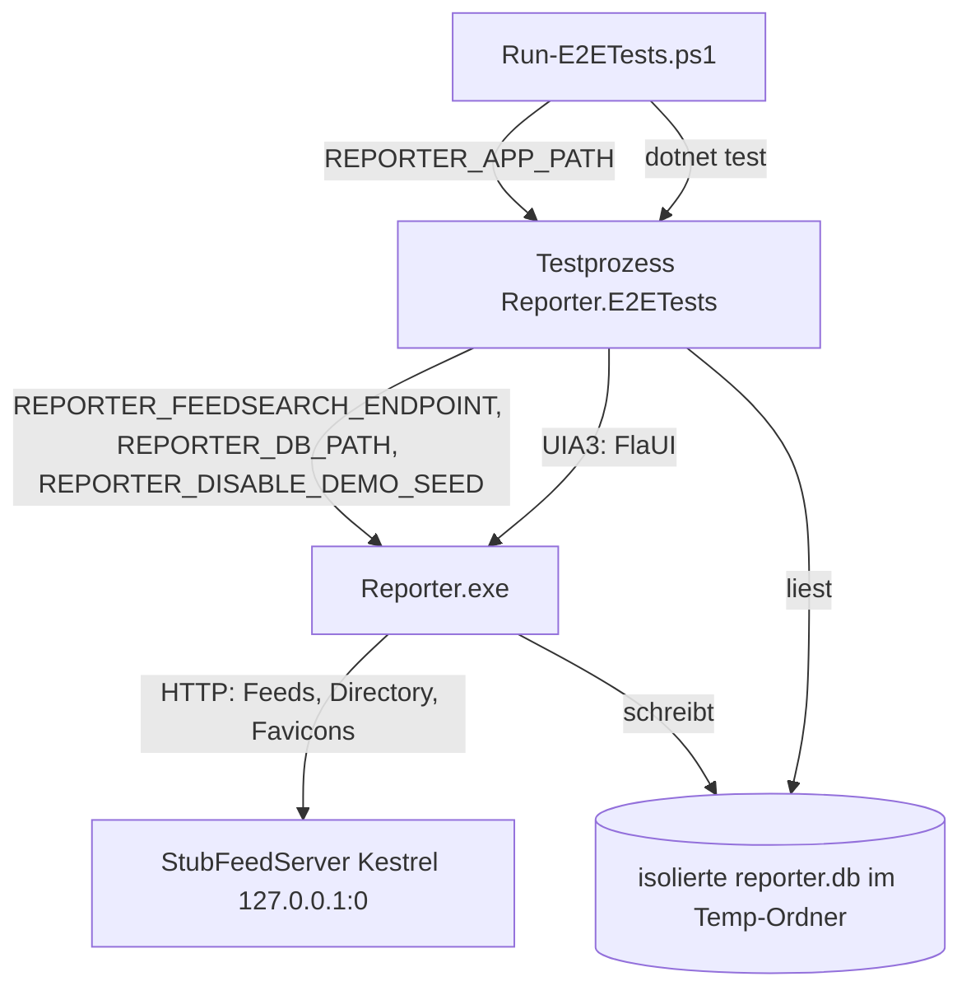

<!-- Licensed under the PolyForm Noncommercial License 1.0.0 - see the LICENSE file in the project root for details. -->

# Tests — Architektur

## Beteiligte Komponenten

Die E2E-Infrastruktur besteht aus dem Testprozess (`src/Reporter.E2ETests`), der realen App (`Reporter.exe`) und dem in-process Stub-Webserver. Zusätzlich wirken die drei Env-Overrides in `MauiProgram` und die Compiled Bindings auf den XAML-Views als Compile-Zeit-Ebene.

| Komponente | Typ | Rolle |
|------------|-----|-------|
| `scripts/Run-E2ETests.ps1` | PowerShell-Skript | Einstiegspunkt: baut die App (Debug, `net10.0-windows10.0.19041.0`, win-x64), setzt `REPORTER_APP_PATH`, ruft `dotnet test` auf das E2E-Projekt |
| `SmokeTests` | xunit-Testklasse | Die sieben FlaUI-Smoke-Tests plus UI-Helfer (`AddFeedViaUi`, `ResetUiState`) gegen die geteilte Fixture-Instanz |
| `ArticleLinkTests` | xunit-Testklasse | Nachweis des externen-Link-Verhaltens im Artikel-WebView: aktiviert einen `Hyperlink` im WebView2-UIA-Subtree und assertet über `StubFeedServer.ExternalLinkHitCount`, dass der System-Browser die URL abgerufen hat |
| `DemoSeedTests` | xunit-Testklasse | Seed-Nachweis des allerersten Starts: startet eine eigene `Reporter.exe` mit frischer Temp-DB ohne `REPORTER_DISABLE_DEMO_SEED`, prüft DB-Zeilen und die „Apple Newsroom"-Karte |
| `E2ETestCollection` | xunit `CollectionDefinition` | Teilt `ReporterAppFixture` über alle Tests; serielle Ausführung innerhalb der Collection |
| `ReporterAppFixture` | Collection-Fixture (`IAsyncLifetime`) | Startet `Reporter.exe` mit den Env-Overrides (inkl. `REPORTER_DISABLE_DEMO_SEED=1` für hermetische Smoke-Tests), attacht per FlaUI-UIA3, stellt `MainWindow`/`DatabasePath`/`Server` bereit, killt den Prozess im Teardown; `ResolveAppPath` ist `internal` und wird von `DemoSeedTests` wiederverwendet |
| `StubFeedServer` | `IAsyncLifetime`-Fixture | In-process Kestrel-Server (`WebApplication.CreateSlimBuilder`) auf `http://127.0.0.1:0`; liefert Feeds (dedizierte `Fixtures/{name}.xml` vor dem `stub-feed.xml`-Template, `{name}`-/`{baseUrl}`-Substitution), Directory-Antworten, Discovery-Seiten und die Zählroute `/external-link` (`ExternalLinkHitCount`) |
| `UiRetry` | statische Helferklasse | Polling (20 s Timeout / 200 ms Intervall), Invoke-/SelectionItem-/Maus-Interaktion, Value-/Tastatur-Texteingabe, Desktop-weite Dialogsuche, geteilte Tab-Auswahl (`SelectTab`) und Kartensuche (`WaitForCard`) |
| `E2EPageHelpers` | Helferklasse pro Testklasse | Seiten-Level-Flüsse auf `UiRetry` aufbauend, geteilt von `SmokeTests` und `ArticleLinkTests`: `SelectTab` mit Anker-Warte auf dem Ziel-Tab, `OpenAddSheet`, `WaitForUrlEntry` |
| `FeedDbAssertions` | statische Helferklasse | Rein lesende SQLite-Abfragen gegen die isolierte `reporter.db` (`Microsoft.Data.Sqlite`, `Mode=ReadOnly`): `FeedExistsAsync` (Tabelle `feeds`), `CategoryExistsAsync` (Tabelle `categories`) und `ItemExistsAsync` (Tabelle `items`) über das gemeinsame `PollUntilExistsAsync` |
| `MauiProgram` | App-Startkonfiguration | Liest `REPORTER_DB_PATH` (DB-Dateipfad), `REPORTER_FEEDSEARCH_ENDPOINT` (Directory-Override, validiert via `ResolveFeedSearchEndpoint`) und `REPORTER_DISABLE_DEMO_SEED` (Demo-Seed-Unterdrückung, via `ResolveDemoSeedSuppressed`) |
| `FeedSearchService` | `Reporter.Core`-Service | Optionaler Konstruktorparameter `directoryEndpoint` mit Fallback auf die Konstante `https://feedsearch.dev/api/v1/search` |
| XAML-Views | `src/Reporter/Views/*.xaml` | `x:DataType` auf allen Seiten und `DataTemplate`s → Compiled Bindings als Compile-Zeit-Prüfebene |

## Abhängigkeiten

- **Testprojekt (`Reporter.E2ETests.csproj`, `net10.0-windows10.0.19041.0`):** Pakete `FlaUI.UIA3` 5.0.0, `Microsoft.Data.Sqlite`, `Microsoft.NET.Test.Sdk`, `xunit`, `xunit.runner.visualstudio`; `FrameworkReference Microsoft.AspNetCore.App` (Kestrel ohne zusätzliches NuGet-Paket); `ProjectReference` auf `Reporter.Core` für die lokalisierten `AppResources`-Texte und Modelle.
- **Kommunikationsrichtungen:** Testprozess → App synchron über UIA3 (UI-Automation); App → Stubserver synchron über HTTP (derselbe DI-`HttpClient` für Feed-Sync, Verzeichnis-Suche und Favicon-Abrufe); Testprozess → SQLite-DB synchron lesend (`Microsoft.Data.Sqlite`).
- **Umgebungsvariablen:** `REPORTER_FEEDSEARCH_ENDPOINT`, `REPORTER_DB_PATH` und `REPORTER_DISABLE_DEMO_SEED` vom Fixture zum App-Prozess (Prozess-Environment), `REPORTER_APP_PATH` vom Skript/Aufrufer zum Testprozess.
- **Voraussetzung der Plattform:** Windows mit interaktiver Desktop-Session; FlaUI-UIA3, weil UIA2 WinUI-3-Controls nicht vollständig abdeckt.

## Datenfluss

1. `Run-E2ETests.ps1` baut die App und startet `dotnet test`; das Collection-Fixture läuft einmal pro Suite.
2. `StubFeedServer` startet Kestrel auf Port `0` und stellt `BaseUrl`/`DirectoryUrl` bereit; Antwortkörper kommen aus `Fixtures/` bzw. werden für `/directory` dynamisch aus `BaseUrl` erzeugt.
3. `ReporterAppFixture` startet `Reporter.exe` mit `REPORTER_FEEDSEARCH_ENDPOINT={DirectoryUrl}`, `REPORTER_DB_PATH={tempDir}\reporter.db` und `REPORTER_DISABLE_DEMO_SEED=1`; die App migriert und nutzt ausschließlich die isolierte DB — der Demo-Seed, den die frische DB-Datei sonst auslösen würde, bleibt aus.
4. `SmokeTests` und `ArticleLinkTests` steuern die App per UIA3 (Namen aus `SemanticProperties.Description`/`AppResources`, AutomationIds); Fachlogik und Persistenz laufen echt in der App. `DemoSeedTests` startet dagegen eine zweite `Reporter.exe`-Instanz mit eigener frischer Temp-DB (`%TEMP%/reporter-e2e-demo-{guid}`) und entfernt `REPORTER_DISABLE_DEMO_SEED` aus deren Prozess-Environment — nur so greift der First-Run-Seed, den der Test nachweist.
5. `FeedDbAssertions` liest die Temp-`reporter.db` parallel zur App (keine Dauerverbindung seitens EF Core → lesende Zugriffe unproblematisch).
6. Teardown: App-Kill, Server-Stopp, Temp-Verzeichnis-Löschung.

## Diagramm

## Skalierung und Zuverlässigkeit

- **Serielle Ausführung:** Eine Collection = ein App-Prozess, ein Server, eine DB — bewusst nicht parallelisiert, da UIA-Fokus und Fensterzustand global sind.
- **Flaky-Abfederung:** Alle Elementzugriffe pollen über `UiRetry` (Standard 20 s), der Fixture-Attach wartet bis zu 2 min aufs Hauptfenster; `DB`-Asserts pollen bis 15 s, um die asynchrone Persistenz in der App abzufedern.
- **Zustandsunabhängigkeit:** Jeder Test nutzt eigene Stub-URLs (eindeutiger Feed-Titel per `{name}`-Substitution), legt benötigte Daten per UI-Seeding selbst an und endet mit `ResetUiState` — keine Reihenfolge-Abhängigkeit, kein `ITestCaseOrderer`.
- **Kein CI-Job:** Die Suite benötigt eine interaktive Desktop-Session und ist als lokale/on-demand-Prüfung ausgelegt; die Pipeline testet weiterhin nur `src/Reporter.Tests`.
