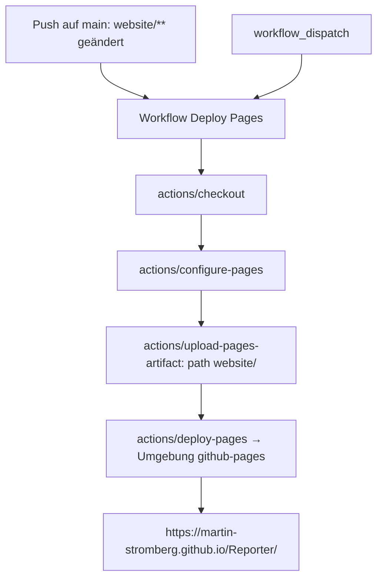

<!-- Licensed under the PolyForm Noncommercial License 1.0.0 - see the LICENSE file in the project root for details. -->

← [Zurück zur Übersicht](index.md)

# Website — Technischer Ablauf

## Übersicht

Die Website ist eine reine statische HTML/CSS-Site ohne Build-Schritt und ohne JavaScript-Pflicht. Ihre Quellen liegen versioniert unter `website/` im Repository; der Workflow `.github/workflows/deploy-pages.yml` packt diesen Ordner bei Änderungen auf `main` als Pages-Artefakt und veröffentlicht ihn in der Umgebung `github-pages`.

## Ablauf

### 1. Seitenstruktur und Verlinkung

Alle acht Seiten folgen demselben Gerüst: `<header>` mit Brand-Link (App-Icon + „Reporter"), Hauptnavigation und Sprachumschalter, `<main>` mit dem Seiteninhalt, `<footer>` mit Kontakt-, Lizenz- und Navigationslinks. Die deutsche Version liegt im Root von `website/`, die englische Spiegelung unter `website/en/`; interne Links sind durchgehend relativ (`en/...` bzw. `../...`, `assets/...`), damit die Site unter der Projektseiten-URL `https://martin-stromberg.github.io/Reporter/` und in jeder lokalen Vorschau ohne `baseurl`-Konfiguration funktioniert.

Beteiligte Dateien:
- `website/index.html`, `website/privacypolicy.html`, `website/changelog.html`, `website/press.html` — deutsche Seiten
- `website/en/index.html`, `website/en/privacypolicy.html`, `website/en/changelog.html`, `website/en/press.html` — englische Seiten
- `website/assets/css/site.css` — gemeinsames Design-System (CSS-Variablen für `#1e293b`/`#f59e0b`, Newsreader/Inter-Fontstack mit System-Fallbacks, `@media (prefers-color-scheme: dark)`, `:focus-visible`-Stile, responsive Breakpoints)
- `website/assets/img/` — komponiertes `appicon.svg`, Logo-Quellen `appiconfg.svg`/`splash.svg`, `app-demo-ios.gif`
- `website/assets/img/screenshots/` — sieben iOS-Screenshots (`01-ungelesen.png` bis `07-ungelesen-nach-zdf.png`)
- `website/assets/img/press/` — gerenderte PNG-Varianten `appicon-1024.png`, `appicon-512.png`, `appicon-256.png`

### 2. Deployment auf GitHub Pages

Der Workflow `Deploy Pages` (`.github/workflows/deploy-pages.yml`) läuft bei `push` auf `main` — gefiltert auf die Pfade `website/**` und die Workflow-Datei selbst — sowie manuell per `workflow_dispatch`. Der Job `deploy` läuft auf `ubuntu-latest` in der Umgebung `github-pages` und führt vier Schritte aus:

1. `actions/checkout@v7` — Repository-Checkout.
2. `actions/configure-pages@v5` — initialisiert die Pages-Umgebung.
3. `actions/upload-pages-artifact@v3` mit `path: website/` — packt ausschließlich den Website-Ordner als Site-Artefakt; interne Dokumentation (`docs/`, Feature-Ordner) wird nicht veröffentlicht.
4. `actions/deploy-pages@v4` — veröffentlicht das Artefakt und gibt die Seiten-URL (`steps.deployment.outputs.page_url`) an die Umgebung zurück.

Der Workflow deklariert die Berechtigungen `contents: read`, `pages: write` und `id-token: write`. Die `concurrency`-Gruppe `pages` mit `cancel-in-progress: false` serialisiert Deployments — ein laufendes Deployment wird nicht abgebrochen, wartende Läufe reihen sich ein.

### 3. Veröffentlichung und Reichweite

Nach erfolgreichem Lauf ist die Site unter `https://martin-stromberg.github.io/Reporter/` erreichbar; Status und URL sind unter „Actions" bzw. der Umgebung „github-pages" im Repository sichtbar. Da nur `main` triggert, gehen Website-Änderungen mit dem regulären `staging` → `main`-Promotion-Merge live — Änderungen auf `staging` allein lösen kein Deployment aus.

## Fehlerbehandlung

- Ein fehlschlagender Deployment-Lauf beeinflusst keine anderen Workflows (`release.yml`, `staging-ci.yml`) — er ist lediglich als roter Lauf unter „Actions" sichtbar.
- Der Pfadfilter verhindert unnötige Läufe bei Änderungen außerhalb von `website/`; umgekehrt lösen Website-Änderungen auf `staging` keinen Lauf aus (siehe [Fehlerbehebung](troubleshooting.md)).
- Dateien außerhalb von `website/` können von der Site nicht referenziert werden — fehlende Kopien äußern sich als 404 auf Bildern oder Downloads (siehe [Fehlerbehebung](troubleshooting.md)).
