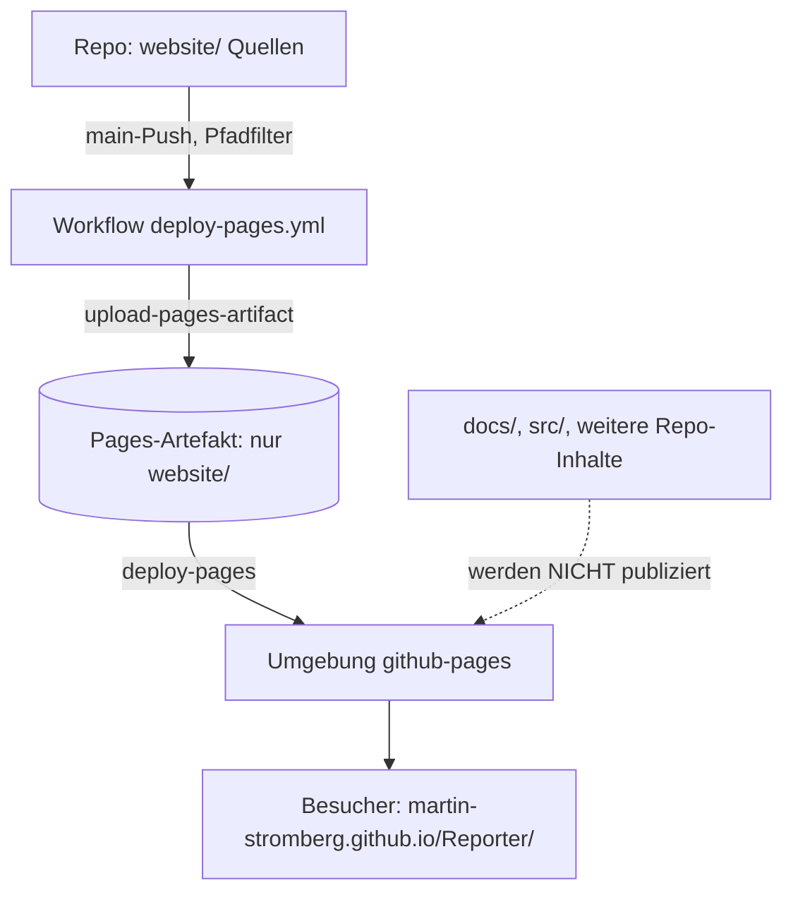

<!-- Licensed under the PolyForm Noncommercial License 1.0.0 - see the LICENSE file in the project root for details. -->

← [Zurück zur Übersicht](index.md)

# Website — Architektur

## Beteiligte Komponenten

| Komponente | Typ | Rolle |
|------------|-----|-------|
| `website/` | Statische Site-Quellen im Repository | Enthält alle acht HTML-Seiten (DE im Root, EN unter `en/`), das gemeinsame Stylesheet `assets/css/site.css` und sämtliche Bildassets (`assets/img/`, `assets/img/screenshots/`, `assets/img/press/`). |
| `.github/workflows/deploy-pages.yml` | GitHub-Actions-Workflow | Publiziert `website/` bei `main`-Push (Pfadfilter) oder `workflow_dispatch` über den offiziellen Pages-Actions-Stack. |
| Umgebung `github-pages` | GitHub-Pages-Laufzeit | Nimmt das Site-Artefakt entgegen und liefert es unter `https://martin-stromberg.github.io/Reporter/` aus. |
| Repository-Einstellung „Pages" | GitHub-Verwaltung (außerhalb des Codes) | Source muss auf „GitHub Actions" stehen — einmaliger Maintainer-Schritt. |

## Abhängigkeiten

- **GitHub Actions → GitHub Pages:** synchroner Deploy-Pfad innerhalb von GitHub; die Authentifizierung läuft über OIDC (`id-token: write`), es sind keine Secrets hinterlegt.
- **Quellartefakte im Repository:** Die Site-Inhalte sind abgeleitete Kopien vorhandener Repo-Dateien — Screenshots/GIF aus `docs/help/anwendung/screenshots/readme-demo-ios/`, Icon-Quellen aus `src/Reporter/Resources/`, Texte aus `README.md`, `docs/help/anwendung/beschreibung.md` und `docs/privacy-policy.md`. Zur Laufzeit der Site besteht keine Abhängigkeit zu diesen Dateien — sie werden beim Deploy nicht mitgeliefert.
- **Keine App-Abhängigkeit:** Die Website hat keine Code-Abhängigkeit zur .NET-MAUI-App; die App ändert sich durch die Site nicht.

## Datenfluss

Beim Push auf `main` (mit Änderungen unter `website/`) oder bei manuellem `workflow_dispatch` checkt der Workflow das Repository aus, packt den Ordner `website/` als Artefakt und übergibt ihn an die Pages-Umgebung. Besucher rufen die fertig gerenderten statischen Dateien direkt von GitHub Pages ab — es gibt keinen Server-Code, keine Datenbank und kein JavaScript-Pflicht.

## Skalierung und Zuverlässigkeit

Die Site ist rein statisch — Skalierung und Verfügbarkeit liegen vollständig bei GitHub Pages. Fehlschlagende Deployments haben keinen Einfluss auf andere Workflows oder die bereits veröffentlichte Site; der `concurrency`-Block serialisiert parallele Läufe ohne Abbruch (`cancel-in-progress: false`).
